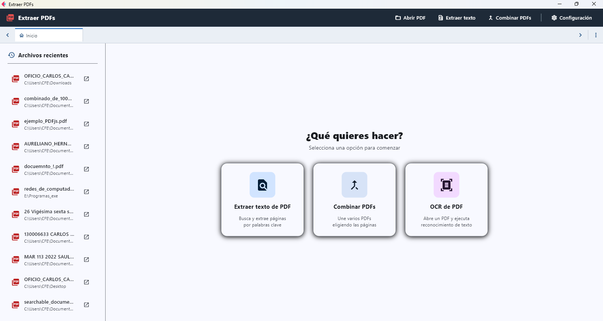
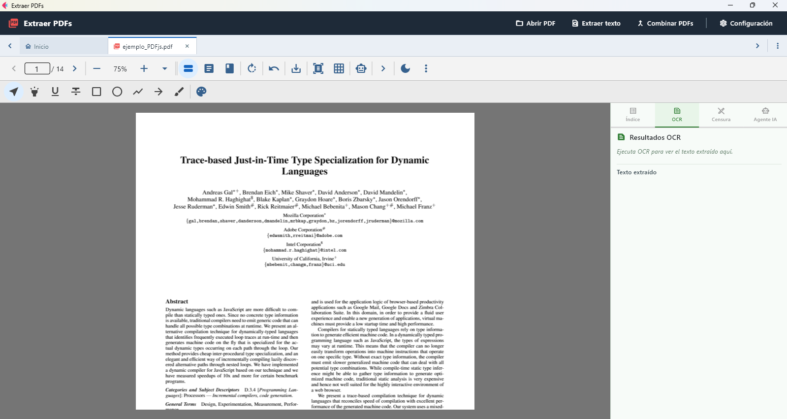
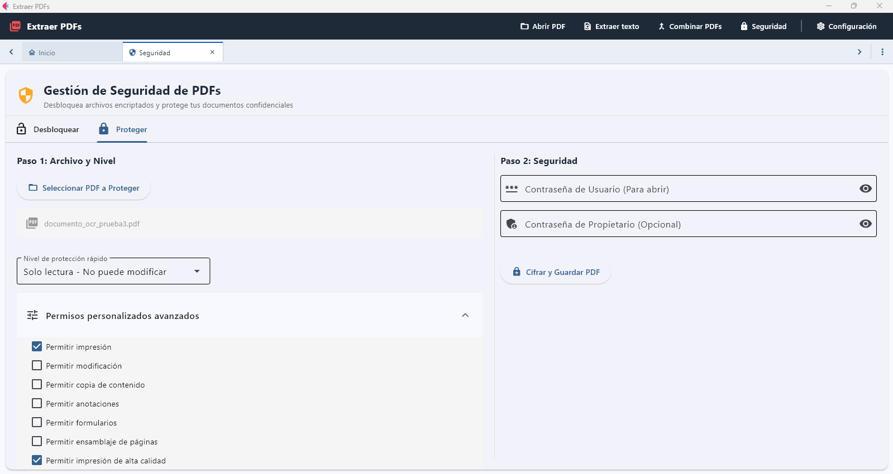
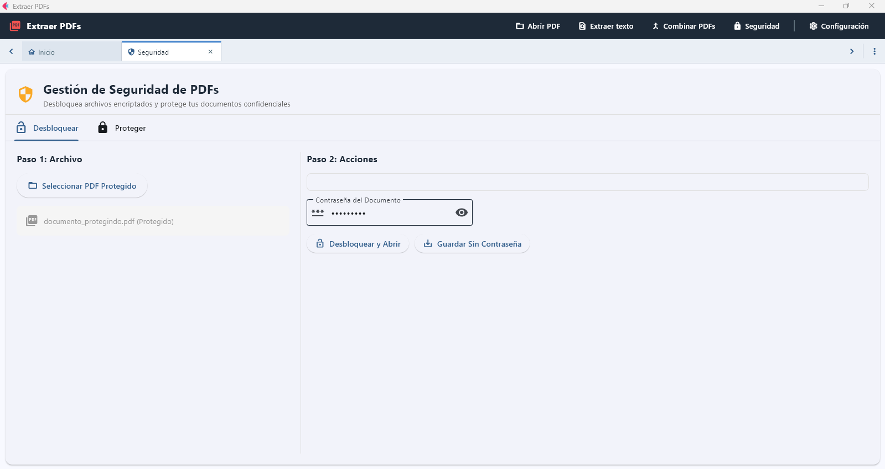
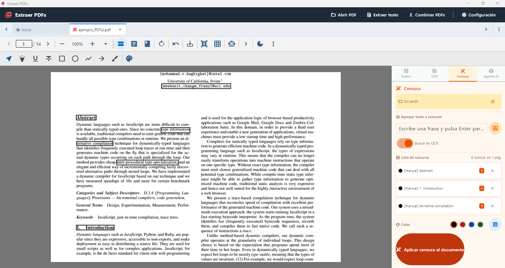
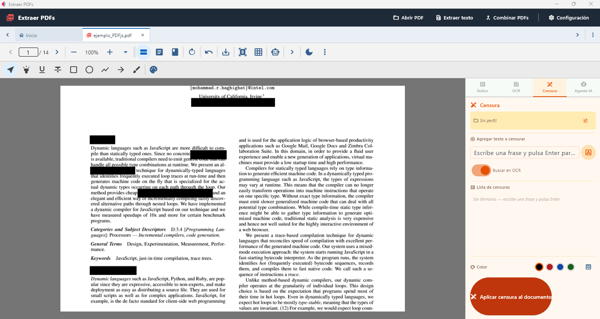
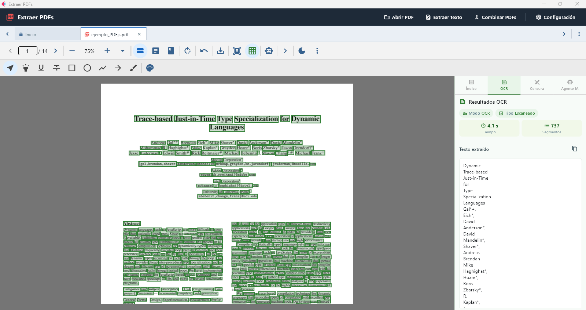

# ExtraerPdfs app

Una aplicación de escritorio completa para gestionar, visualizar y manipular archivos PDF con capacidades avanzadas de seguridad, OCR y anotaciones.



## Características

### 📖 Visor de PDF
Visualiza y navega por documentos PDF con soporte para:
- Anotaciones en el documento
- Zoom y navegación fluida
- Selección de texto



📚 [Más información sobre el Visor de PDF](docs/visor-pdf.md)

### 🔐 Seguridad
Protege tus documentos PDF con:
- **Proteger PDF**: Añade contraseña y permisos de acceso
- **Desbloquear PDF**: Elimina protecciones existentes




📚 [Más información sobre Seguridad en PDF](docs/seguridad-pdf.md)

### 🖍️ Redacción y Censura
Censura información sensible en tus documentos:




📚 [Más información sobre Seguridad en PDF](docs/seguridad-pdf.md)

### 🔍 OCR (Reconocimiento Óptico de Caracteres)
Extrae texto automáticamente de imágenes en PDFs:



### ✏️ Anotaciones
Añade comentarios y marcas en tus documentos PDF

📚 [Más información sobre el Visor de PDF](docs/visor-pdf.md)

### 📄 Fusión de PDF
Combina múltiples archivos PDF en uno solo

📚 [Más información sobre Combinar PDF](docs/combinar-pdf.md)

### 📊 Extracción de Datos
Extrae información de tus documentos PDF

📚 [Más información sobre Extracción de PDF](docs/extraer-pdf.md)

## Instalación y Ejecución

### Usando uv

**Ejecutar como aplicación de escritorio:**

```bash
uv run flet run
```

**Ejecutar como aplicación web:**

```bash
uv run flet run --web
```

### Usando Poetry

**Instalar dependencias:**

```bash
poetry install
```

**Ejecutar como aplicación de escritorio:**

```bash
poetry run flet run
```

**Ejecutar como aplicación web:**

```bash
poetry run flet run --web
```

Para más detalles, consulta la [Guía de Inicio](https://flet.dev/docs/getting-started/).

## Compilación

### Android

```bash
flet build apk -v
```

Para más detalles sobre compilación y firma, consulta la [Guía de Empaquetado para Android](https://flet.dev/docs/publish/android/).

### iOS

```bash
flet build ipa -v
```

Para más detalles, consulta la [Guía de Empaquetado para iOS](https://flet.dev/docs/publish/ios/).

### macOS

```bash
flet build macos -v
```

Para más detalles, consulta la [Guía de Empaquetado para macOS](https://flet.dev/docs/publish/macos/).

### Linux

```bash
flet build linux -v
```

Para más detalles, consulta la [Guía de Empaquetado para Linux](https://flet.dev/docs/publish/linux/).

### Windows

```bash
flet build windows -v
```

Para más detalles, consulta la [Guía de Empaquetado para Windows](https://flet.dev/docs/publish/windows/).