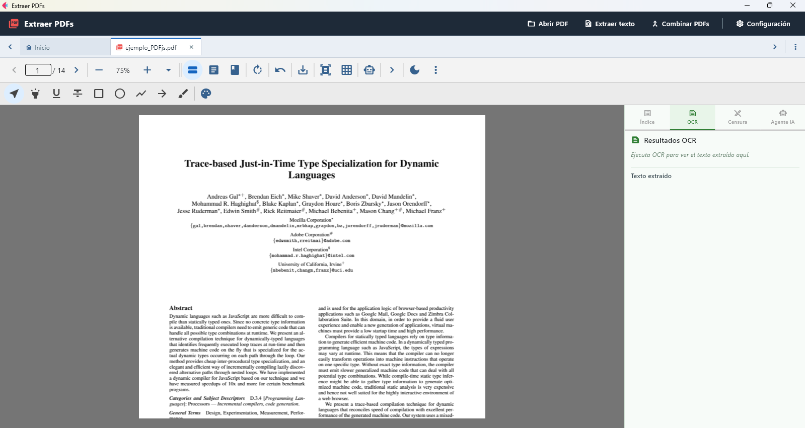
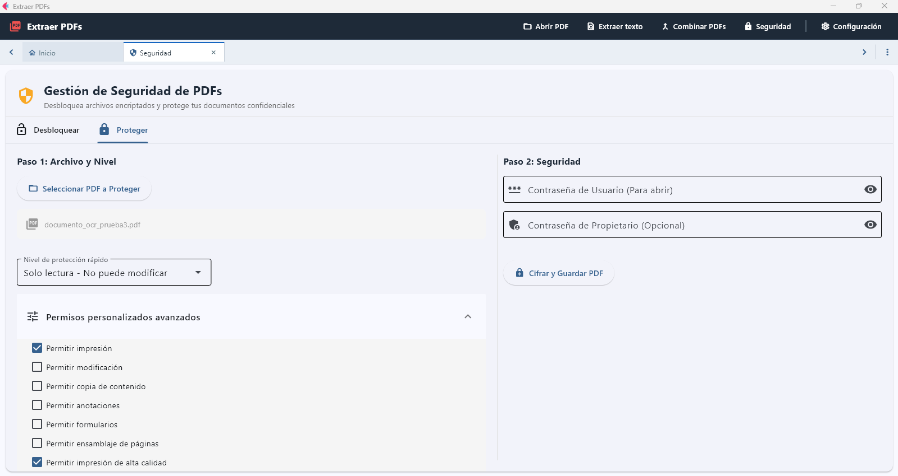
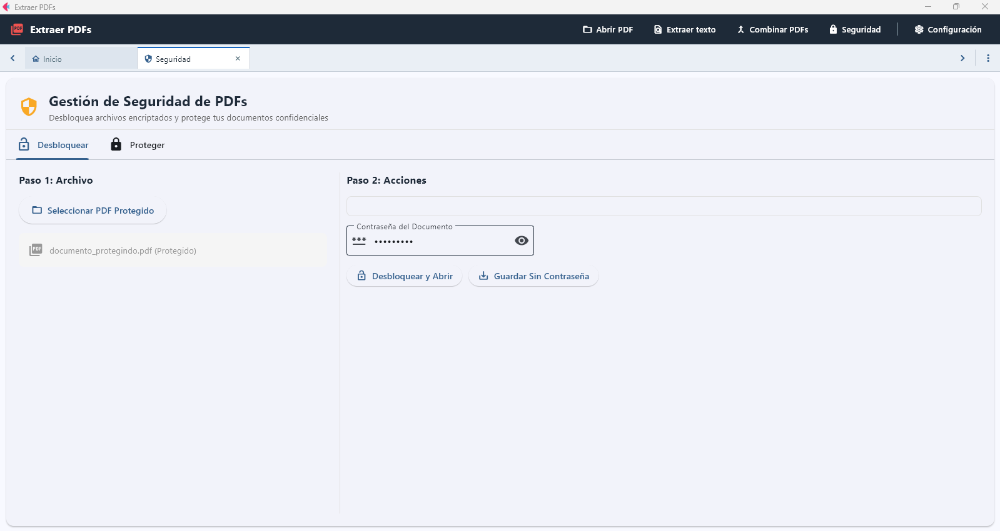
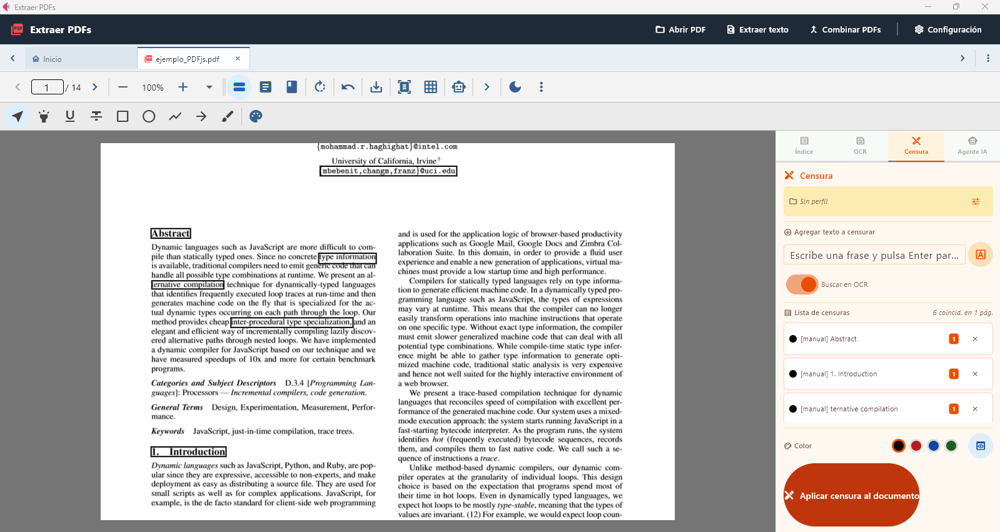
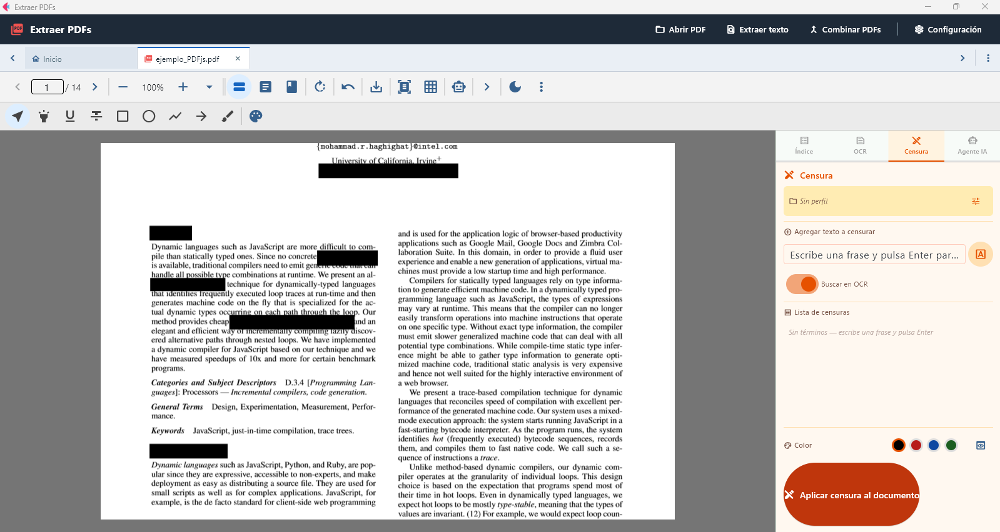
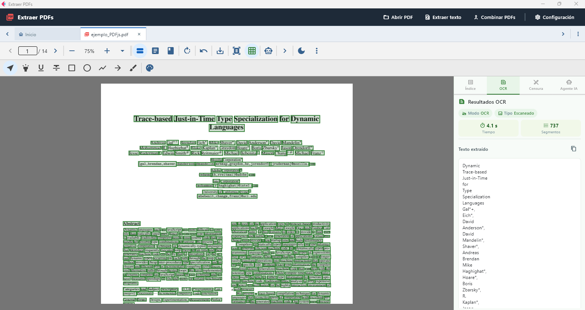
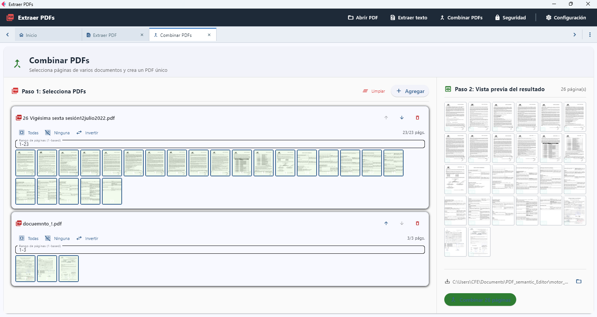
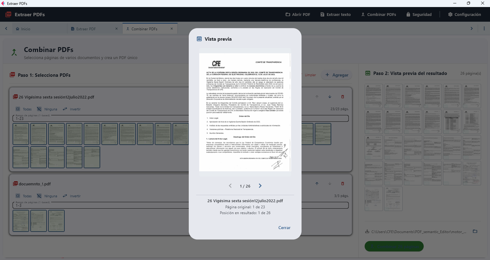
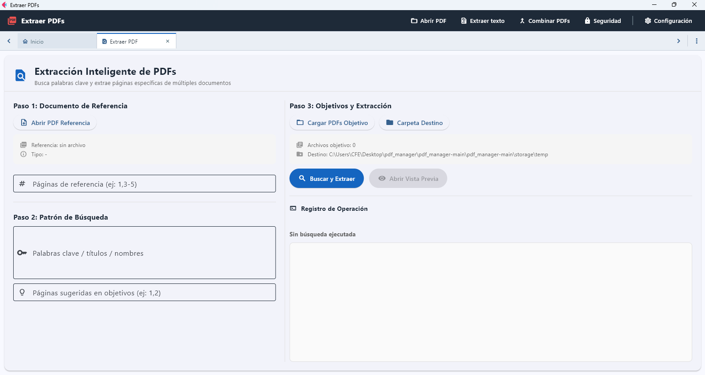

# PdfManager App

Una aplicación de escritorio completa para gestionar, visualizar y manipular archivos PDF con capacidades avanzadas de seguridad, OCR y anotaciones.


## Arquitectura general

La app está organizada por responsabilidades para que la UI principal cargue rápido y cada módulo mantenga su propia lógica:

- `src/main.py`: punto de entrada. Gestiona la instancia única, el menú principal y las pestañas fijas de la aplicación.
- `src/document_manager_ui.py`: implementa la barra de pestañas personalizada y notifica foco/pérdida de foco a los visores PDF.
- `src/home.py`: pantalla inicial y accesos a las funciones principales.
- `src/pdf_viewer/`: visor PDF completo. `viewer.py` ensambla los mixins y delega renderizado, zoom, selección, OCR, censura, búsqueda, leyendas e impresión.
- `src/pdf_extractor/`, `src/pdf_merge/`, `src/pdf_security/`: módulos especializados para extraer, combinar y proteger PDFs.
- `src/settings_tab.py` y `src/help_tab.py`: configuración y ayuda dentro de pestañas integradas.

Las pestañas fijas que abre `main.py` son: inicio, extracción, combinación, seguridad, configuración y ayuda. Los PDFs abiertos por el usuario se añaden después como pestañas dinámicas del visor.

## Características

### 📖 Visor de PDF
Visualiza y navega por documentos PDF con soporte para:
- Anotaciones en el documento
- Zoom y navegación fluida
- Selección de texto



📚 [Más información sobre el Visor de PDF](docs/visor-pdf.md)

### 🔐 Seguridad
Protege tus documentos PDF con:
- **Proteger PDF**: Añade contraseña y permisos de acceso
- **Desbloquear PDF**: Elimina protecciones existentes




📚 [Más información sobre Seguridad en PDF](docs/seguridad-pdf.md)

### 🖍️ Redacción y Censura
Censura información sensible en tus documentos:




📚 [Más información sobre Seguridad en PDF](docs/seguridad-pdf.md)

### 🔍 OCR (Reconocimiento Óptico de Caracteres)
Extrae texto automáticamente de imágenes en PDFs:



### ✏️ Anotaciones
Añade comentarios y marcas en tus documentos PDF

📚 [Más información sobre el Visor de PDF](docs/visor-pdf.md)

### ❓ Ayuda y documentación
Consulta la guía de uso integrada desde la pestaña de ayuda.

### 📄 Fusión de PDF
Combina múltiples archivos PDF en uno solo



📚 [Más información sobre Combinar PDF](docs/combinar-pdf.md)

### 📊 Extracción de Datos
Extrae información de tus documentos PDF


📚 [Más información sobre Extracción de PDF](docs/extraer-pdf.md)

## Instalación y Ejecución

### Modo desarrollo (clonar y ejecutar)

1. Clona el repositorio y sitúate en la carpeta del proyecto:

```bash
git clone https://github.com/Mahynlo/pdf_manager.git
cd pdf_manager
```

2. Crea y activa un entorno virtual:

- En Linux / macOS:

```bash
python -m venv .venv
source .venv/bin/activate
```

- En Windows (PowerShell):

```powershell
python -m venv .venv
.\.venv\Scripts\Activate.ps1
```

Nota: el usuario solicitó el método clásico de activación Windows `\.venv\Scripts\activate`; use la variante adecuada para su shell.

3. Instala la herramienta `uv` si no la tienes (opcional, `uv` es la envoltura usada en este repo para ejecutar comandos):

```bash
pip install uv
```

4. (Una sola vez) sincroniza dependencias/entorno con `uv` (según flujo del proyecto):

```bash
uv sync
```

5. Ejecuta la aplicación en modo desarrollo:

```bash
uv run flet run
```

Para ejecutar en modo web:

```bash
uv run flet run --web
```

Si prefieres no usar `uv`, sigue estos pasos alternativos con `poetry` o `pip`.

### Usando Poetry (alternativa)

**Instalar dependencias:**

```bash
poetry install
```

**Ejecutar como aplicación de escritorio:**

```bash
poetry run flet run
```

**Ejecutar como aplicación web:**

```bash
poetry run flet run --web
```

### Usando pip + virtualenv (otra alternativa)

Después de crear y activar el entorno virtual (ver arriba), instala dependencias con:

```bash
pip install -r requirements.txt
```

Si no existe `requirements.txt`, puedes instalar directamente desde el `pyproject.toml` usando `pip` junto con `pip-tools` o usar `poetry` para exportar las dependencias.

Para más detalles, consulta la [Guía de Inicio](https://flet.dev/docs/getting-started/).

## Compilación

Para más detalles, consulta la [Guía de Empaquetado para Linux](https://flet.dev/docs/publish/linux/).

### Windows

```bash
flet build windows -v
```

Para más detalles, consulta la [Guía de Empaquetado para Windows](https://flet.dev/docs/publish/windows/).

> Para generar el instalador completo (exe + launcher de "Abrir con" + Inno Setup) usa `.\build.ps1`.

📚 [Más información sobre "Abrir con" e instalador en Windows](docs/abrir-con-windows.md)