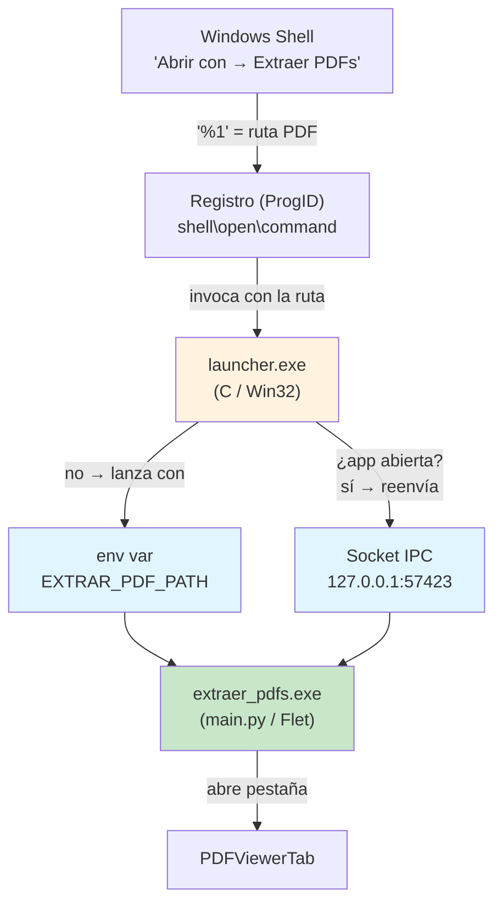
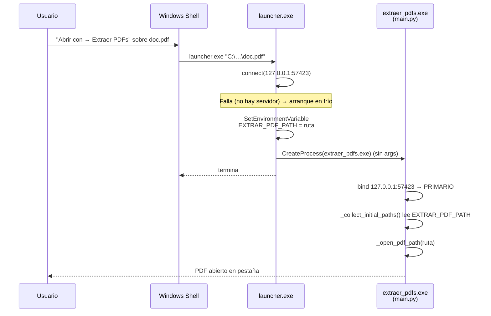
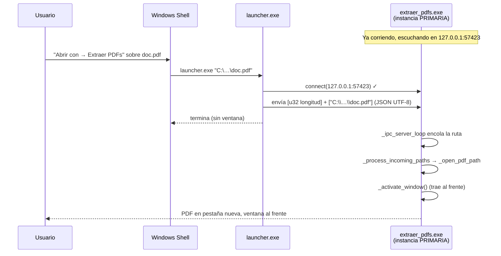
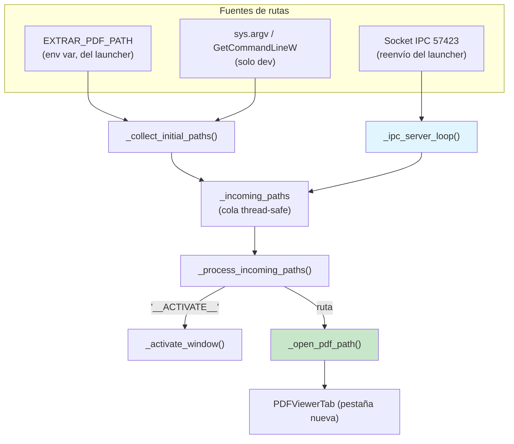

# "Abrir con" e instancia única en Windows — Arquitectura y funcionamiento

## Índice

1. [Visión general](#1-visión-general)
2. [El problema: el exe de Flet no recibe argumentos](#2-el-problema-el-exe-de-flet-no-recibe-argumentos)
3. [Arquitectura de la solución](#3-arquitectura-de-la-solución)
4. [Flujo con la app cerrada (arranque en frío)](#4-flujo-con-la-app-cerrada-arranque-en-frío)
5. [Flujo con la app abierta (reenvío en caliente)](#5-flujo-con-la-app-abierta-reenvío-en-caliente)
6. [El launcher (`launcher.c`)](#6-el-launcher-launcherc)
7. [Instancia única e IPC en `main.py`](#7-instancia-única-e-ipc-en-mainpy)
8. [Registro en el instalador (`setup.iss`)](#8-registro-en-el-instalador-setupiss)
9. [Compilación (`build.ps1`)](#9-compilación-buildps1)
10. [Diagnóstico](#10-diagnóstico)
11. [Resumen](#11-resumen)

---

## 1. Visión general

Cuando el usuario hace **clic derecho → "Abrir con" → Extraer PDFs** sobre un `.pdf` (o lo asocia como programa predeterminado), Windows debe entregar la ruta del archivo a la aplicación para que la abra en una pestaña nueva. La app es **desktop, de instancia única**: si ya está abierta, el PDF debe aparecer en la ventana existente, no abrir una segunda copia.

Esto exige resolver tres cosas:

- ✅ Recibir la ruta que Windows pasa al invocar la asociación.
- ✅ Reenviar esa ruta a la instancia ya abierta (o arrancar una si no hay).
- ✅ Hacerlo **sin** que aparezca una ventana en blanco huérfana.

| Capa | Tecnología | Responsabilidad |
|------|-----------|-----------------|
| **Puente** | `launcher.exe` (C / Win32, `launcher/launcher.c`) | Recibe `%1` de Windows y la entrega a la app por socket IPC o variable de entorno |
| **App** | `main.py` (Flet) | Servidor IPC de instancia única, lee `EXTRAR_PDF_PATH`, abre el PDF en pestaña |
| **Registro** | Inno Setup (`installer/setup.iss`) | Crea el ProgID y la entrada de "Abrir con" apuntando al **launcher** |

---

## 2. El problema: el exe de Flet no recibe argumentos

El intento natural —y el que trae casi cualquier instalador— es registrar el comando:

```
"extraer_pdfs.exe" "%1"
```

**Esto NO funciona en el build empaquetado por `flet build windows`.** El exe es un *runner* de Flutter que arranca el backend de Python como subproceso; si recibe **cualquier** argumento de línea de comandos, el bootstrap de Flutter se rompe y **el backend de Python nunca arranca**. El resultado es exactamente el síntoma reportado: **una ventana de Flutter en blanco que se queda colgada**.

Comportamiento verificado lanzando el exe instalado de distintas formas y observando el log diagnóstico:

| Cómo se lanza el exe empaquetado | ¿Arranca Python? | Resultado |
|---|---|---|
| Sin argumentos | ✅ Sí | Funciona (home normal) |
| `extraer_pdfs.exe "C:\…\doc.pdf"` (lo que hace "Abrir con") | ❌ No | **Ventana en blanco** |
| `extraer_pdfs.exe --dart-entrypoint-args "C:\…\doc.pdf"` | ❌ No | Ventana en blanco |
| Sin args + ruta en la **env var** `EXTRAR_PDF_PATH` | ✅ Sí | Abre el PDF correctamente |

> ⚠️ Un workaround anterior leía la línea de comandos real del proceso vía `GetCommandLineW`/`CommandLineToArgvW`. **Solo funciona en desarrollo** (`uv run`), donde es Python quien recibe el argumento. En el exe empaquetado nunca llega a ejecutarse, porque Python no arranca cuando hay un argumento presente. La única vía fiable es **no pasar argumentos al exe** y usar la variable de entorno.

---

## 3. Arquitectura de la solución

El registro de "Abrir con" apunta a un **launcher nativo intermedio**, no al exe de Flet. Como es un ejecutable Win32 normal, recibe la ruta sin problemas y la entrega a la app por la vía que sí funciona.



La decisión del launcher es simple:

- **¿Logra conectar al socket `127.0.0.1:57423`?** → la app ya está abierta: le reenvía la ruta y termina. **Sin abrir ventana nueva.**
- **¿Falla la conexión?** → no hay app: lanza `extraer_pdfs.exe` **sin argumentos** pero con `EXTRAR_PDF_PATH` apuntando al PDF.

---

## 4. Flujo con la app cerrada (arranque en frío)



`main.py` lee la variable de entorno al arrancar (`_collect_initial_paths`) y encola la ruta en la cola de entrada (`_incoming_paths`), que el procesador despacha a `_open_pdf_path`. Soporta varias rutas separadas por `|`.

---

## 5. Flujo con la app abierta (reenvío en caliente)



Esta es la diferencia clave con el diseño anterior: el **launcher** hace el reenvío por socket directamente (es ligero, no arranca Flutter), así que **no hay parpadeo de ventana** cuando la app ya está abierta. La ruta sin ruta (lanzar el launcher sin argumento) envía el marcador `["__ACTIVATE__"]`, que solo trae la ventana al frente.

---

## 6. El launcher (`launcher.c`)

Ejecutable Win32 mínimo (`launcher/launcher.c`, ~170 líneas, compilado a ~65 KB, subsistema GUI → sin consola). Entrada por `wWinMain` + `CommandLineToArgvW` para soportar rutas con acentos (UTF-16).

### Responsabilidades

| Función | Responsabilidad |
|---------|-----------------|
| `to_utf8()` | Convierte la ruta wide (UTF-16) a UTF-8 |
| `build_json()` | Construye el payload `["ruta"]` en UTF-8, escapando `\` y `"` |
| `forward()` | Conecta a `127.0.0.1:57423` y envía `[u32 big-endian = longitud] + JSON`; devuelve `1` si lo entregó |
| `launch_app()` | `SetEnvironmentVariableW(EXTRAR_PDF_PATH)` + `CreateProcessW(extraer_pdfs.exe)` en el mismo directorio |
| `wWinMain()` | Si hay ruta → JSON; si no → `["__ACTIVATE__"]`. Intenta `forward()`; si falla, `launch_app()` |

### Protocolo IPC (idéntico al de `main.py`)

```
┌────────────────────┬─────────────────────────────────────┐
│ 4 bytes (u32 BE)   │  N bytes  (JSON, UTF-8)              │
│ longitud del cuerpo│  ["C:\\Users\\…\\doc.pdf"]           │
└────────────────────┴─────────────────────────────────────┘
```

- Longitud en **big-endian** (`htonl` en C ↔ `struct.pack(">I", n)` en Python).
- El cuerpo es una **lista JSON de rutas** (o `["__ACTIVATE__"]`).
- En loopback, si no hay servidor, `connect()` falla al instante (`WSAECONNREFUSED`): no hace falta timeout.

> El exe principal se localiza con `GetModuleFileNameW` (directorio del propio launcher) + `extraer_pdfs.exe`. Por eso ambos deben instalarse en la **misma carpeta** (`{app}`).

---

## 7. Instancia única e IPC en `main.py`

La instancia primaria es la dueña del socket; las rutas entrantes (de la env var, de argv en dev, o del socket) confluyen en una cola y se abren en el hilo de UI.



Puntos clave (todos en `src/main.py`):

- **`_try_bind_server()`** — usa `SO_EXCLUSIVEADDRUSE` en Windows (no `SO_REUSEADDR`, que permitiría múltiples binds). El primer proceso que liga el puerto es el **primario**.
- **`_ipc_server_loop()`** — acepta conexiones y encola las rutas recibidas.
- **`_collect_initial_paths()`** — recolecta rutas de `sys.argv`, `GetCommandLineW` (dev) y de la variable `EXTRAR_PDF_PATH` (separador `|`); valida que sean `.pdf` existentes.
- **`_process_incoming_paths()`** — desencola; `__ACTIVATE__` solo trae la ventana al frente, una ruta llama a `_open_pdf_path()`.
- **`_activate_window()`** — desminimiza, hace visible y `to_front()`.

> La rama de "instancia secundaria" de `main.py` (que reenvía por IPC y sale) sigue existiendo para el caso de doble-lanzamiento manual del exe en dev, pero **ya no es la vía de "Abrir con"**: con el launcher, la app secundaria nunca se arranca con argumentos.

---

## 8. Registro en el instalador (`setup.iss`)

El ProgID `ExtraerPdfs.PdfFile` apunta su comando de apertura al **launcher**, no al exe.

```ini
; El comando de apertura invoca el LAUNCHER (el exe de Flet se queda en blanco con args)
Root: HKCR; Subkey: "{#MyAppProgID}\shell\open\command";
    ValueData: """{app}\launcher.exe"" ""%1"""

; Icono visible del tipo de archivo: el del exe principal
Root: HKCR; Subkey: "{#MyAppProgID}\DefaultIcon";
    ValueData: "{app}\extraer_pdfs.exe,0"

; "Buscar otra aplicación" muestra el launcher con nombre amigable
Root: HKCR; Subkey: "Applications\launcher.exe"; ValueName: "FriendlyAppName"; ValueData: "Extraer PDFs"
Root: HKCR; Subkey: "Applications\launcher.exe\shell\open\command"; ValueData: """{app}\launcher.exe"" ""%1"""
Root: HKCR; Subkey: "Applications\launcher.exe\SupportedTypes"; ValueName: ".pdf"

; Oculta el exe crudo de "Abrir con" (la variante que se queda en blanco)
Root: HKCR; Subkey: "Applications\extraer_pdfs.exe"; ValueName: "NoOpenWith"

; Añade el ProgID a "Abrir con" para .pdf (sin cambiar el predeterminado)
Root: HKCR; Subkey: ".pdf\OpenWithProgids"; ValueName: "{#MyAppProgID}"; Tasks: assocpdf
```

| Clave | Para qué sirve |
|-------|----------------|
| `ProgID\shell\open\command` → launcher | El handler real de "Abrir con Extraer PDFs" |
| `ProgID\DefaultIcon` → exe | El `.pdf` muestra el icono de la app |
| `Applications\launcher.exe\FriendlyAppName` | "Buscar otra app" lista "Extraer PDFs", no "launcher.exe" |
| `Applications\launcher.exe\SupportedTypes` | El launcher aparece como opción para `.pdf` |
| `Applications\extraer_pdfs.exe\NoOpenWith` | Evita que el usuario elija el exe crudo (ventana en blanco) |
| `.pdf\OpenWithProgids` | Suma la app al menú sin robar el predeterminado |
| `Capabilities` + `RegisteredApplications` (HKLM) | Permite fijarla como predeterminada en *Configuración → Apps predeterminadas* |

`ChangesAssociations=yes` en `[Setup]` hace que Windows refresque el caché de iconos/asociaciones tras instalar.

---

## 9. Compilación (`build.ps1`)

`build.ps1` compila el launcher **dentro** del directorio de salida del build de Flet, para que el `[Files]` del `.iss` (`Source: "{#MyAppSourceDir}\*"`) lo copie a `{app}` junto al exe:

```powershell
gcc launcher\launcher.c -o <BuildOutput>\launcher.exe `
    -municode -static -mwindows -O2 -s -lws2_32 -lshell32
```

| Flag | Motivo |
|------|--------|
| `-municode` | Punto de entrada `wWinMain` (Unicode) en mingw |
| `-static` | Enlaza estático → binario autónomo (sin libgcc/libwinpthread) |
| `-mwindows` | Subsistema GUI → sin ventana de consola |
| `-O2 -s` | Optimiza y elimina símbolos (binario pequeño) |
| `-lws2_32` | Winsock (socket IPC) |
| `-lshell32` | `CommandLineToArgvW` |

Requiere **gcc (mingw)**. Si no se encuentra, `build.ps1` aborta mostrando el comando manual. El proceso completo (`.\build.ps1`) hace: build de Flet → compila launcher → genera instalador con Inno Setup.

> El `launcher.exe` compilado está en `.gitignore`; solo se versiona `launcher.c`.

### En CI (GitHub Actions)

El workflow `.github/workflows/build.yml` compila el launcher en un paso propio antes de empaquetar. El runner `windows-latest` (Windows Server 2025) trae **gcc 15 vía MSYS2 en `C:\msys64\ucrt64\bin`** (toolchain UCRT) pero **no en el PATH**; el workflow sondea esa ruta directamente (evita instalar mingw por Chocolatey) y solo recurre a choco si no la encuentra. **No** usa `C:\msys64\usr\bin\gcc.exe`, que produciría un binario dependiente de `msys-2.0.dll`.

---

## 10. Diagnóstico

`main.py` escribe un log best-effort en **`%USERPROFILE%\.extraer_pdfs_debug.log`** (truncado al pasar 1 MB). Es la herramienta principal para depurar "Abrir con":

- Línea `LAUNCH | …` al inicio del módulo → **Python arrancó**. Si falta tras un "Abrir con", el exe se quedó en blanco (no llegó a Python).
- `BIND | OK … PRIMARY` / `FAIL … SECONDARY` → rol de la instancia.
- `ENV | EXTRAR_PDF_PATH = …` → llegó la ruta por la env var (camino en frío).
- `IPC | server recv payload = […]` → llegó la ruta por socket (camino en caliente, reenvío del launcher).
- `COLLECT | final paths = […]` → rutas aceptadas; `OPEN | SUCCESS` → PDF abierto.

Prueba manual rápida del camino en frío (sin tocar el registro):

```powershell
$env:EXTRAR_PDF_PATH = "C:\ruta\doc.pdf"
Start-Process "C:\Program Files (x86)\Extraer PDFs\extraer_pdfs.exe"
Remove-Item Env:\EXTRAR_PDF_PATH
```

---

## 11. Resumen

| Pieza | Archivo | Rol |
|-------|---------|-----|
| Launcher nativo | `launcher/launcher.c` | Recibe `%1` y lo entrega por socket o env var |
| Servidor IPC + arranque | `src/main.py` | Instancia única, lee `EXTRAR_PDF_PATH`, abre el PDF |
| Registro de asociaciones | `installer/setup.iss` | ProgID → launcher; "Abrir con"; predeterminada |
| Compilación | `build.ps1` | Compila el launcher dentro del build de Flet |
| Diagnóstico | `~/.extraer_pdfs_debug.log` | Traza de argv/env/IPC/apertura |

**Regla de oro:** nunca pasar argumentos al exe empaquetado de Flet. La ruta viaja por **socket IPC** (app abierta) o por **`EXTRAR_PDF_PATH`** (app cerrada); el `launcher.exe` es el puente que traduce el `%1` de Windows a una de esas dos vías.
