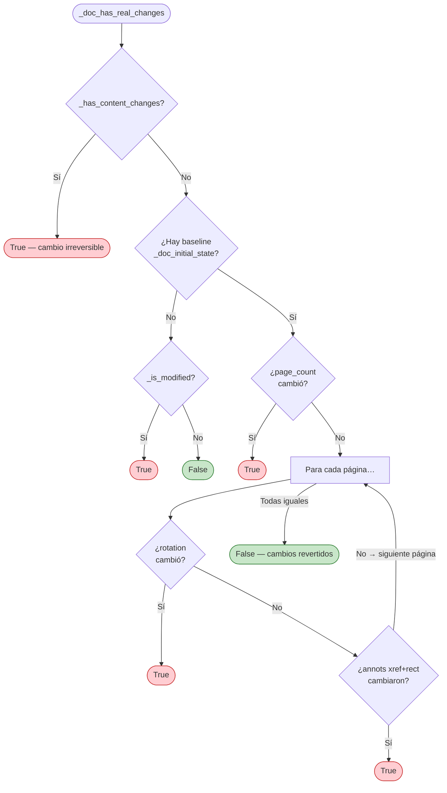
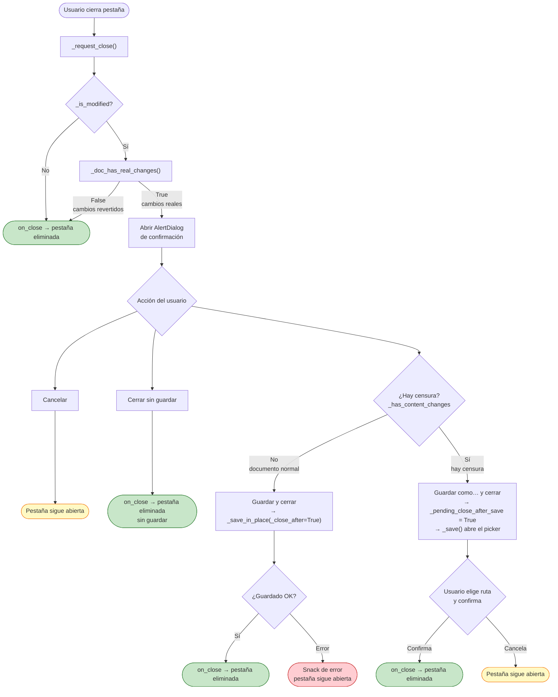
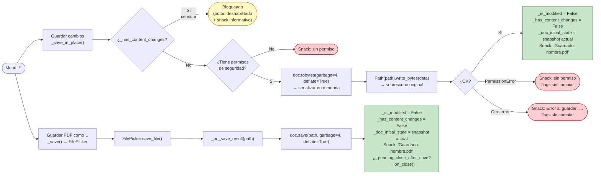
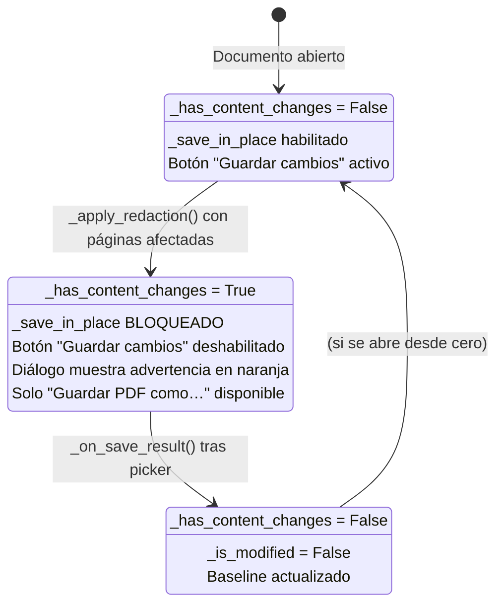
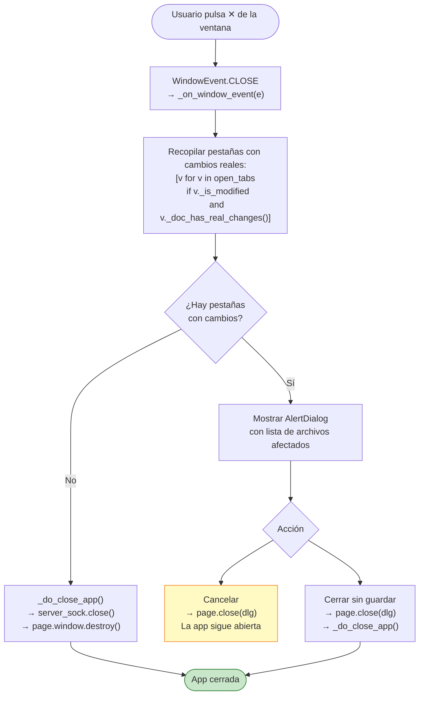

# Cierre y guardado — Detección de cambios y protección de datos

## Índice

1. [Visión general](#1-visión-general)
2. [Detección de cambios](#2-detección-de-cambios)
3. [Flujo de cierre de pestaña](#3-flujo-de-cierre-de-pestaña)
4. [Opciones de guardado](#4-opciones-de-guardado)
5. [Caso especial: documentos con censura](#5-caso-especial-documentos-con-censura)
6. [Cierre de la aplicación](#6-cierre-de-la-aplicación)
7. [Variables de estado](#7-variables-de-estado)

---

## 1. Visión general

Cuando el usuario intenta cerrar una pestaña de PDF o la ventana completa de la
aplicación, el sistema comprueba si el documento tiene **cambios sin guardar** y,
de ser así, abre un diálogo de confirmación antes de proceder.

El mecanismo opera en dos niveles:

| Nivel | Qué detecta | Por qué se necesita |
|-------|-------------|---------------------|
| **Bandera rápida** (`_is_modified`) | Que *alguna* operación de escritura ocurrió | Evitar la comparación costosa en documentos no tocados |
| **Comparación de estado** (`_doc_has_real_changes`) | Que el estado actual difiere del baseline guardado | Permitir deshacer/revertir sin que aparezca el diálogo |

Solo se muestra el diálogo si **ambos** niveles confirman que hay cambios: la
bandera está activa **y** el estado real difiere del baseline. Si el usuario,
por ejemplo, rotó una página y luego la volvió a 0°, la bandera estará activa pero
la comparación devuelve `False` → cierre directo sin preguntar.

---

## 2. Detección de cambios

### 2.1 Bandera rápida `_is_modified`

`_is_modified` (bool) actúa como atajo: se pone en `True` en cualquier operación
de escritura y se limpia solo tras un guardado exitoso. Si es `False`, el cierre
es inmediato sin hacer ninguna comparación adicional.

Las operaciones que activan la bandera son:

| Operación | Lugar en el código |
|-----------|-------------------|
| Añadir / mover / escalar / recolorear / borrar anotación | `_annot_mixin.py`, `_gesture_mixin.py` |
| Dibujar trazo libre (tinta) o forma | `_gesture_mixin.py` |
| Resaltado / subrayado / tachado desde selección de texto | `_text_sel_mixin.py` |
| Rotar página (`_rotate`, `_rotate_ccw`, `_rotate_180_all`) | `_render_mixin.py` |
| Deshacer / Rehacer | `_render_mixin.py` |
| Operaciones de página (mover, duplicar, eliminar, insertar) | `_after_page_op` en `viewer.py` |
| Aplicar censura | `_redact_mixin.py` |
| Corrección de orientación (manual o automática) | `_ocr_mixin.py` |

### 2.2 Snapshot de estado `_compute_doc_state`

Al abrir un PDF (y después de cada guardado) se toma un **snapshot ligero** del
estado del documento:

```python
{
    "page_count": n,
    "pages": {
        i: {
            "rotation": doc[i].rotation,
            "annots":   [(a.xref, tuple(a.rect)) for a in doc[i].annots()],
        }
        for i in range(n)
    }
}
```

El snapshot captura tres cosas que cubren todas las operaciones reversibles:

- **Número de páginas** → detecta añadir / eliminar / duplicar
- **Rotación por página** → detecta rotar y deshacer la rotación
- **Anotaciones por xref y rect** → detecta añadir, borrar o mover anotaciones

> Las operaciones de censura (`apply_redactions`) queman el contenido y eliminan
> los objetos de anotación — no dejarían rastro en el xref. Por eso se usa la
> bandera separada `_has_content_changes` (ver sección 5).

### 2.3 Comparación `_doc_has_real_changes`



**Casos que devuelven `False` (cierre sin diálogo) aunque `_is_modified` sea `True`:**

- El usuario rotó una página 90° y la devolvió a 0°.
- El usuario añadió una anotación y luego hizo Ctrl+Z hasta deshacer todas.
- El usuario reordenó páginas y las volvió al orden original.

**Casos que devuelven `True` y abren el diálogo:**

- Hay al menos una página con rotación diferente a la del baseline.
- Hay anotaciones nuevas, eliminadas o movidas respecto al baseline.
- El número de páginas cambió.
- `_has_content_changes = True` (censura aplicada).

---

## 3. Flujo de cierre de pestaña

El cierre de una pestaña pasa siempre por `_request_close`. Hay tres puntos de
entrada:

| Desde | Cómo llega a `_request_close` |
|-------|-------------------------------|
| Botón ✕ de la pestaña | `close_cb` del `TabInfo` apunta a `_request_close` |
| Botón ✕ dentro del visor | `on_click=self._request_close` |
| Menú contextual de la pestaña | `on_click=lambda e: self._request_close()` |



### Contenido del diálogo según el tipo de documento

**Documento sin censura:**

```
┌─────────────────────────────────────────┐
│  Cambios sin guardar                    │
│                                         │
│  Este documento tiene cambios sin       │
│  guardar. ¿Qué deseas hacer?            │
│                                         │
│  [Cancelar] [Cerrar sin guardar] [Guardar y cerrar] │
└─────────────────────────────────────────┘
```

**Documento con censura aplicada:**

```
┌─────────────────────────────────────────┐
│  Cambios sin guardar                    │
│                                         │
│  ⚠ Este documento tiene censura         │
│  aplicada. Solo se puede guardar como   │
│  copia para preservar el original.      │
│                                         │
│  [Cancelar] [Cerrar sin guardar] [Guardar como… y cerrar] │
└─────────────────────────────────────────┘
```

---

## 4. Opciones de guardado

El menú "Más opciones" (⋮) del visor ofrece dos rutas de guardado:



### `_save_in_place` — Guardado sobre el original

Este método usa `doc.tobytes()` + `Path.write_bytes()` en lugar del patrón clásico
de archivo temporal + `os.replace`. La razón es específica de Windows:

> **Problema:** `fitz.open(path)` en Windows puede mantener el archivo original
> abierto. `os.replace(tmp, original)` falla entonces con `PermissionError`
> (la operación de renombrado no puede desplazar un archivo en uso).
>
> **Solución:** `doc.tobytes()` serializa el PDF **íntegramente en memoria** (sin
> tocar el archivo en disco). Luego `Path.write_bytes(data)` abre el original para
> escritura directa — operación que sí puede coexistir con la lectura de PyMuPDF.

```
doc.tobytes(garbage=4, deflate=True)   →   bytes del PDF en RAM
Path(self.path).write_bytes(data)      →   sobrescribe el original
```

Después de un guardado exitoso (por cualquiera de las dos rutas):

1. `_is_modified = False` → los cierres posteriores no abrirán el diálogo.
2. `_has_content_changes = False` → aunque esta bandera ya bloquea `_save_in_place`,
   se limpia en `_on_save_result` (ruta del picker) por simetría.
3. `_doc_initial_state` se actualiza con el snapshot del estado recién guardado →
   el próximo cierre comparará contra este nuevo baseline, no el de apertura.

### Cuándo usar cada opción

| Situación | Opción recomendada |
|-----------|-------------------|
| Anotaciones, rotaciones, operaciones de página | **Guardar cambios** — rápido, sin diálogo |
| Censura aplicada | **Guardar PDF como…** — obligatorio; crea copia |
| Quieres un PDF diferente (nuevo nombre/ruta) | **Guardar PDF como…** |
| PDF con restricciones de seguridad que lo impiden | Ni una ni otra — el sistema lo informa |

---

## 5. Caso especial: documentos con censura

Cuando se aplica censura (`_apply_redaction` en `_redact_mixin.py`), PyMuPDF
quema el contenido tapado en el pixmap de la página y **elimina los objetos de
anotación de censura**. Esto tiene dos consecuencias:

1. **Irreversibilidad:** no hay `undo` posible — la información tapada ya no existe
   en el documento en memoria.
2. **Comparación de xrefs inútil:** como los objetos de anotación de censura
   desaparecen, `_doc_has_real_changes` (que compara xrefs) devolvería `False`
   aunque el contenido haya cambiado drásticamente.

Para manejar estos casos, se usa la bandera `_has_content_changes`:



**Por qué no permitir guardar la censura sobre el original:**

- El original sin censurar debe quedar intacto por si hubo un error al seleccionar qué censurar.
- Una vez creada la copia con censura, el usuario tiene ambos archivos y puede
  verificar que la censura es correcta antes de borrar el original manualmente.

**Efectos visibles en la UI al aplicar censura:**

1. El botón "Guardar cambios" del menú ⋮ se deshabilita (`disabled = True`).
2. Si el usuario intenta usar "Guardar cambios" (desde código / atajos), aparece un
   snack: *"Este documento tiene censura aplicada. Usa 'Guardar PDF como…'…"*
3. El diálogo de cierre muestra el texto en naranja y cambia el botón a **"Guardar como… y cerrar"**,
   que abre el picker de archivos.

---

## 6. Cierre de la aplicación

Cuando el usuario pulsa el botón de cerrar ventana del sistema operativo (la X de
la barra de título), el sistema operativo emite un evento de cierre. Con
`page.window.prevent_close = True` activado, Flet **intercepta** ese evento en
lugar de destruir la ventana inmediatamente.



El diálogo lista los nombres de **todos** los archivos con cambios pendientes:

```
┌──────────────────────────────────────────────────┐
│  Archivos sin guardar                            │
│                                                  │
│  Los siguientes documentos tienen cambios sin    │
│  guardar:                                        │
│                                                  │
│    • informe_2024.pdf                            │
│    • contrato_v3.pdf                             │
│                                                  │
│  Si cierras ahora perderás esos cambios.         │
│                                                  │
│  [Cancelar]   [Cerrar sin guardar]               │
└──────────────────────────────────────────────────┘
```

> El diálogo de cierre de la app **no** ofrece "Guardar todo" (a diferencia del
> diálogo individual de pestaña). La razón es que cada archivo puede necesitar
> una decisión diferente — censura obligaría al picker, archivos protegidos podrían
> bloquearlo. La opción recomendada es cancelar el cierre, guardar cada pestaña
> individualmente y luego volver a cerrar.

### Mecanismo `prevent_close` + `destroy()`

```python
# En main.py, al configurar la ventana:
page.window.prevent_close = True
page.window.on_event = _on_window_event

def _do_close_app() -> None:
    try:
        server_sock.close()  # liberar el socket de instancia única
    except Exception:
        pass
    page.window.destroy()   # destruir la ventana explícitamente
```

Sin `prevent_close = True`, el evento CLOSE destruiría la ventana antes de que
Python pudiera abrir el diálogo. Con él activado, el evento llega como notificación
y la ventana solo se destruye cuando el código llama a `page.window.destroy()`.

---

## 7. Variables de estado

| Variable | Tipo | Inicialización | Se activa en | Se limpia en |
|----------|------|---------------|--------------|--------------|
| `_is_modified` | `bool` | `False` al abrir | Cualquier operación de escritura | Guardado exitoso |
| `_has_content_changes` | `bool` | `False` al abrir | `_apply_redaction()` con páginas afectadas | `_on_save_result()` (picker) |
| `_doc_initial_state` | `dict \| None` | Snapshot al abrir | — | Se **reemplaza** tras cada guardado |
| `_pending_close_after_save` | `bool` | `False` | `_request_close` con censura (antes del picker) | `_on_save_result()` al cerrar |
| `_save_in_place_btn` | `ft.PopupMenuItem` | Activo al construir | — | `disabled = True` tras censura |

### Ciclo de vida de las banderas en escenarios típicos

**Escenario A — Anotar y guardar sobre el original:**

```
Abrir PDF
  → _is_modified = False
  → _doc_initial_state = {snapshot}

Añadir anotación
  → _is_modified = True

Clic "Guardar cambios"
  → _save_in_place()
  → doc.tobytes() + write_bytes()
  → _is_modified = False
  → _doc_initial_state = {nuevo snapshot con la anotación}

Cerrar pestaña
  → _is_modified == False → cierre directo, sin diálogo
```

**Escenario B — Rotar y deshacer la rotación:**

```
Abrir PDF
  → _doc_initial_state = {rotation: 0}

Rotar página 90°
  → _is_modified = True

Rotar página −90° (volver a 0°)
  → _is_modified sigue True (la bandera no "resta")

Cerrar pestaña
  → _is_modified == True → evalúa _doc_has_real_changes()
  → rotation actual (0°) == rotation en baseline (0°)
  → _doc_has_real_changes() = False
  → cierre directo, sin diálogo
```

**Escenario C — Aplicar censura y cerrar:**

```
Abrir PDF
  → _is_modified = False
  → _has_content_changes = False
  → _save_in_place_btn.disabled = False

Aplicar censura
  → _is_modified = True
  → _has_content_changes = True
  → _save_in_place_btn.disabled = True (visual)

Cerrar pestaña
  → _is_modified == True → evalúa _doc_has_real_changes()
  → _has_content_changes == True → True (cortocircuito)
  → Diálogo con advertencia naranja + botón "Guardar como… y cerrar"

Usuario elige "Guardar como… y cerrar"
  → _pending_close_after_save = True
  → _save() abre el FilePicker
  → Usuario elige ruta → _on_save_result()
  → _is_modified = False
  → _has_content_changes = False
  → on_close() → pestaña eliminada
```

**Escenario D — Intentar cerrar la app con dos PDFs modificados:**

```
PDF A: anotaciones sin guardar (_is_modified = True, cambios reales)
PDF B: rotación revertida (_is_modified = True, cambios revertidos → False)

Pulsar ✕ de la ventana
  → Evaluar cada tab:
      PDF A: _is_modified && _doc_has_real_changes() → True → incluido
      PDF B: _is_modified && _doc_has_real_changes() → False → excluido
  → unsaved = [PDF A]
  → Diálogo con "• informe_a.pdf"

Usuario cancela → app sigue abierta
Usuario va a la pestaña A → "Guardar cambios" → _is_modified = False
Vuelve a pulsar ✕ → unsaved = [] → app se cierra directamente
```
