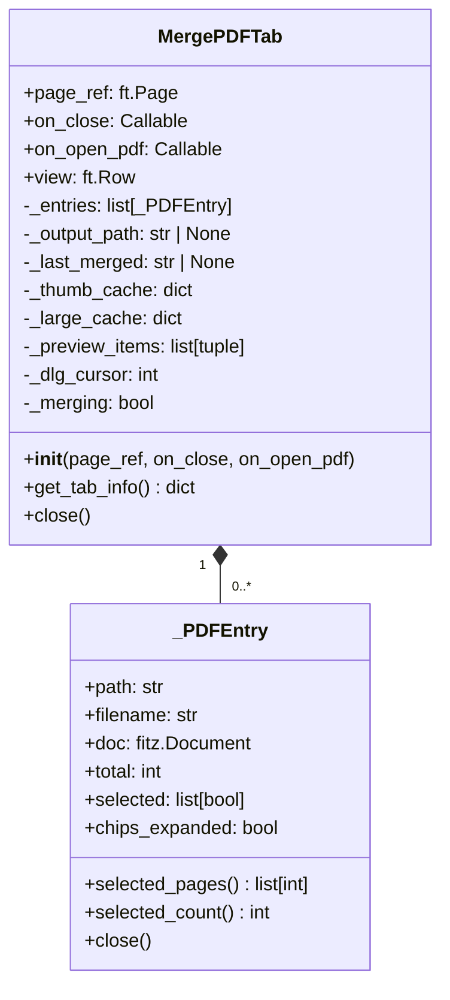
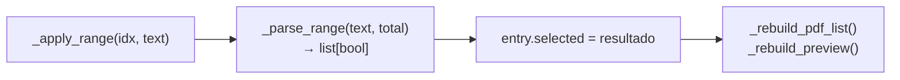
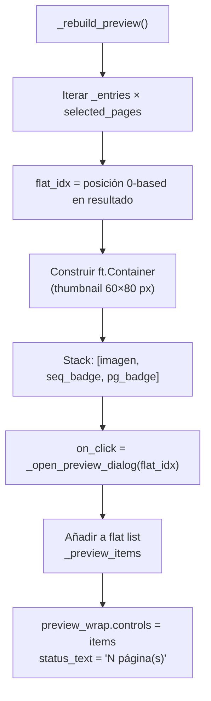
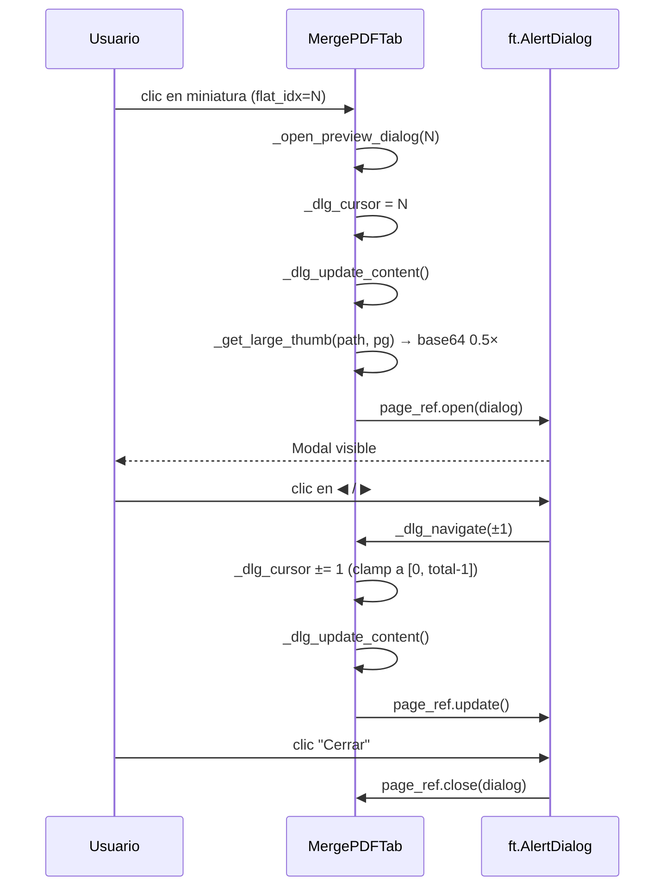
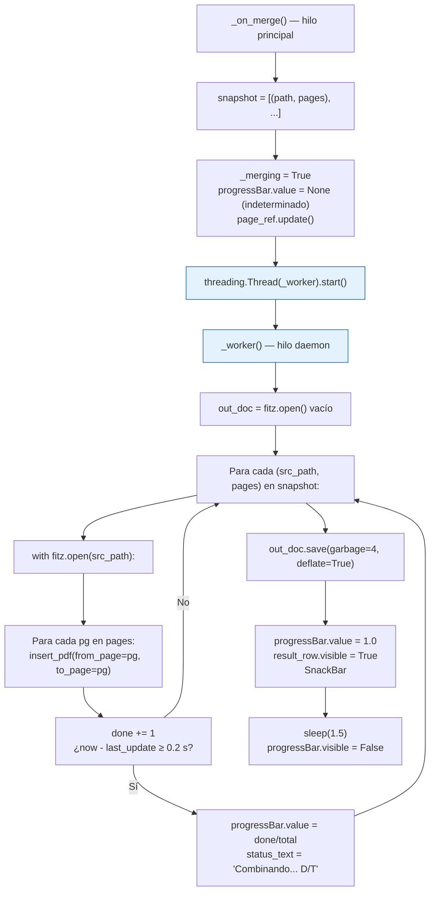

# Módulo Combinar PDFs — Arquitectura y funcionamiento

## Índice

1. [Visión general](#1-visión-general)
2. [Estructura de clases](#2-estructura-de-clases)
3. [Flujo completo: desde agregar PDFs hasta guardar](#3-flujo-completo-desde-agregar-pdfs-hasta-guardar)
4. [Selección de páginas](#4-selección-de-páginas)
5. [Caché de miniaturas](#5-caché-de-miniaturas)
6. [Panel de vista previa del resultado](#6-panel-de-vista-previa-del-resultado)
7. [Lightbox de vista previa](#7-lightbox-de-vista-previa)
8. [Operación de combinación](#8-operación-de-combinación)
9. [Variables de estado principales](#9-variables-de-estado-principales)

---

## 1. Visión general

El módulo `pdf_merge` implementa una pestaña singleton que permite combinar múltiples PDFs con control granular de qué páginas incluir y en qué orden.

| Capa | Tecnología | Responsabilidad |
|------|-----------|-----------------|
| UI | Flet / Flutter | Panel izquierdo (lista de PDFs), panel derecho (vista previa), diálogo lightbox |
| Renderizado | PyMuPDF (`fitz`) | Miniaturas 0.25× para chips/grid; miniaturas 0.5× para lightbox |
| Combinación | PyMuPDF (`fitz`) | `insert_pdf` página a página con progreso en tiempo real |

**Constantes clave:**

```
_CHIPS_PREVIEW = 30    # Páginas visibles por defecto en el chip grid
_CHIPS_MAX     = 120   # Máximo de chips que se muestran (expandido)
Escala thumbnail: 0.25× (chips/grid),  0.5× (lightbox)
```

---

## 2. Estructura de clases



`_PDFEntry` mantiene el documento abierto mientras la entrada está en la lista; `close()` lo libera cuando se quita o cuando se cierra la pestaña.

---

## 3. Flujo completo: desde agregar PDFs hasta guardar

```mermaid
flowchart TD
    A([Usuario hace clic en\n"Agregar PDF"]) --> B["FilePicker.pick_files()\nallow_multiple=True"]
    B --> C["_on_pdfs_picked(e)"]
    C --> D{¿Ruta ya\nen _entries?}
    D -- Sí --> E[Ignorar duplicado]
    D -- No --> F["_PDFEntry(path)\nfitz.open(path)\nselected = [True] * total"]
    F --> G{¿_output_path\nes None?}
    G -- Sí --> H["Auto-sugerir:\ndirectorio_del_pdf/combinado.pdf"]
    G -- No --> I
    H --> I["_entries.append(entry)"]
    I --> J["_rebuild_pdf_list()\n_rebuild_preview()"]
    J --> K([Usuario ajusta\nselección de páginas])
    K --> L["_toggle_page() /\n_select_all_pages() /\n_invert_pages() /\n_apply_range()"]
    L --> J
    K --> M([Usuario reordena PDFs])
    M --> N["_move_entry(idx, delta)\nSwap en _entries"]
    N --> J
    K --> O([Usuario hace clic\n"Combinar y guardar"])
    O --> P["_on_merge()"]
    P --> Q{¿output_path\ndefinido?}
    Q -- No --> R["Abrir FilePicker\nde guardado"]
    Q -- Sí --> S["Validar: salida ≠ entrada"]
    S --> T["Snapshot inmutable:\n[(path, [pages])...]"]
    T --> U["Hilo background:\n_worker()"]
    U --> V["fitz.open() vacío\nPor cada (src, pages):\n  insert_pdf(pg a pg)"]
    V --> W["Actualizar progreso UI\ncada 0.2 s"]
    W --> X["out_doc.save(garbage=4, deflate=True)"]
    X --> Y(["PDF guardado\nBanner + Snackbar"])

    style A fill:#E8F5E9,stroke:#2E7D32
    style Y fill:#E8F5E9,stroke:#2E7D32
    style U fill:#E3F2FD,stroke:#1565C0
```

---

## 4. Selección de páginas

### Modos de selección por entrada

Cada `_PDFEntry` expone un array `selected: list[bool]` con un elemento por página. Las cuatro operaciones disponibles en la cabecera de cada tarjeta de PDF son:

| Acción | Método | Efecto |
|--------|--------|--------|
| Todas | `_select_all_pages(idx, True)` | `selected = [True] * total` |
| Ninguna | `_select_all_pages(idx, False)` | `selected = [False] * total` |
| Invertir | `_invert_pages(idx)` | `selected = [not s for s in selected]` |
| Chip individual | `_toggle_page(idx, pg)` | `selected[pg] ^= True` |

### Campo de rango de páginas

Acepta la notación `"1-5, 8, 10-15"` (o puntos y coma como separadores). Se aplica al perder el foco o al presionar Enter.



**Conversión inversa** (`_selection_to_range`): cuando se reconstruye la tarjeta, el campo muestra el rango compacto equivalente a la selección actual (p. ej. `[T,T,T,F,T]` → `"1-3, 5"`).

### Chip grid

```
_CHIPS_PREVIEW = 30  → se muestran los primeros 30 chips por defecto
_CHIPS_MAX     = 120 → al expandir se muestran hasta 120
> 120 páginas        → mensaje informando usar el campo de rango
```

Las miniaturas se cargan en un hilo background (`_render_thumbs_async`); mientras no están listas se muestra un placeholder gris.

**Visual de cada chip:**

```
┌────────────────┐
│   [thumbnail]  │   ← imagen o placeholder
│  [overlay tint]│   ← azul semitransparente (seleccionado)
│                │     negro 40% (excluido)
│ [núm. de página│   ← badge negro semitransparente, parte inferior
└────────────────┘
Borde azul primario = seleccionado
Borde gris = no incluido
```

---

## 5. Caché de miniaturas

El módulo mantiene dos cachés independientes, ambas de tipo `dict[tuple[str, int], str]` donde la clave es `(ruta_archivo, índice_página_0based)` y el valor es un PNG codificado en base64:

| Caché | Escala | Uso |
|-------|--------|-----|
| `_thumb_cache` | 0.25× | Chips de selección y grid de vista previa |
| `_large_cache` | 0.5× | Imagen ampliada en el lightbox |

Ambas cachés se limpian completamente en `close()` y en `_clear_all()`. Al quitar un PDF individual (`_remove_entry`), solo se eliminan las entradas de esa ruta de `_thumb_cache`.

---

## 6. Panel de vista previa del resultado

El panel derecho muestra una cuadrícula de todas las páginas que se incluirán en el PDF de salida, en el orden exacto en que aparecerán.



**Badges en cada miniatura de la cuadrícula:**

```
┌─────────────┬──┐
│             │ N│  ← seq_badge (negro): posición en el resultado (1-based)
│ [thumbnail] │  │
│             │  │
├──┐          │  │
│pX│          │  │  ← pg_badge (azul): número de página original (1-based)
└──┴──────────┴──┘
```

`_preview_items: list[tuple[_PDFEntry, int]]` es la única fuente de verdad para la navegación del lightbox; se sincroniza en cada llamada a `_rebuild_preview()`.

---

## 7. Lightbox de vista previa

Al hacer clic sobre cualquier miniatura de la cuadrícula de vista previa se abre un `ft.AlertDialog` modal con una imagen ampliada (0.5×) y controles de navegación.



**Contenido del diálogo:**

```
┌──────────────────────────────────┐
│  🔍 Vista previa                 │
├──────────────────────────────────┤
│  ┌────────────────────────────┐  │
│  │     imagen 300 × 420 px    │  │
│  └────────────────────────────┘  │
│        ◀   3 / 12   ▶           │
│  ─────────────────────────────   │
│  nombre_archivo.pdf              │
│  Página original: 7 de 24        │
│  Posición en resultado: 3 de 12  │
└──────────────────────────────────┘
                          [Cerrar]
```

Los botones ◀ / ▶ se deshabilitan automáticamente al llegar al primer o último elemento.

---

## 8. Operación de combinación

### Pre-validaciones

1. `_output_path` debe estar definido (si no, se abre el selector de archivo).
2. Al menos una página debe estar seleccionada.
3. La ruta de salida no puede coincidir con la ruta de ningún archivo de entrada (comparación con `Path.resolve()`).

### Ejecución en background



**Parámetros de guardado:**

| Parámetro | Valor | Efecto |
|-----------|-------|--------|
| `garbage` | 4 | Limpieza máxima de objetos no referenciados |
| `deflate` | True | Compresión de streams — reduce tamaño del archivo |

El snapshot se toma antes de lanzar el hilo, por lo que cambios en la UI durante la combinación no afectan el resultado.

---

## 9. Variables de estado principales

```python
self._entries: list[_PDFEntry]           # PDFs agregados, en orden de combinación
self._output_path: str | None            # Ruta destino del PDF resultado
self._last_merged: str | None            # Ruta del último PDF guardado exitosamente
self._merging: bool                      # True mientras la combinación está en curso

# Caché de imágenes
self._thumb_cache: dict[tuple[str,int], str]   # Miniaturas 0.25× (chips y grid)
self._large_cache: dict[tuple[str,int], str]   # Miniaturas 0.5× (lightbox)

# Vista previa y lightbox
self._preview_items: list[tuple[_PDFEntry, int]]  # (entrada, página_original) por posición resultado
self._dlg_cursor: int                             # Índice activo en el lightbox

# Controles UI (refs)
self._pdf_col: ft.Column          # Lista de tarjetas de PDF (panel izquierdo)
self._preview_wrap: ft.Row        # Grid de miniaturas del resultado
self._preview_empty: ft.Container # Placeholder cuando no hay páginas
self._status_text: ft.Text        # "N página(s)" / "Combinando..." / "Completado"
self._output_label: ft.Text       # Muestra la ruta de salida seleccionada
self._merge_btn: ft.ElevatedButton# Botón "Combinar N páginas" (disabled si merging o 0 págs)
self._result_row: ft.Container    # Banner verde con "Abrir" tras merge exitoso
self._progress_bar: ft.ProgressBar# Indeterminado durante init, 0-1 durante merge

# Lightbox
self._dialog: ft.AlertDialog
self._dlg_img: ft.Image
self._dlg_nav: ft.Text            # "N / Total"
self._dlg_info: ft.Column         # [filename, página original, posición resultado]
self._dlg_prev: ft.IconButton     # ◀
self._dlg_next: ft.IconButton     # ▶
```
