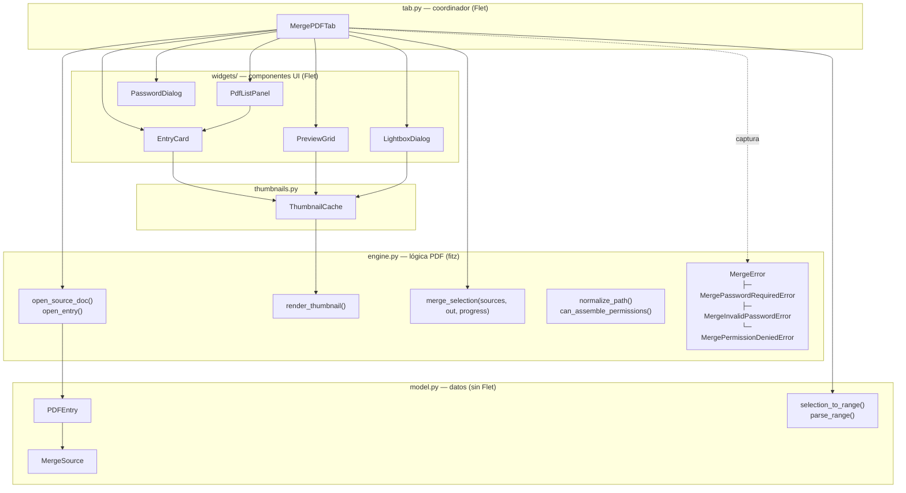
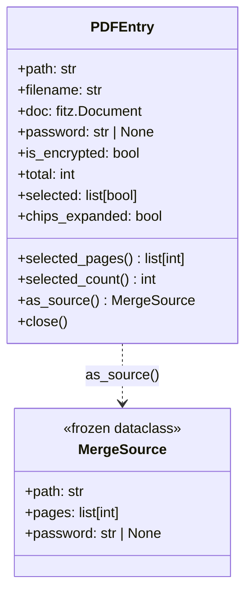
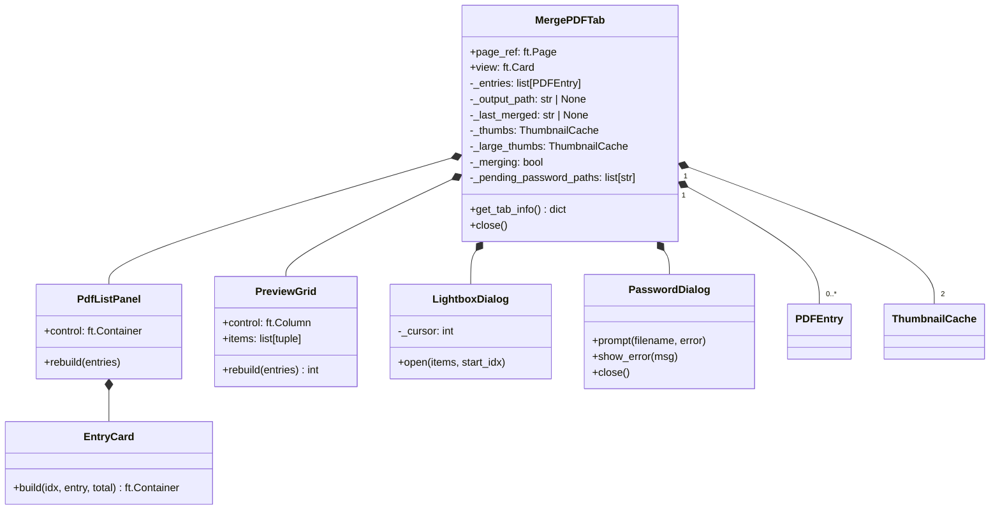
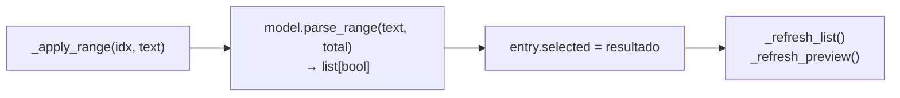
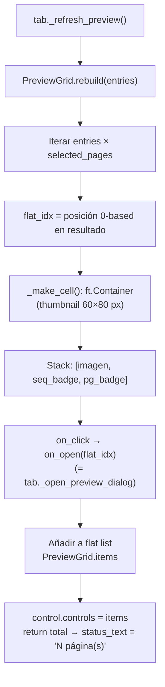
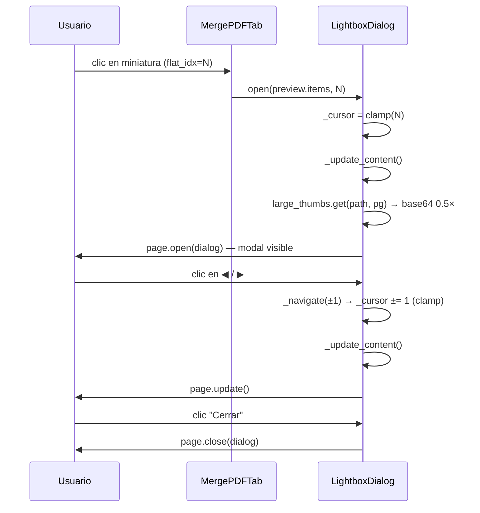
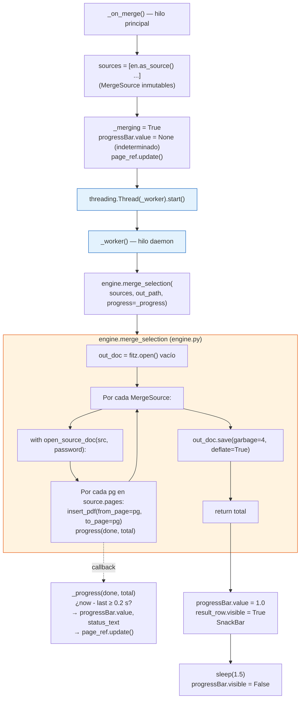

# Módulo Combinar PDFs — Arquitectura y funcionamiento

## Índice

1. [Visión general](#1-visión-general)
2. [Estructura de archivos y clases](#2-estructura-de-archivos-y-clases)
3. [Flujo completo: desde agregar PDFs hasta guardar](#3-flujo-completo-desde-agregar-pdfs-hasta-guardar)
4. [Selección de páginas](#4-selección-de-páginas)
5. [Caché de miniaturas](#5-caché-de-miniaturas)
6. [Panel de vista previa del resultado](#6-panel-de-vista-previa-del-resultado)
7. [Lightbox de vista previa](#7-lightbox-de-vista-previa)
8. [Operación de combinación](#8-operación-de-combinación)
9. [Variables de estado principales](#9-variables-de-estado-principales)

---

## 1. Visión general

El módulo `pdf_merge` implementa una pestaña singleton que permite combinar múltiples PDFs con control granular de qué páginas incluir y en qué orden.

La responsabilidad está **separada por capas**: la lógica de PDF nunca importa Flet, la UI nunca toca `fitz` directamente, y la UI a su vez se descompone en componentes enfocados. Esto deja la lógica (rangos, apertura/autenticación, render y combinación) testeable sin instanciar la interfaz, y cada pieza visual aislada en su propia clase.

| Capa | Archivo(s) | Tecnología | Responsabilidad |
|------|-----------|-----------|-----------------|
| Datos | `model.py` | `fitz` (solo tipos) | `PDFEntry` (estado de selección por PDF), `MergeSource` (snapshot inmutable), helpers de rango ↔ selección |
| Lógica PDF | `engine.py` | PyMuPDF (`fitz`) | Apertura/autenticación, permisos de ensamblaje, render de miniaturas, combinación página a página |
| Caché | `thumbnails.py` | — | `ThumbnailCache`: caché thread-safe de miniaturas base64 a una escala fija |
| Componentes UI | `widgets/` | Flet / Flutter | Cada clase construye y posee un trozo del árbol de widgets: `EntryCard`, `PdfListPanel`, `PreviewGrid`, `LightboxDialog`, `PasswordDialog` |
| Coordinador | `tab.py` | Flet / Flutter | `MergePDFTab`: posee el estado compartido, los file pickers y el worker de combinación; ensambla los componentes y los conecta por callbacks |

**Constantes clave:**

```
# widgets/entry_card.py
_CHIPS_PREVIEW = 30     # Páginas visibles por defecto en el chip grid
_CHIPS_MAX     = 120    # Máximo de chips que se muestran (expandido)

# tab.py
_THUMB_SCALE   = 0.25   # Miniaturas de chips / grid de vista previa
_LARGE_SCALE   = 0.5    # Miniaturas del lightbox
```

---

## 2. Estructura de archivos y clases


```mermaid
flowchart TD
    subgraph COORD["tab.py — coordinador (Flet)"]
        MT["MergePDFTab"]
    end
    subgraph WIDGETS["widgets/ — componentes UI (Flet)"]
        W1["EntryCard"]
        W2["PdfListPanel"]
        W3["PreviewGrid"]
        W4["LightboxDialog"]
        W5["PasswordDialog"]
    end
    subgraph CACHE["thumbnails.py"]
        TC["ThumbnailCache"]
    end
    subgraph ENGINE["engine.py — lógica PDF (fitz)"]
        E1["open_source_doc()\nopen_entry()"]
        E2["render_thumbnail()"]
        E3["merge_selection(sources, out, progress)"]
        E4["normalize_path()\ncan_assemble_permissions()"]
        EX["MergeError\n├─ MergePasswordRequiredError\n├─ MergeInvalidPasswordError\n└─ MergePermissionDeniedError"]
    end
    subgraph MODEL["model.py — datos (sin Flet)"]
        PE["PDFEntry"]
        MS["MergeSource"]
        RH["selection_to_range()\nparse_range()"]
    end

    MT --> W1 & W2 & W3 & W4 & W5
    MT --> E1
    MT --> E3
    MT --> RH
    W2 --> W1
    W1 --> TC
    W3 --> TC
    W4 --> TC
    TC --> E2
    E1 --> PE
    PE --> MS
    MT -.captura.-> EX
```

**Reglas de dependencia:**

- `model.py` no importa nada del paquete (hoja).
- `engine.py` importa `model` (devuelve `PDFEntry` / consume `MergeSource`); lanza las excepciones `Merge*`.
- `thumbnails.py` importa `engine` (`render_thumbnail`).
- `widgets/` importa `model` y `thumbnails`; **construye widgets y delega acciones por callbacks** — no contiene lógica de negocio ni toca `engine` directamente (salvo tipos).
- `tab.py` importa todo lo anterior, posee el estado y traduce resultados/excepciones a snackbars/diálogos. **Ningún módulo de lógica (`model`, `engine`, `thumbnails`) importa `flet`.**

### Modelo de datos (`model.py`)


```mermaid
classDiagram
    class PDFEntry {
        +path: str
        +filename: str
        +doc: fitz.Document
        +password: str | None
        +is_encrypted: bool
        +total: int
        +selected: list[bool]
        +chips_expanded: bool
        +selected_pages() list[int]
        +selected_count() int
        +as_source() MergeSource
        +close()
    }

    class MergeSource {
        <<frozen dataclass>>
        +path: str
        +pages: list[int]
        +password: str | None
    }

    PDFEntry ..> MergeSource : as_source()
```

`PDFEntry` mantiene el documento abierto mientras la entrada está en la lista; `close()` lo libera cuando se quita o cuando se cierra la pestaña. `as_source()` produce un `MergeSource` inmutable: el snapshot que consume la combinación, de modo que cambios en la UI durante el merge no afectan el resultado.

### Coordinador y componentes (`tab.py` + `widgets/`)


```mermaid
classDiagram
    class MergePDFTab {
        +page_ref: ft.Page
        +view: ft.Card
        -_entries: list[PDFEntry]
        -_output_path: str | None
        -_last_merged: str | None
        -_thumbs: ThumbnailCache
        -_large_thumbs: ThumbnailCache
        -_merging: bool
        -_pending_password_paths: list[str]
        +get_tab_info() dict
        +close()
    }

    class PdfListPanel {
        +control: ft.Container
        +rebuild(entries)
    }
    class EntryCard {
        +build(idx, entry, total) ft.Container
    }
    class PreviewGrid {
        +control: ft.Column
        +items: list[tuple]
        +rebuild(entries) int
    }
    class LightboxDialog {
        -_cursor: int
        +open(items, start_idx)
    }
    class PasswordDialog {
        +prompt(filename, error)
        +show_error(msg)
        +close()
    }

    MergePDFTab "1" *-- "0..*" PDFEntry
    MergePDFTab "1" *-- "2" ThumbnailCache
    MergePDFTab *-- PdfListPanel
    MergePDFTab *-- PreviewGrid
    MergePDFTab *-- LightboxDialog
    MergePDFTab *-- PasswordDialog
    PdfListPanel *-- EntryCard
```

Cada componente **construye y posee su subárbol de widgets** y recibe del coordinador las acciones como callbacks (`on_toggle_page`, `on_open`, `on_confirm`…). El estado compartido (entradas, cachés, ruta de salida, flag de combinación, cola de contraseñas) vive solo en `MergePDFTab`.

| Componente | Archivo | Posee | Refresca con |
|-----------|---------|-------|--------------|
| `PdfListPanel` | `widgets/pdf_list.py` | Panel izquierdo + columna de tarjetas | `rebuild(entries)` |
| `EntryCard` | `widgets/entry_card.py` | *Builder* de una tarjeta de PDF (chips, rango, acciones) | `build(idx, entry, total)` |
| `PreviewGrid` | `widgets/preview_grid.py` | Grid del resultado; expone `items` para el lightbox | `rebuild(entries) → total` |
| `LightboxDialog` | `widgets/lightbox.py` | Diálogo modal de vista ampliada | `open(items, idx)` |
| `PasswordDialog` | `widgets/password_dialog.py` | Diálogo de contraseña (solo widget) | `prompt(filename, error)` |

`EntryCard` y `PdfListPanel` son *builders* puros (no necesitan `ft.Page`); `LightboxDialog` y `PasswordDialog` reciben `page` para abrir/cerrar/actualizar.

---

## 3. Flujo completo: desde agregar PDFs hasta guardar

```mermaid
flowchart TD
    A([Usuario hace clic en\n"Agregar"]) --> B["FilePicker.pick_files()\nallow_multiple=True"]
    B --> C["_on_pdfs_picked(e)"]
    C --> D{¿Ruta ya\nen _entries?}
    D -- Sí --> E[Ignorar duplicado]
    D -- No --> F["engine.open_entry(path)\n→ PDFEntry"]
    F --> G{¿_output_path\nes None?}
    G -- Sí --> H["_suggest_output_path():\ndirectorio_del_pdf/combinado.pdf"]
    G -- No --> I
    H --> I["_entries.append(entry)"]
    F -. PDF protegido .-> PWD["MergePasswordRequiredError\n→ encolar en _pending_password_paths\n→ diálogo de contraseña"]
    I --> J["_refresh_list()\n_refresh_preview()"]
    J --> K([Usuario ajusta\nselección de páginas])
    K --> L["_toggle_page() /\n_select_all_pages() /\n_invert_pages() /\n_apply_range()"]
    L --> J
    K --> M([Usuario reordena PDFs])
    M --> N["_move_entry(idx, delta)\nSwap en _entries"]
    N --> J
    K --> O([Usuario hace clic\n"Combinar y guardar"])
    O --> P["_on_merge()"]
    P --> Q{¿output_path\ndefinido?}
    Q -- No --> R["Abrir FilePicker\nde guardado"]
    Q -- Sí --> S["Validar: salida ≠ entrada"]
    S --> T["sources = [en.as_source() ...]\n(snapshot inmutable)"]
    T --> U["Hilo background:\n_worker()"]
    U --> V["engine.merge_selection(\nsources, out_path, progress=cb)"]
    V --> W["cb(done, total) → UI\ncada 0.2 s"]
    W --> X(["PDF guardado\nBanner + Snackbar"])

    style A fill:#E8F5E9,stroke:#2E7D32
    style X fill:#E8F5E9,stroke:#2E7D32
    style U fill:#E3F2FD,stroke:#1565C0
```

### PDFs protegidos

`engine.open_entry()` (que envuelve `engine.open_source_doc(enforce_permissions=True)`) puede lanzar:

| Excepción | Causa | Manejo en `tab.py` |
|-----------|-------|--------------------|
| `MergePasswordRequiredError` | PDF cifrado sin contraseña | Se encola en `_pending_password_paths` y se abre el diálogo de contraseña |
| `MergeInvalidPasswordError` | Contraseña incorrecta | Reintenta el diálogo con mensaje de error |
| `MergePermissionDeniedError` | El PDF no permite ensamblaje | Snackbar sugiriendo usar el módulo Seguridad |

El diálogo de contraseña permite **Cancelar**, **Ir a Seguridad** (`on_open_security`) o **Agregar** con la contraseña ingresada (`_confirm_add_protected_pdf`).

---

## 4. Selección de páginas

### Modos de selección por entrada

Cada `PDFEntry` expone un array `selected: list[bool]` con un elemento por página. Las cuatro operaciones disponibles en la cabecera de cada tarjeta de PDF son:

| Acción | Método (`tab.py`) | Efecto |
|--------|-------------------|--------|
| Todas | `_select_all_pages(idx, True)` | `selected = [True] * total` |
| Ninguna | `_select_all_pages(idx, False)` | `selected = [False] * total` |
| Invertir | `_invert_pages(idx)` | `selected = [not s for s in selected]` |
| Chip individual | `_toggle_page(idx, pg)` | `selected[pg] ^= True` |

### Campo de rango de páginas

Acepta la notación `"1-5, 8, 10-15"` (o puntos y coma como separadores). Se aplica al perder el foco o al presionar Enter. La conversión la realizan funciones puras de `model.py`:


```mermaid
flowchart LR
    A["_apply_range(idx, text)"] --> B["model.parse_range(text, total)\n→ list[bool]"]
    B --> C["entry.selected = resultado"]
    C --> D["_refresh_list()\n_refresh_preview()"]
```

**Conversión inversa** (`model.selection_to_range`): cuando se reconstruye la tarjeta, el campo muestra el rango compacto equivalente a la selección actual (p. ej. `[T,T,T,F,T]` → `"1-3, 5"`).

### Chip grid

```
_CHIPS_PREVIEW = 30  → se muestran los primeros 30 chips por defecto
_CHIPS_MAX     = 120 → al expandir se muestran hasta 120
> 120 páginas        → mensaje informando usar el campo de rango
```

Las miniaturas se cargan en un hilo background (`_render_thumbs_async`); mientras no están listas se muestra un placeholder gris.

**Visual de cada chip:**

```
┌────────────────┐
│   [thumbnail]  │   ← imagen o placeholder
│  [overlay tint]│   ← azul semitransparente (seleccionado)
│                │     negro 40% (excluido)
│ [núm. de página│   ← badge negro semitransparente, parte inferior
└────────────────┘
Borde azul primario = seleccionado
Borde gris = no incluido
```

---

## 5. Caché de miniaturas

La caché está encapsulada en la clase `ThumbnailCache` (`thumbnails.py`). El renderizado real de cada página lo hace `engine.render_thumbnail(path, page, scale, password)`, que devuelve un PNG codificado en base64 (sin imponer permisos — las miniaturas son solo de visualización).

`MergePDFTab` mantiene **dos instancias** de `ThumbnailCache`, una por escala:

| Atributo | Escala | Uso |
|----------|--------|-----|
| `self._thumbs` | `0.25×` | Chips de selección y grid de vista previa |
| `self._large_thumbs` | `0.5×` | Imagen ampliada en el lightbox |

Cada `ThumbnailCache` guarda internamente `dict[tuple[str, int], str]` (clave `(ruta, página_0based)` → PNG base64) protegido por un `threading.Lock`, y expone:

| Método | Efecto |
|--------|--------|
| `get(path, page, password)` | Devuelve la miniatura, renderizándola y cacheándola si falta |
| `has(path, page)` | True si ya está en caché (usado por `_render_thumbs_async` para evitar trabajo duplicado) |
| `prune_path(path)` | Elimina todas las entradas de una ruta (al quitar un PDF con `_remove_entry`) |
| `clear()` | Vacía la caché (en `close()` y `_clear_all()`) |

---

## 6. Panel de vista previa del resultado

El panel derecho muestra una cuadrícula de todas las páginas que se incluirán en el PDF de salida, en el orden exacto en que aparecerán. Lo gestiona el componente **`PreviewGrid`** (`widgets/preview_grid.py`): el coordinador llama a `PreviewGrid.rebuild(entries)`, que devuelve el total de páginas (usado para el `status_text`).


```mermaid
flowchart TD
    A["tab._refresh_preview()"] --> A2["PreviewGrid.rebuild(entries)"]
    A2 --> B["Iterar entries × selected_pages"]
    B --> C["flat_idx = posición 0-based en resultado"]
    C --> D["_make_cell(): ft.Container\n(thumbnail 60×80 px)"]
    D --> E["Stack: [imagen, seq_badge, pg_badge]"]
    E --> F["on_click → on_open(flat_idx)\n(= tab._open_preview_dialog)"]
    F --> G["Añadir a flat list\nPreviewGrid.items"]
    G --> H["control.controls = items\nreturn total → status_text = 'N página(s)'"]
```

**Badges en cada miniatura de la cuadrícula:**

```
┌─────────────┬──┐
│             │ N│  ← seq_badge (negro): posición en el resultado (1-based)
│ [thumbnail] │  │
│             │  │
├──┐          │  │
│pX│          │  │  ← pg_badge (azul): número de página original (1-based)
└──┴──────────┴──┘
```

`PreviewGrid.items: list[tuple[PDFEntry, int]]` es la única fuente de verdad para la navegación del lightbox; se reconstruye en cada `rebuild()`. El coordinador lo pasa al lightbox al abrirlo: `self._lightbox.open(self._preview.items, flat_idx)`.

---

## 7. Lightbox de vista previa

Al hacer clic sobre cualquier miniatura de la cuadrícula de vista previa se abre el componente **`LightboxDialog`** (`widgets/lightbox.py`): un `ft.AlertDialog` modal con una imagen ampliada (0.5×) y controles de navegación. El componente posee su propio cursor (`_cursor`) y la lista de items que recibe al abrirse.


```mermaid
sequenceDiagram
    participant U as Usuario
    participant Tab as MergePDFTab
    participant LB as LightboxDialog

    U->>Tab: clic en miniatura (flat_idx=N)
    Tab->>LB: open(preview.items, N)
    LB->>LB: _cursor = clamp(N)
    LB->>LB: _update_content()
    LB->>LB: large_thumbs.get(path, pg) → base64 0.5×
    LB->>U: page.open(dialog) — modal visible

    U->>LB: clic en ◀ / ▶
    LB->>LB: _navigate(±1) → _cursor ±= 1 (clamp)
    LB->>LB: _update_content()
    LB->>U: page.update()

    U->>LB: clic "Cerrar"
    LB->>U: page.close(dialog)
```

**Contenido del diálogo:**

```
┌──────────────────────────────────┐
│  🔍 Vista previa                 │
├──────────────────────────────────┤
│  ┌────────────────────────────┐  │
│  │     imagen 300 × 420 px    │  │
│  └────────────────────────────┘  │
│        ◀   3 / 12   ▶           │
│  ─────────────────────────────   │
│  nombre_archivo.pdf              │
│  Página original: 7 de 24        │
│  Posición en resultado: 3 de 12  │
└──────────────────────────────────┘
                          [Cerrar]
```

Los botones ◀ / ▶ se deshabilitan automáticamente al llegar al primer o último elemento.

---

## 8. Operación de combinación

### Pre-validaciones (`_on_merge`, hilo principal)

1. `_output_path` debe estar definido (si no, se abre el selector de archivo).
2. Al menos una página debe estar seleccionada.
3. La ruta de salida no puede coincidir con la ruta de ningún archivo de entrada (comparación con `Path.resolve()`).

### Separación UI / lógica

La combinación real vive en `engine.merge_selection(sources, out_path, progress)` — **sin Flet**. La pestaña le pasa un snapshot inmutable y un callback de progreso; el motor llama a `progress(done, total)` tras insertar cada página y la UI decide con qué frecuencia repintar (throttle de 0.2 s).


```mermaid
flowchart TD
    A["_on_merge() — hilo principal"] --> B["sources = [en.as_source() ...]\n(MergeSource inmutables)"]
    B --> C["_merging = True\nprogressBar.value = None (indeterminado)\npage_ref.update()"]
    C --> D["threading.Thread(_worker).start()"]

    D --> E["_worker() — hilo daemon"]
    E --> F["engine.merge_selection(\nsources, out_path, progress=_progress)"]

    subgraph ENG["engine.merge_selection (engine.py)"]
        F1["out_doc = fitz.open() vacío"] --> F2["Por cada MergeSource:"]
        F2 --> F3["with open_source_doc(src, password):"]
        F3 --> F4["Por cada pg en source.pages:\n  insert_pdf(from_page=pg, to_page=pg)\n  progress(done, total)"]
        F4 --> F2
        F2 --> F5["out_doc.save(garbage=4, deflate=True)"]
        F5 --> F6["return total"]
    end

    F --> ENG
    F4 -. callback .-> P["_progress(done, total)\n¿now - last ≥ 0.2 s?\n→ progressBar.value, status_text\n→ page_ref.update()"]
    F6 --> G["progressBar.value = 1.0\nresult_row.visible = True\nSnackBar"]
    G --> H["sleep(1.5)\nprogressBar.visible = False"]

    style D fill:#E3F2FD,stroke:#1565C0
    style E fill:#E3F2FD,stroke:#1565C0
    style ENG fill:#FFF3E0,stroke:#E65100
```

**Parámetros de guardado** (en `engine.merge_selection`):

| Parámetro | Valor | Efecto |
|-----------|-------|--------|
| `garbage` | 4 | Limpieza máxima de objetos no referenciados |
| `deflate` | True | Compresión de streams — reduce tamaño del archivo |

El snapshot (`sources`) se toma antes de lanzar el hilo, por lo que cambios en la UI durante la combinación no afectan el resultado. Si `merge_selection` lanza una excepción (p. ej. permisos o contraseña que cambió), `_worker` la captura y muestra un snackbar de error.

---

## 9. Variables de estado principales

### `PDFEntry` (`model.py`) — una por PDF agregado

```python
entry.path: str               # Ruta normalizada (absoluta)
entry.filename: str           # Nombre para mostrar
entry.doc: fitz.Document      # Documento abierto (se cierra en close())
entry.password: str | None    # Contraseña usada al abrir (None si no cifrado)
entry.total: int              # Número de páginas
entry.selected: list[bool]    # Selección por página
entry.chips_expanded: bool    # Si el chip grid muestra > _CHIPS_PREVIEW
```

### `MergePDFTab` (`tab.py`) — coordinador

El coordinador posee **solo el estado compartido y los controles del panel derecho ligados a la combinación**. Toda la UI de la lista, vista previa y diálogos vive en los componentes.

```python
# Estado compartido
self._entries: list[PDFEntry]            # PDFs agregados, en orden de combinación
self._output_path: str | None            # Ruta destino del PDF resultado
self._last_merged: str | None            # Ruta del último PDF guardado exitosamente
self._merging: bool                      # True mientras la combinación está en curso
self._pending_password_paths: list[str]  # Cola de PDFs protegidos por desbloquear

# Caché de imágenes (instancias de ThumbnailCache)
self._thumbs: ThumbnailCache             # Miniaturas 0.25× (chips y grid)
self._large_thumbs: ThumbnailCache       # Miniaturas 0.5× (lightbox)

# Componentes UI
self._pdf_list: PdfListPanel             # Panel izquierdo + tarjetas (usa un EntryCard)
self._preview: PreviewGrid               # Grid del resultado (.items, .rebuild)
self._lightbox: LightboxDialog           # Diálogo de vista ampliada
self._pwd: PasswordDialog                # Diálogo de contraseña

# Controles del panel derecho ligados a la combinación (refs)
self._status_text: ft.Text        # "N página(s)" / "Combinando..." / "Completado"
self._output_label: ft.Text       # Muestra la ruta de salida seleccionada
self._merge_btn: ft.ElevatedButton# Botón "Combinar N páginas" (disabled si merging o 0 págs)
self._result_row: ft.Container    # Banner verde con "Abrir" tras merge exitoso
self._progress_bar: ft.ProgressBar# Indeterminado durante init, 0-1 durante merge

# File pickers
self._pick_pdfs: ft.FilePicker    # Selección de PDFs de entrada
self._save_picker: ft.FilePicker  # Selección de ruta de salida
```

### Estado interno de los componentes (`widgets/`)

```python
# PreviewGrid
self.items: list[tuple[PDFEntry, int]]   # (entrada, página_original) por posición resultado

# LightboxDialog
self._items: list[tuple[PDFEntry, int]]  # snapshot recibido en open()
self._cursor: int                        # índice activo en el lightbox

# PasswordDialog
self._field: ft.TextField                # campo de contraseña
self._error: ft.Text                     # mensaje de error
```
