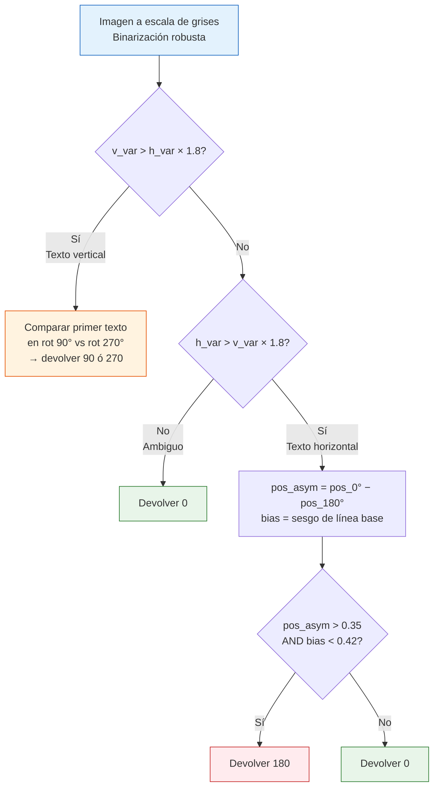

# Corrección de orientación de páginas

## Índice

1. [Visión general](#1-visión-general)
2. [Clasificación de documentos](#2-clasificación-de-documentos)
3. [Detección manual — botón «Corregir orientación»](#3-detección-manual--botón-corregir-orientación)
4. [Detección automática al abrir](#4-detección-automática-al-abrir)
5. [Algoritmos de detección](#5-algoritmos-de-detección)
   - 5.1 [Vectores de dirección de texto (páginas nativas)](#51-vectores-de-dirección-de-texto-páginas-nativas)
   - 5.2 [Varianza de perfiles (páginas escaneadas, 90°/270°)](#52-varianza-de-perfiles-páginas-escaneadas-90270)
   - 5.3 [Clasificador MobileNetV3 (páginas escaneadas, 0°/180°)](#53-clasificador-mobilenetv3-páginas-escaneadas-0180)
6. [Sistema de coordenadas y la matriz de rotación](#6-sistema-de-coordenadas-y-la-matriz-de-rotación)
7. [Aplicación de la corrección y limpieza de caché](#7-aplicación-de-la-corrección-y-limpieza-de-caché)
8. [Gestión del modelo de ML en memoria](#8-gestión-del-modelo-de-ml-en-memoria)
9. [Archivos y funciones clave](#9-archivos-y-funciones-clave)

---

## 1. Visión general

El visor detecta y corrige automáticamente páginas giradas en documentos PDF. La funcionalidad cubre dos rutas distintas:

| Ruta | Cuándo ocurre | Alcance |
|------|---------------|---------|
| **Automática** (`_auto_detect_orientation`) | Al abrir un documento escaneado | Sondea 5 páginas representativas y, si todas necesitan el mismo giro, lo aplica a todo el documento |
| **Manual** (`_fix_orientation`) | Botón «Corregir orientación» | Analiza cada página individualmente y aplica ángulos independientes (útil en documentos con orientaciones mixtas) |

Ambas rutas usan el mismo conjunto de algoritmos implementados en `OCRProcessor` (`src/pdf_viewer/ocr/processor.py`). El resultado se escribe con `page.set_rotation()` sobre el documento en memoria; los cambios no se guardan en disco hasta que el usuario guarda explícitamente.

---

## 2. Clasificación de documentos

Antes de elegir qué algoritmo de detección aplicar, el sistema clasifica cada página:

```python
# OCRProcessor.page_kind(page) → "native" | "scanned" | "hybrid"
has_text   = bool(page.get_text("text").strip())
has_images = bool(page.get_images(full=True))
```

| `has_text` | `has_images` | Tipo | Algoritmo de orientación |
|-----------|-------------|------|--------------------------|
| ✓ | ✗ | `native` | Vectores de dirección (§ 5.1) |
| ✗ | ✓ | `scanned` | Varianza + clasificador ML (§ 5.2 + 5.3) |
| ✓ | ✓ | `hybrid` | Vectores de dirección (tiene texto extraíble) |
| ✗ | ✗ | `scanned` (fallback) | Varianza + clasificador ML |

> **Regla práctica:** cualquier página con texto extraíble (nativa o híbrida) usa el método basado en vectores de texto; las páginas puramente de imagen usan los métodos basados en píxeles. El punto de decisión es `page_needs_ocr(page)` → `not bool(page.get_text("text").strip())`.

A nivel de documento completo, `get_doc_kind(doc)` muestrea las primeras 20 páginas y devuelve el tipo mayoritario. El resultado se cachea por `doc.name` para evitar re-escaneos.

---

## 3. Detección manual — botón «Corregir orientación»

`_OCRMixin._fix_orientation()` en `_ocr_mixin.py`.

```mermaid
flowchart TD
    BTN([«Corregir orientación»]) --> GUARD{¿Ya en\ncurso?}
    GUARD -- Sí --> SNACK["Mostrar aviso\ny salir"]
    GUARD -- No --> INIT["Mostrar barra de progreso\nLanzar hilo de fondo"]

    INIT --> LOOP["Para cada página p en 0…N-1"]

    LOOP --> PROBE["with _doc_lock:\nprobe_orientation(doc, p)\n→ (imagen_numpy, native_angle)"]

    PROBE --> BRANCH{¿native_angle\nes None?}

    BRANCH -- No\nPágina nativa --> USE_NATIVE["angle = native_angle\n(vectores de dirección)"]

    BRANCH -- Sí\nPágina escaneada --> FAST["score_orientation_fast(imagen)\n→ 0, 90, 180 ó 270"]

    FAST --> FAST_BRANCH{fast_angle\n∈ {90, 270}?}
    FAST_BRANCH -- Sí --> USE_FAST["angle = fast_angle"]
    FAST_BRANCH -- No --> CLASSIF["score_orientation_classifier(imagen)\n→ MobileNetV3\n→ 0, 90, 180 ó 270"]
    CLASSIF --> USE_CLASSIF["angle = classifier_angle"]

    USE_NATIVE --> COLLECT
    USE_FAST --> COLLECT
    USE_CLASSIF --> COLLECT

    COLLECT["Si angle ≠ 0:\ncorrections.append((p, angle))"]

    COLLECT --> NEXT{¿Quedan\npáginas?}
    NEXT -- Sí --> LOOP
    NEXT -- No --> APPLY

    APPLY["with _doc_lock:\npage.set_rotation(\n  (page.rotation + angle) % 360\n)"]

    APPLY --> CACHE["Limpiar cachés\n(render, OCR, texto, censura)"]
    CACHE --> REBUILD["_rebuild_scroll_content()\nRestaurar posición de scroll"]
    REBUILD --> DONE(["«N páginas corregidas.\nGuarda el PDF para conservarlo»"])

    style BTN fill:#E8F5E9,stroke:#2E7D32
    style DONE fill:#E8F5E9,stroke:#2E7D32
    style BRANCH fill:#FFF9C4,stroke:#F9A825
    style FAST_BRANCH fill:#FFF9C4,stroke:#F9A825
```

**Puntos clave de la implementación:**

- El bloque `with self._doc_lock` solo cubre la rasterización de la página (`probe_orientation`), no el procesado de la imagen. Así los workers de render del visor no quedan bloqueados mientras se analiza la orientación.
- Si no se encuentra ninguna corrección, se muestra el mensaje «La orientación de todas las páginas parece correcta» y se sale sin tocar el documento.
- `corrections` es una lista de `(page_index, angle_to_add)`. El ángulo que se suma es siempre 0, 90, 180 ó 270 grados; `(page.rotation + angle) % 360` garantiza que el resultado esté en `[0, 90, 180, 270]`.

---

## 4. Detección automática al abrir

`_OCRMixin._auto_detect_orientation()` en `_ocr_mixin.py`. Se lanza en segundo plano al abrir un documento.

**Condiciones para activarse** (todas deben cumplirse):

1. El documento NO es de tipo `native` — los documentos de texto nativo no se tocan automáticamente para no alterar PDFs bien formados sin que el usuario lo pida.
2. Ninguna página tiene ya `/Rotate ≠ 0` — se interpreta como que el documento fue corregido anteriormente.
3. El documento tiene al menos una página.

**Estrategia de sondeo:**

```python
step = max(1, n // 5)
probe_pages = list(range(0, n, step))[:5]   # hasta 5 páginas equidistantes
```

Se rasteriza solo ese subconjunto de páginas y se detecta el ángulo de cada una. Luego:

| Resultado | Acción |
|-----------|--------|
| Todas las páginas sondadas necesitan el **mismo ángulo** | Aplicar ese ángulo a **todas** las páginas del documento |
| Las páginas sondadas necesitan ángulos **distintos** (orientaciones mixtas) | Corregir solo las páginas sondeadas y mostrar sugerencia de usar «Corregir orientación» |
| Ninguna página necesita corrección | No hacer nada (sin mensaje) |

Para las páginas escaneadas dentro del sondeo automático el flujo usa los mismos métodos de imagen (`score_orientation_fast` + `score_orientation_classifier`) que la detección manual.

---

## 5. Algoritmos de detección

### 5.1 Vectores de dirección de texto (páginas nativas)

`OCRProcessor.detect_orientation_native(page)` — `processor.py`

Este método es la fuente de verdad para cualquier página con texto extraíble. No usa modelos de ML ni analiza píxeles: lee directamente los metadatos de la fuente del PDF.

**Principio:**

`page.get_text("dict")` devuelve cada línea de texto con un campo `dir` = vector unitario `(cos θ, sin θ)` que indica hacia dónde fluye el texto en el **espacio de contenido** (espacio pre-rotación, antes de aplicar `/Rotate`). Multiplicando ese vector por la parte lineal de `page.rotation_matrix` se obtiene la dirección de flujo en pantalla.

```
dirección_pantalla = dir_contenido × parte_lineal(rotation_matrix)
```

> **Caveat de PyMuPDF:** `page.rotation_matrix` es una transformación **afín** — incluye una traslación `(e, f)` que en páginas rotadas no es `(0, 0)`. Aplicar el punto `(dx, dy) * matrix` directamente da un PUNTO desplazado, no un vector. Para extraer solo la rotación hay que restar el origen transformado:
>
> ```python
> origin = fitz.Point(0.0, 0.0) * rm   # traslación de la matriz
> p      = fitz.Point(dx, dy)  * rm    # punto transformado
> vector = (p.x - origin.x, p.y - origin.y)   # solo la rotación
> ```
>
> Es el mismo patrón que usa `_screen_delta_to_page()` en `annotations.py`.

**Ponderación:** cada línea contribuye al vector acumulado con peso = número de caracteres que contiene. Así, un párrafo largo de cuerpo de texto pesa mucho más que un título corto o un número de pie de página.

```python
wx, wy = 0.0, 0.0
for cada línea:
    p = (dir.x, dir.y) * rotation_matrix  # aplicar rotación (sin traslación)
    wx += (p.x - origin.x) * n_chars
    wy += (p.y - origin.y) * n_chars
```

**Tabla de decisión:**

| `wx` dominante | Signo de `wx` | Ángulo devuelto | Significado |
|---------------|---------------|-----------------|-------------|
| `|wx| ≥ |wy|` | `wx ≥ 0` | **0°** — sin corrección | Texto fluye a la derecha en pantalla |
| `|wx| ≥ |wy|` | `wx < 0` | **180°** | Texto fluye a la izquierda (invertido) |
| `|wy| > |wx|` | `wy < 0` | **90°** | Texto sube en pantalla |
| `|wy| > |wx|` | `wy ≥ 0` | **270°** | Texto baja en pantalla |

**Ejemplos concretos:**

```
Página con /Rotate 180, texto normal (dir = (1,0)):
  rotation_matrix_180 → parte lineal: (1,0) → (-1, 0)
  wx = -1 × chars < 0   →   devuelve 180°   ✓

Página con /Rotate 0, texto correcto (dir = (1,0)):
  rotation_matrix_0 = identidad → parte lineal: (1,0) → (1, 0)
  wx = +1 × chars ≥ 0   →   devuelve 0°   ✓

Página con /Rotate 90, texto de contenido escrito en retrato (dir = (1,0)):
  rotation_matrix_90 → parte lineal: (1,0) → (0, 1)
  wy = +1 × chars > 0   →   devuelve 270°
  set_rotation(90 + 270 = 0)  →  texto visible en retrato   ✓

Página con /Rotate 90, contenido escrito para paisaje (dir = (0,−1)):
  rotation_matrix_90 → parte lineal: (0,−1) → (1, 0)
  wx = +1 × chars ≥ 0   →   devuelve 0° (ya correcta)   ✓
```

---

### 5.2 Varianza de perfiles (páginas escaneadas, 90°/270°)

`OCRProcessor.score_orientation_fast(img)` — `processor.py`

Método heurístico sin modelo ML, diseñado para páginas escaneadas. Tarda menos de 15 ms.

**Preprocesado:**

```
imagen RGB → escala de grises → binarización
  fondo = percentil 90 de luminosidad
  umbral_tinta = max(50, fondo × 0.62)
  binary[i,j] = 1 si pixel < umbral_tinta
```

El percentil 90 como estimación del fondo es robusto frente a páginas con fondo amarillento o grisáceo; la media fallaría en esos casos.

**Señal 1 — Varianza de perfiles** (decide 90°/270° vs 0°/180°):

```python
h_var = var(binary.sum(axis=1))   # varianza de la proyección horizontal
v_var = var(binary.sum(axis=0))   # varianza de la proyección vertical
```

- Si `v_var > h_var × 1.8` → texto en columnas verticales → la página está a 90° o 270°.
- Si `h_var > v_var × 1.8` → texto en líneas horizontales → la página está a 0° o 180°.
- Si ninguna supera el ratio → señal ambigua → devuelve 0 (sin corrección).

**Señal 2 — Posición del primer borde de texto** (`_first_text_row`):

Calcula en qué fracción del alto aparece la primera fila con densidad de tinta significativa (≥ 40% del máximo suavizado). Se usa para distinguir dentro de cada par:

- 90° vs 270°: se prueba la imagen rotada 90° CCW y 270° CCW; la orientación correcta tiene el primer texto más arriba.
- 0° vs 180°: `pos_asym = pos_en_0° − pos_en_180°`. Si `pos_asym > 0.35` → candidato a 180°.

**Señal 3 — Sesgo de línea base** (`_baseline_bias`):

Analiza la posición relativa del pico de densidad dentro de cada banda de texto en la zona central de la imagen (excluyendo el 12% superior e inferior para evitar artefactos de bordes de escaneado):

- En texto latino a 0°: la línea base está cerca del fondo de cada letra → `bias > 0.55`.
- En texto a 180°: la línea base sube al tope de cada letra → `bias < 0.42`.

**Para declarar 180°**, las señales 2 y 3 deben coincidir (`pos_asym > 0.35 AND bias < 0.42`). Exigir dos señales independientes reduce drásticamente los falsos positivos en escaneos ruidosos.



---

### 5.3 Clasificador MobileNetV3 (páginas escaneadas, 0°/180°)

`OCRProcessor.score_orientation_classifier(img)` — `processor.py`

Se usa únicamente cuando `score_orientation_fast` no distingue 0° de 180° (devuelve 0) en una página escaneada. Es el paso más costoso en tiempo (carga el modelo si no está en memoria).

**Modelo:** `page_orientation_predictor` de OnnxTR, basado en **MobileNetV3-small** (~5 MB). Clasifica la imagen completa de la página en una de cuatro clases: 0°, 90°, 180°, 270°.

**Salida de la API (OnnxTR v0.8.x):**

```python
result = predictor([img])
# result = [[class_idx], [angle_deg], [confidence]]
#
# Ejemplos con texto derecho en distintas orientaciones:
#   0°  → [[0], [   0], [0.98]]
#  90°  → [[1], [ -90], [0.99]]   # rot 90° CCW en imagen
# 180°  → [[2], [ 180], [0.99]]
# 270°  → [[3], [  90], [1.00]]   # rot 90° CW en imagen
```

El campo `angle` (índice 1) ya es el valor correcto para sumar al `/Rotate` actual. Si la confianza es `< 0.50` se devuelve 0 (sin corrección, para evitar aplicar un giro incierto).

**Carga perezosa:** el modelo solo se carga al primer uso. Tras la detección, un timer de ~12 s libera el modelo de la memoria si no hay otra operación pendiente (ver § 8).

---

## 6. Sistema de coordenadas y la matriz de rotación

PyMuPDF mantiene dos espacios de coordenadas que es crucial no confundir:

| Espacio | Quién lo usa | Cómo se obtiene |
|---------|-------------|-----------------|
| **Contenido / pre-rotación** | `get_text()`, `get_text("dict")`, `get_image_info()`, coordenadas de anotaciones | Devuelto por defecto; ignora `/Rotate` |
| **Pantalla / rotado** | `get_pixmap()`, `page.rect` | Aplica `/Rotate` automáticamente |

La conversión entre espacios usa las matrices que expone PyMuPDF:

```
contenido → pantalla :  fitz.Rect(r) * page.rotation_matrix
pantalla  → contenido:  fitz.Rect(r) * page.derotation_matrix
```

**Trampa del vector de dirección.** `rotation_matrix` es una transformación **afín** (incluye traslación). Para transformar un vector de dirección hay que cancelar la traslación:

```python
origin = fitz.Point(0.0, 0.0) * rotation_matrix   # componente de traslación
p      = fitz.Point(dx, dy)   * rotation_matrix   # punto desplazado
# Vector puro (solo rotación):
vx, vy = p.x - origin.x, p.y - origin.y
```

Equivalentemente se puede usar la parte `(a, b, c, d)` de la matriz:
```
x' = a·dx + c·dy
y' = b·dx + d·dy
```
ignorando `e` y `f`.

**Tabla de transformaciones para cada `/Rotate`:**

| `/Rotate` | Parte lineal de `rotation_matrix` | `(1, 0)` → | `(0, 1)` → |
|-----------|-----------------------------------|-----------|-----------|
| 0° | Identidad | `(1, 0)` | `(0, 1)` |
| 90° (CCW) | `(dx,dy)→(−dy, dx)` | `(0, 1)` | `(−1, 0)` |
| 180° | `(dx,dy)→(−dx,−dy)` | `(−1, 0)` | `(0, −1)` |
| 270° (CW) | `(dx,dy)→(dy,−dx)` | `(0, −1)` | `(1, 0)` |

> Estas transformaciones son las de rotación en el sistema de coordenadas de Fitz (origen arriba-izquierda, Y crece hacia abajo). La rotación matemática convencional (Y hacia arriba) tiene los signos contrarios en la componente Y.

---

## 7. Aplicación de la corrección y limpieza de caché

Cuando se ha recopilado la lista de correcciones, todas se aplican dentro de un único `_doc_lock`:

```python
with self._doc_lock:
    for p, angle in corrections:
        page = self.doc[p]
        page.set_rotation((page.rotation + angle) % 360)
```

`(page.rotation + angle) % 360` garantiza que el resultado siempre sea uno de `{0, 90, 180, 270}`, aunque la suma supere 360.

Después de aplicar las correcciones se invalidan **todas las cachés** que guardan posiciones en coordenadas de pantalla, porque esas coordenadas cambian al rotar:

| Caché invalidada | Variable | Motivo |
|-----------------|----------|--------|
| Imágenes renderizadas | `_render_cache.clear()` | Las imágenes rasterizadas estaban en la orientación errónea |
| Resultados OCR | `_ocr_by_page = {}` | Las cajas OCR están en coordenadas de pantalla |
| Palabras de texto | `_page_words = {}` / `_page_word_bands = {}` | Rectángulos de palabra en pantalla |
| Bloques de texto | `_page_blocks_cache = {}` | Bloques para el panel de censura |
| Índice de hover | `_text_rects_cache = {}` | Bandas de hover por palabra |
| Estado de censura | `_clear_redact_state()` | Previews de censura en pantalla |

Por último, `_rebuild_scroll_content(scroll_back=False)` reconstruye la columna de páginas con las nuevas dimensiones (que pueden cambiar si la rotación intercambia ancho y alto), y `viewer_scroll.scroll_to(offset)` restaura la posición de scroll a la página que estaba visible antes de la corrección.

---

## 8. Gestión del modelo de ML en memoria

El clasificador MobileNetV3 (~5 MB) se gestiona con un timer de liberación para no mantenerlo en RAM permanentemente:

```
Al empezar la detección:
  _cancel_orientation_model_release()   ← cancela cualquier timer pendiente

Al terminar la detección:
  _schedule_orientation_model_release() ← programa liberación en ~12 s

Si empieza otra detección antes de los 12 s:
  _cancel_orientation_model_release()   ← el timer se cancela y el modelo sigue cargado
```

`release_orientation_predictor()` en `OCRProcessor` libera el objeto del predictor y lo pone a `None`; la siguiente llamada a `orientation_predictor` (propiedad lazy) lo vuelve a cargar.

Este patrón es el mismo que usa el modelo OCR principal (`_OCR_MODEL_RELEASE_DELAY`) en `_ocr_mixin.py`. Mantiene el modelo caliente durante ráfagas de correcciones (documentos con muchas páginas o múltiples pulsaciones del botón en poco tiempo) sin que quede permanentemente en memoria.

---

## 9. Archivos y funciones clave

| Archivo | Función / Método | Rol |
|---------|-----------------|-----|
| `src/pdf_viewer/_ocr_mixin.py` | `_fix_orientation()` | Orquesta la corrección manual página a página |
| `src/pdf_viewer/_ocr_mixin.py` | `_auto_detect_orientation()` | Detección automática al abrir escaneos |
| `src/pdf_viewer/ocr/processor.py` | `detect_orientation_native(page)` | Detección por vectores de dirección de texto (nativo/híbrido) |
| `src/pdf_viewer/ocr/processor.py` | `score_orientation_fast(img)` | Heurística de varianza sin ML (escaneos, 90°/270°) |
| `src/pdf_viewer/ocr/processor.py` | `score_orientation_classifier(img)` | Clasificador MobileNetV3 (escaneos, 0°/180°) |
| `src/pdf_viewer/ocr/processor.py` | `probe_orientation(doc, page_num)` | Rasteriza la página y devuelve `(imagen, native_angle)` |
| `src/pdf_viewer/ocr/processor.py` | `score_orientation(img)` | Detección completa por OCR en las 4 orientaciones (uso interno) |
| `src/pdf_viewer/ocr/processor.py` | `get_doc_kind(doc)` | Clasifica el documento como `native` / `scanned` / `hybrid` |
| `src/pdf_viewer/ocr/processor.py` | `page_kind(page)` | Clasifica una página individual |
| `src/pdf_viewer/ocr/processor.py` | `release_orientation_predictor()` | Libera el modelo ML de la memoria |
