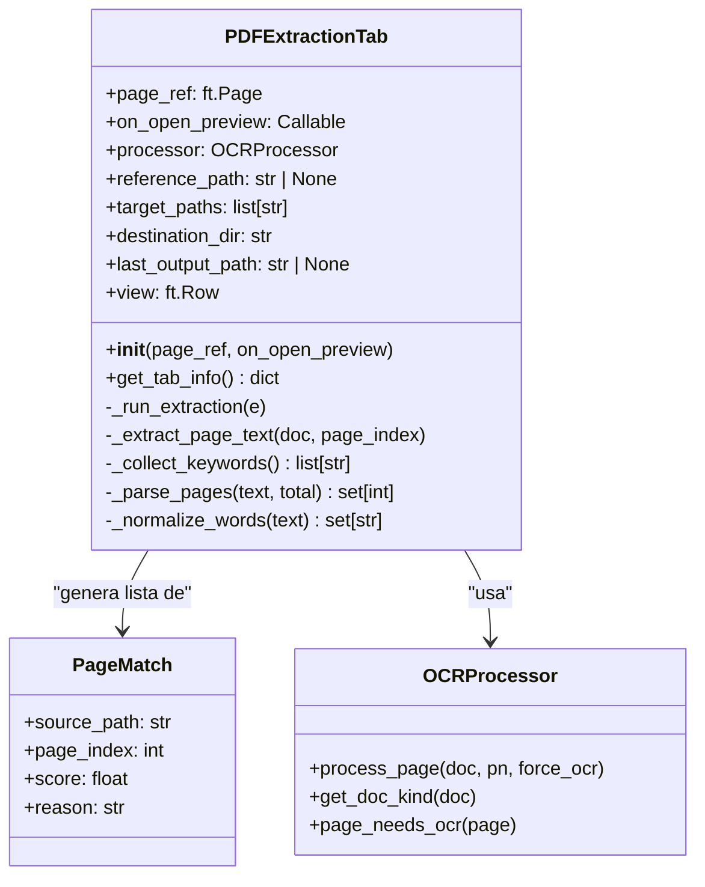
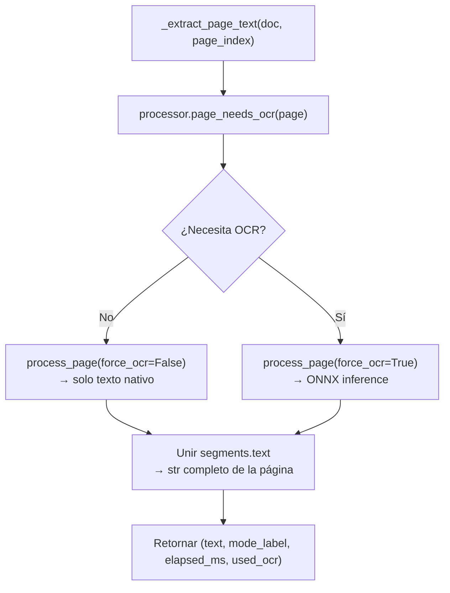

# Módulo Extraer PDF — Arquitectura y funcionamiento

## Índice

1. [Visión general](#1-visión-general)
2. [Estructura de clases y datos](#2-estructura-de-clases-y-datos)
3. [Flujo completo de extracción](#3-flujo-completo-de-extracción)
4. [Algoritmo de puntuación](#4-algoritmo-de-puntuación)
5. [Integración con OCR](#5-integración-con-ocr)
6. [Guardado del resultado](#6-guardado-del-resultado)
7. [Interfaz de usuario](#7-interfaz-de-usuario)
8. [Variables de estado principales](#8-variables-de-estado-principales)

---

## 1. Visión general

El módulo `pdf_extractor` implementa una pestaña de búsqueda y extracción de páginas: dado un conjunto de PDFs objetivo y un conjunto de palabras clave (con un documento de referencia opcional), encuentra todas las páginas que contienen **todas** las palabras clave y las combina en un nuevo PDF de salida.

| Capa | Tecnología | Responsabilidad |
|------|-----------|-----------------|
| UI | Flet / Flutter | Formulario de configuración + log en tiempo real |
| Extracción de texto | PyMuPDF (`fitz`) | Texto nativo vía `get_text()` |
| OCR | `OCRProcessor` (ONNX) | Texto en páginas escaneadas o híbridas |
| Combinación | PyMuPDF (`fitz`) | Construir PDF de salida con las páginas coincidentes |

---

## 2. Estructura de clases y datos



### `PageMatch` — resultado de una coincidencia

| Campo | Tipo | Descripción |
|-------|------|-------------|
| `source_path` | `str` | Ruta absoluta del PDF origen |
| `page_index` | `int` | Índice 0-based de la página dentro del PDF |
| `score` | `float` | Puntuación combinada (ver sección 4) |
| `reason` | `str` | Descripción legible: `"keywords=3, sim=0.42"` |

---

## 3. Flujo completo de extracción

```mermaid
flowchart TD
    START([Usuario hace clic\n"Buscar y extraer"]) --> V1{¿target_paths\nvacío?}
    V1 -- Sí --> E1["✗ Log error\nReturn"]
    V1 -- No --> V2{¿keywords\nvacías?}
    V2 -- Sí --> E2["✗ Log error\nReturn"]
    V2 -- No --> A

    A["Recopilar palabras clave\n_collect_keywords()"] --> B{¿reference_path\nconfigurado?}

    B -- Sí --> C["Abrir PDF referencia\nProcesar páginas indicadas\n(o todas si vacío)"]
    C --> D["_normalize_words(text)\n→ ref_tokens: set[str]"]
    D --> E
    B -- No --> E

    E["Para cada PDF en target_paths:"] --> F["fitz.open(path)\nget_doc_kind() → native/hybrid/scanned"]
    F --> G{¿Páginas\nsugeridas?}
    G -- Sí --> H["scan_order = hint_pages + resto"]
    G -- No --> H2["scan_order = [0..total-1]"]
    H --> I
    H2 --> I

    I["Para cada página en scan_order:"] --> J["_extract_page_text(doc, i)\n→ text, mode, elapsed_ms, used_ocr"]
    J --> K{¿Todas las\nkeywords en\npage_text?}
    K -- No --> L{¿Es página\nsugerida?}
    L -- Sí --> M["Log '~ no coincide'"]
    L -- No --> I
    M --> I
    K -- Sí --> N["score = len(kw_hits)"]
    N --> O{¿ref_tokens\nno vacío?}
    O -- Sí --> P["Jaccard(ref_tokens, page_tokens)\nscore += jaccard × 2"]
    O -- No --> Q
    P --> Q["file_matches.append(PageMatch(…))"]
    Q --> I

    I --> R["file_matches.sort(score DESC)\nall_matches.extend(file_matches)"]
    R --> E

    E --> S{¿all_matches\nvacío?}
    S -- Sí --> T["Log: sin coincidencias\nReturn"]
    S -- No --> U["_save_output(all_matches)"]
    U --> V(["Archivo guardado\nBotón 'Abrir vista previa' habilitado"])

    style START fill:#E8F5E9,stroke:#2E7D32
    style V fill:#E8F5E9,stroke:#2E7D32
    style E1 fill:#FFEBEE,stroke:#C62828
    style E2 fill:#FFEBEE,stroke:#C62828
```

---

## 4. Algoritmo de puntuación

La búsqueda requiere que **todas** las palabras clave estén presentes en la página (condición AND). Las páginas que pasan este filtro reciben una puntuación compuesta:

```
score = len(keyword_hits)                    # Parte 1: número de keywords presentes
      + jaccard(ref_tokens, page_tokens) × 2  # Parte 2: similitud con referencia (si existe)
```

**Cálculo de Jaccard:**

```python
page_tokens = _normalize_words(page_text)
inter = len(ref_tokens & page_tokens)
union = len(ref_tokens | page_tokens)
jaccard = inter / union   # 0.0 – 1.0
```

`_normalize_words` convierte el texto a minúsculas, elimina puntuación y descarta tokens de menos de 4 caracteres.

**Resultado:** dentro de cada archivo las páginas se ordenan por `score` descendente; la lista global `all_matches` acumula resultados de todos los archivos en el orden en que se procesan.

### Páginas sugeridas (`hint_pages`)

El campo "Página sugerida en cada objetivo" permite especificar índices que se verifican primero. En el log aparecen marcadas con ⭐. Independientemente del resultado, el algoritmo continúa con el resto de páginas para no perder coincidencias.

---

## 5. Integración con OCR



El `OCRProcessor` es la misma instancia que usa el visor de PDF. El extractor no implementa OCR propio: delega completamente en el módulo `pdf_viewer.ocr`.

**Etiquetas de modo reportadas en el log:**

| `mode_label` | Significado |
|--------------|-------------|
| `"Nativo"` | Texto extraído directamente del PDF |
| `"OCR"` | Página procesada con el modelo ONNX |
| `"Híbrido"` | Mezcla de texto nativo y OCR |

---

## 6. Guardado del resultado

Tras completar la búsqueda, las páginas coincidentes se agrupan por archivo fuente y se insertan en un `fitz.Document` vacío:

```python
grouped: dict[str, list[PageMatch]] = {}
for match in all_matches:
    grouped.setdefault(match.source_path, []).append(match)

out_doc = fitz.open()
for src_path, matches in grouped.items():
    with fitz.open(src_path) as src_doc:
        for pidx in sorted({m.page_index for m in matches}):
            out_doc.insert_pdf(src_doc, from_page=pidx, to_page=pidx)

out_doc.save(str(out_path), garbage=4, deflate=True)
```

**Nombre del archivo de salida:** `extraccion_YYYYMMDD_HHMMSS.pdf`

**Directorio de salida por defecto:** `<workspace_root>/storage/temp/`

La deduplicación de páginas (`{m.page_index for m in matches}`) garantiza que una misma página no se incluya dos veces aunque aparezca en múltiples resultados. Las páginas se insertan en orden ascendente dentro de cada archivo.

---

## 7. Interfaz de usuario

La vista se divide en dos paneles laterales:

```
┌─────────────────────────────────┬──────────────────────────────────────────────┐
│  Panel izquierdo                │  Panel derecho                               │
│  (flex: 1)                      │  (flex: 2)                                   │
├─────────────────────────────────┼──────────────────────────────────────────────┤
│  Referencia                     │  Objetivos y extracción                      │
│  [Abrir PDF referencia]         │  [Cargar PDFs objetivo] [Carpeta destino]    │
│  Referencia: nombre.pdf         │  Archivos objetivo: N                        │
│  Tipo: Texto nativo             │  Destino: /ruta/carpeta                      │
│                                 │  [Buscar y extraer] [Abrir vista previa]     │
│  Páginas de referencia          │                                              │
│  [TextField: "1,3-5"]           │  Analizando: archivo.pdf — página 3/42 ⭐   │
│                                 │  Finalizado: 5 coincidencia(s) en 2 archivo  │
│  Patrón de búsqueda             │                                              │
│  Palabras clave / títulos       │  Registro de operación                       │
│  [TextArea multiline]           │  ┌────────────────────────────────────────┐  │
│                                 │  │ 📄 [1/2] archivo.pdf — Nativo, 42 págs│  │
│  Opciones avanzadas             │  │   ✓ Pág 3 ⭐ [Nativo | 12ms]: "fact" │  │
│  Página sugerida                │  │   ✓ Pág 17 [OCR | 843ms]: "fact"     │  │
│  [TextField]                    │  │   → 2 página(s) encontrada(s), OCR 1  │  │
│                                 │  │ ─────────────────────────────────────  │  │
│                                 │  │ 💾 Archivo guardado: extraccion_…pdf  │  │
│                                 │  └────────────────────────────────────────┘  │
└─────────────────────────────────┴──────────────────────────────────────────────┘
```

### Log de operación

Las entradas del log se añaden en tiempo real mediante `_log(text, color)`. Cada entrada es un `ft.Text` con `selectable=True` y `font_family="Consolas"`, lo que permite copiar rutas o fragmentos directamente.

**Código de colores:**

| Color | Significado |
|-------|-------------|
| `PRIMARY` | Cabeceras de archivo, resumen de coincidencias, ruta de salida |
| `GREEN` | Página coincidente (✓) |
| `ORANGE` | Advertencia: escaneado / página sugerida sin texto / sin coincidencia |
| `ERROR` (rojo) | Error al abrir archivo o sin keywords definidas |
| `OUTLINE` | Sin coincidencias en un archivo |
| `ON_SURFACE_VARIANT` | Texto informativo neutro |

---

## 8. Variables de estado principales

```python
# Configuración
self.reference_path: str | None       # PDF de referencia (opcional)
self.target_paths: list[str]          # PDFs donde buscar
self.destination_dir: str             # Carpeta de salida
self.last_output_path: str | None     # Ruta del PDF generado en la última búsqueda

# Componente reutilizado
self.processor: OCRProcessor          # Motor OCR compartido (mismo que el visor)

# Controles UI
self._ref_path_text: ft.Text          # "Referencia: nombre.pdf"
self._ref_kind_text: ft.Text          # "Tipo: Texto nativo / Híbrido / Escaneado"
self._target_count_text: ft.Text      # "Archivos objetivo: N"
self._dest_text: ft.Text              # "Destino: /ruta"
self._reference_pages: ft.TextField   # Páginas de referencia (rango 1-based)
self._hint_pages: ft.TextField        # Páginas sugeridas en objetivos
self._keywords: ft.TextField          # Palabras clave (multiline)
self._results: ft.ListView            # Log de operación (auto_scroll=True)
self._progress: ft.Text              # Estado en tiempo real durante la búsqueda
self._summary: ft.Text               # Resumen final ("Finalizado: X coincidencias")
self._run_btn: ft.ElevatedButton     # "Buscar y extraer" (disabled durante ejecución)
self._preview_btn: ft.OutlinedButton # "Abrir vista previa" (enabled tras resultado exitoso)
```
