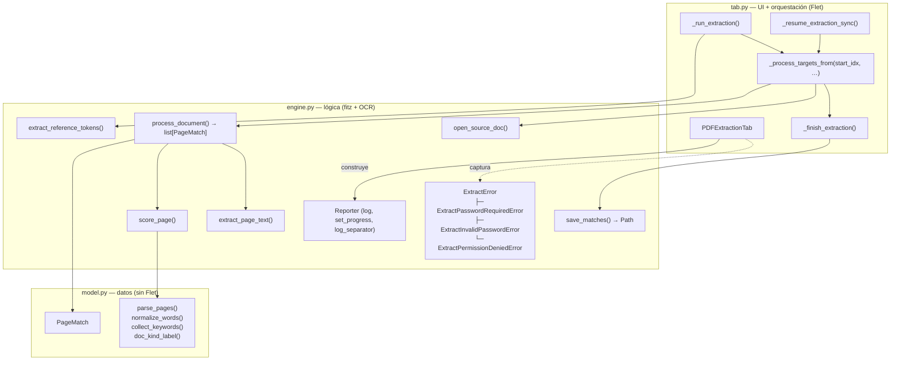
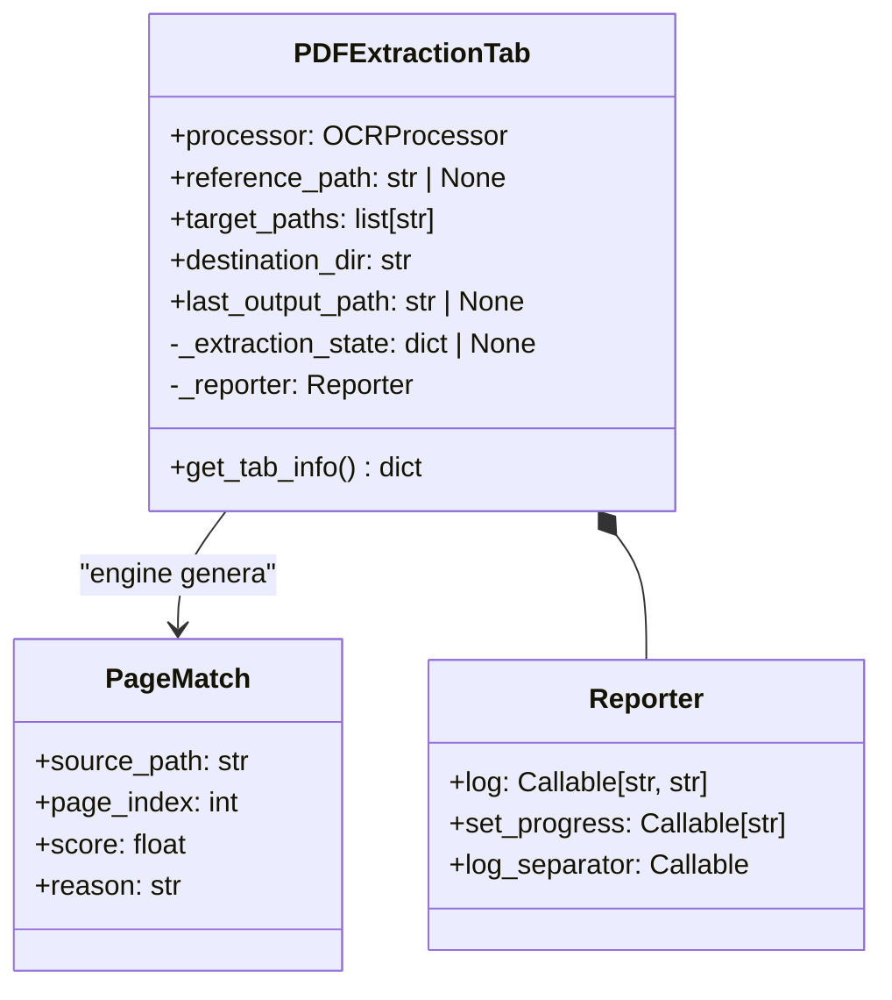
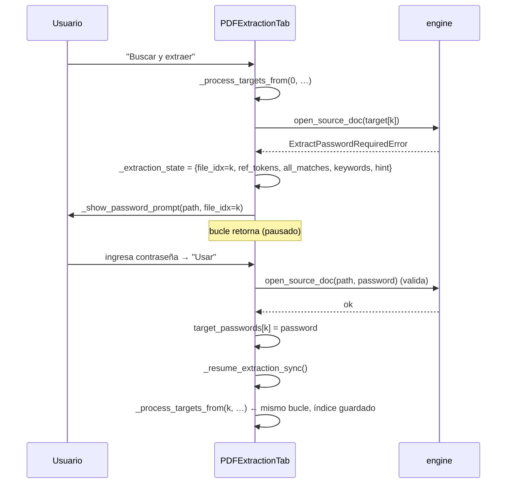
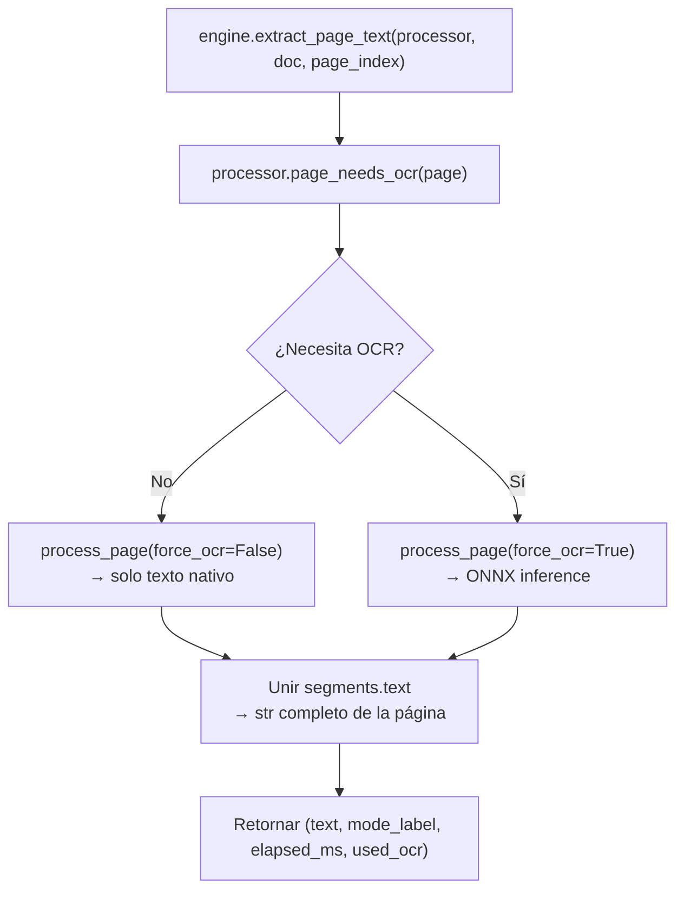
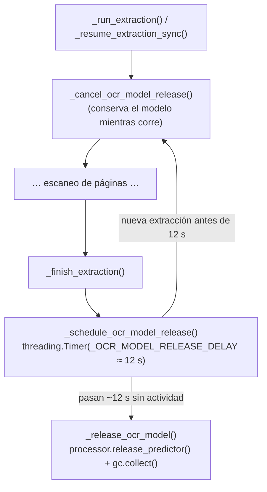

# Módulo Extraer PDF — Arquitectura y funcionamiento

## Índice

1. [Visión general](#1-visión-general)
2. [Estructura de archivos y clases](#2-estructura-de-archivos-y-clases)
3. [Flujo completo de extracción](#3-flujo-completo-de-extracción)
4. [Pausa y reanudación por contraseña](#4-pausa-y-reanudación-por-contraseña)
5. [Algoritmo de puntuación](#5-algoritmo-de-puntuación)
6. [Integración con OCR](#6-integración-con-ocr)
7. [Guardado del resultado](#7-guardado-del-resultado)
8. [Interfaz de usuario](#8-interfaz-de-usuario)
9. [Variables de estado principales](#9-variables-de-estado-principales)

---

## 1. Visión general

El módulo `pdf_extractor` implementa una pestaña de búsqueda y extracción de páginas: dado un conjunto de PDFs objetivo y un conjunto de palabras clave (con un documento de referencia opcional), encuentra todas las páginas que contienen **todas** las palabras clave y las combina en un nuevo PDF de salida.

La responsabilidad está **separada por capas**: la lógica de extracción nunca importa Flet y se comunica con la UI mediante callbacks (`Reporter`), de modo que el algoritmo (scoring, OCR, guardado) es testeable sin instanciar la interfaz.

| Capa | Archivo | Tecnología | Responsabilidad |
|------|---------|-----------|-----------------|
| Datos | `model.py` | — | `PageMatch` + helpers puros: `parse_pages`, `normalize_words`, `collect_keywords`, `doc_kind_label` |
| Lógica | `engine.py` | PyMuPDF (`fitz`) + `OCRProcessor` | Apertura/autenticación, OCR por página, scoring, guardado; excepciones `Extract*`; `Reporter` |
| UI + orquestación | `tab.py` | Flet / Flutter | `PDFExtractionTab`: formulario, log en tiempo real, diálogo de contraseña, y **el bucle de scan con pausa/reanudación** |

**Regla de dependencia:** `model` es hoja; `engine` importa `model`; `tab` importa ambos. **Ni `model` ni `engine` importan `flet`.** El motor emite progreso/log a través de un `Reporter` (tres callbacks) que el tab conecta a sus controles.

---

## 2. Estructura de archivos y clases


```mermaid
flowchart TD
    subgraph TAB["tab.py — UI + orquestación (Flet)"]
        T["PDFExtractionTab"]
        RUN["_run_extraction()"]
        PROC["_process_targets_from(start_idx, …)"]
        RESUME["_resume_extraction_sync()"]
        FINISH["_finish_extraction()"]
    end
    subgraph ENGINE["engine.py — lógica (fitz + OCR)"]
        E1["open_source_doc()"]
        E2["extract_page_text()"]
        E3["score_page()"]
        E4["extract_reference_tokens()"]
        E5["process_document() → list[PageMatch]"]
        E6["save_matches() → Path"]
        ER["Reporter (log, set_progress, log_separator)"]
        EX["ExtractError\n├─ ExtractPasswordRequiredError\n├─ ExtractInvalidPasswordError\n└─ ExtractPermissionDeniedError"]
    end
    subgraph MODEL["model.py — datos (sin Flet)"]
        PM["PageMatch"]
        H["parse_pages()\nnormalize_words()\ncollect_keywords()\ndoc_kind_label()"]
    end

    RUN --> PROC
    RESUME --> PROC
    PROC --> FINISH
    PROC --> E1 & E5
    RUN --> E4
    FINISH --> E6
    E5 --> E2 & E3
    E5 --> PM
    E3 --> H
    T -.captura.-> EX
    T -- construye --> ER
```

`_run_extraction` y `_resume_extraction_sync` **comparten el mismo bucle** `_process_targets_from`: el primero arranca en el índice `0`, el segundo en el índice guardado al pausar. Antes del refactor estos dos caminos eran ~200 líneas duplicadas.

### `PageMatch` — resultado de una coincidencia (`model.py`)


```mermaid
classDiagram
    class PageMatch {
        +source_path: str
        +page_index: int
        +score: float
        +reason: str
    }
    class Reporter {
        +log: Callable[str, str]
        +set_progress: Callable[str]
        +log_separator: Callable
    }
    class PDFExtractionTab {
        +processor: OCRProcessor
        +reference_path: str | None
        +target_paths: list[str]
        +destination_dir: str
        +last_output_path: str | None
        -_extraction_state: dict | None
        -_reporter: Reporter
        +get_tab_info() dict
    }
    PDFExtractionTab --> PageMatch : "engine genera"
    PDFExtractionTab *-- Reporter
```

| Campo de `PageMatch` | Tipo | Descripción |
|-------|------|-------------|
| `source_path` | `str` | Ruta absoluta del PDF origen |
| `page_index` | `int` | Índice 0-based de la página dentro del PDF |
| `score` | `float` | Puntuación combinada (ver sección 5) |
| `reason` | `str` | Descripción legible: `"keywords=3, sim=0.42"` |

---

## 3. Flujo completo de extracción

```mermaid
flowchart TD
    START([Usuario hace clic\n"Buscar y extraer"]) --> V1{¿target_paths\nvacío?}
    V1 -- Sí --> E1["✗ Log error\nReturn"]
    V1 -- No --> V2{¿keywords\nvacías?}
    V2 -- Sí --> E2["✗ Log error\nReturn"]
    V2 -- No --> A

    A["keywords = model.collect_keywords(...)"] --> B["_process_reference()"]
    B --> C{¿reference_path\nconfigurado?}
    C -- Sí --> D["engine.extract_reference_tokens()\n→ ref_tokens: set[str]"]
    C -- No --> E
    D --> E

    E["_process_targets_from(0, ref_tokens, [], keywords, hint)"] --> F["Para file_idx en [start_idx .. N):"]
    F --> G["engine.open_source_doc(path, password)"]
    G -- ExtractPasswordRequiredError --> PAUSE["Guardar _extraction_state\nMostrar diálogo contraseña\nReturn (pausa)"]
    G -- ok --> H["engine.process_document(doc, …)\n→ list[PageMatch]"]
    H --> I["all_matches.extend(matches)"]
    I --> F

    F -- fin del bucle --> J["_finish_extraction(all_matches)"]
    J --> S{¿all_matches\nvacío?}
    S -- Sí --> T["Resumen: sin coincidencias\nReturn"]
    S -- No --> U["engine.save_matches(...) → out_path"]
    U --> VEND(["Archivo guardado\nBotón 'Abrir vista previa' habilitado"])

    style START fill:#E8F5E9,stroke:#2E7D32
    style VEND fill:#E8F5E9,stroke:#2E7D32
    style E1 fill:#FFEBEE,stroke:#C62828
    style E2 fill:#FFEBEE,stroke:#C62828
    style PAUSE fill:#FFF3E0,stroke:#E65100
```

`engine.process_document` encapsula todo el trabajo por documento (clasificación, orden de escaneo con páginas sugeridas, OCR + scoring página a página, log y orden por puntuación) y devuelve la lista de `PageMatch` del archivo. El tab solo orquesta el bucle y acumula resultados.

---

## 4. Pausa y reanudación por contraseña

El scan corre **sincrónicamente en el hilo de UI**. Cuando un objetivo está cifrado y no se conoce su contraseña, `engine.open_source_doc` lanza `ExtractPasswordRequiredError`; el bucle entonces **se pausa**: guarda su estado, muestra el diálogo y retorna. Al confirmar la contraseña, se reanuda el **mismo** bucle desde el índice guardado.


```mermaid
sequenceDiagram
    participant U as Usuario
    participant Tab as PDFExtractionTab
    participant Eng as engine

    U->>Tab: "Buscar y extraer"
    Tab->>Tab: _process_targets_from(0, …)
    Tab->>Eng: open_source_doc(target[k])
    Eng-->>Tab: ExtractPasswordRequiredError
    Tab->>Tab: _extraction_state = {file_idx=k, ref_tokens, all_matches, keywords, hint}
    Tab->>U: _show_password_prompt(path, file_idx=k)
    Note over Tab: bucle retorna (pausado)

    U->>Tab: ingresa contraseña → "Usar"
    Tab->>Eng: open_source_doc(path, password) (valida)
    Eng-->>Tab: ok
    Tab->>Tab: target_passwords[k] = password
    Tab->>Tab: _resume_extraction_sync()
    Tab->>Tab: _process_targets_from(k, …) ← mismo bucle, índice guardado
```

**Estado de pausa** (`self._extraction_state`): `{ref_tokens, all_matches, file_idx, keywords, hint_pages_raw}`. Es la única estructura que persiste entre la pausa y la reanudación; se limpia al reanudar y al finalizar.

**Documento de referencia:** si la referencia requiere contraseña durante el run, **no** se pausa el scan — se registra el aviso, `ref_tokens` queda vacío y la búsqueda continúa (la contraseña de referencia normalmente se pide al seleccionarla, con `file_idx = -1`).

**Manejo de contraseña** (`_confirm_protected_pdf_password`): valida la contraseña reabriendo el documento; según el resultado:

| Resultado | Acción |
|-----------|--------|
| `ExtractInvalidPasswordError` | Reabre el diálogo con el mensaje "Contraseña incorrecta" (conservando `file_idx`) |
| `ExtractPermissionDeniedError` | Snackbar sugiriendo usar Seguridad; cancela esa entrada |
| OK | Guarda la contraseña (`reference_password` si `file_idx == -1`, si no `target_passwords[file_idx]`) y reanuda si había scan pausado |

---

## 5. Algoritmo de puntuación

La función pura `engine.score_page(text, keywords, ref_tokens)` requiere que **todas** las palabras clave estén presentes en la página (condición AND). Las páginas que pasan este filtro reciben una puntuación compuesta:

```
score = len(keyword_hits)                     # Parte 1: número de keywords presentes
      + jaccard(ref_tokens, page_tokens) × 2   # Parte 2: similitud con referencia (si existe)
```

**Cálculo de Jaccard** (dentro de `score_page`):

```python
page_tokens = model.normalize_words(page_text)
inter = len(ref_tokens & page_tokens)
union = len(ref_tokens | page_tokens)
jaccard = inter / union   # 0.0 – 1.0
```

`model.normalize_words` convierte el texto a minúsculas, elimina puntuación y descarta tokens de menos de 4 caracteres. `score_page` devuelve `(matched, score, reason, keyword_hits)`.

**Resultado:** dentro de cada archivo `process_document` ordena las páginas por `score` descendente; la lista global `all_matches` acumula resultados de todos los archivos en el orden en que se procesan.

### Páginas sugeridas (`hint_pages`)

El campo "Páginas sugeridas en objetivos" permite especificar índices que se verifican primero. En el log aparecen marcadas con ⭐. Independientemente del resultado, el algoritmo continúa con el resto de páginas para no perder coincidencias.

---

## 6. Integración con OCR


```mermaid
flowchart TD
    A["engine.extract_page_text(processor, doc, page_index)"] --> B["processor.page_needs_ocr(page)"]
    B --> C{¿Necesita OCR?}
    C -- No --> D["process_page(force_ocr=False)\n→ solo texto nativo"]
    C -- Sí --> E["process_page(force_ocr=True)\n→ ONNX inference"]
    D --> F["Unir segments.text\n→ str completo de la página"]
    E --> F
    F --> G["Retornar (text, mode_label, elapsed_ms, used_ocr)"]
```

El `OCRProcessor` es la misma instancia que usa el visor de PDF. El extractor no implementa OCR propio: delega completamente en el módulo `pdf_viewer.ocr`. El motor recibe el `processor` como parámetro, sin acoplarse a cómo se construye.

**Etiquetas de modo reportadas en el log:**

| `mode_label` | Significado |
|--------------|-------------|
| `"Nativo"` | Texto extraído directamente del PDF |
| `"OCR"` | Página procesada con el modelo ONNX |
| `"Híbrido"` | Mezcla de texto nativo y OCR |

### Recorte de regiones de imagen

Antes de ejecutar la inferencia, `OCRProcessor._image_regions` recorta el *bounding box* de cada imagen al área de la página (`fitz.Rect(bbox) & page.rect`) y descarta las regiones vacías o menores de 8 pt. Sin este recorte, algunos PDFs reportan bboxes que caen (total o parcialmente) **fuera** de la página; al generar el *pixmap* con `clip=rect`, PyMuPDF producía una imagen de **0 px** en una dimensión y OnnxTR fallaba con `ZeroDivisionError` al calcular la relación de aspecto (`h / w`). Como defensa adicional, `_ocr_on_regions` salta cualquier pixmap de `width == 0` o `height == 0`, y `_run_predictor` retorna sin palabras si recibe una imagen degenerada.

### Manejo de memoria del modelo OCR

El modelo OCR (varios cientos de MB en RAM) se gestiona con el **mismo patrón de timer de inactividad que el visor** (`pdf_viewer/_ocr_mixin.py`):


```mermaid
flowchart TD
    RUN["_run_extraction() / _resume_extraction_sync()"] --> CANCEL["_cancel_ocr_model_release()\n(conserva el modelo mientras corre)"]
    CANCEL --> SCAN["… escaneo de páginas …"]
    SCAN --> FIN["_finish_extraction()"]
    FIN --> SCHED["_schedule_ocr_model_release()\nthreading.Timer(_OCR_MODEL_RELEASE_DELAY ≈ 12 s)"]
    SCHED -- "pasan ~12 s sin actividad" --> REL["_release_ocr_model()\nprocessor.release_predictor() + gc.collect()"]
    SCHED -- "nueva extracción antes de 12 s" --> CANCEL
```

- **Carga perezosa:** el predictor se instancia la primera vez que una página realmente necesita OCR (propiedad `OCRProcessor.predictor`). Una extracción 100 % texto nativo nunca lo carga.
- **Liberación por inactividad:** al terminar un run, `_finish_extraction` programa `_schedule_ocr_model_release`; si la pestaña queda inactiva ~12 s (`_OCR_MODEL_RELEASE_DELAY`), el `threading.Timer` (daemon) dispara `release_predictor()` + `gc.collect()` y se recupera la RAM.
- **Cancelación durante un run:** `_run_extraction` y `_resume_extraction_sync` llaman a `_cancel_ocr_model_release()` para no descargar el modelo a mitad del trabajo. Extracciones consecutivas en menos de 12 s reutilizan el modelo cargado; tras la liberación, la siguiente lo recarga de forma perezosa.

---

## 7. Guardado del resultado

`engine.save_matches(matches, target_paths, target_passwords, dest_dir)` agrupa las páginas coincidentes por archivo fuente y las inserta en un `fitz.Document` vacío:

```python
grouped: dict[str, list[PageMatch]] = {}
for match in matches:
    grouped.setdefault(match.source_path, []).append(match)

out_doc = fitz.open()
for src_path, src_matches in grouped.items():
    password = target_passwords.get(file_idx_de(src_path))
    with open_source_doc(src_path, password=password) as src_doc:
        for pidx in sorted({m.page_index for m in src_matches}):
            out_doc.insert_pdf(src_doc, from_page=pidx, to_page=pidx)

out_doc.save(str(out_path), garbage=4, deflate=True)
```

**Nombre del archivo de salida:** `extraccion_YYYYMMDD_HHMMSS.pdf`
**Directorio de salida por defecto:** `<workspace_root>/storage/temp/`

La deduplicación de páginas (`{m.page_index for m in src_matches}`) garantiza que una misma página no se incluya dos veces aunque aparezca en múltiples resultados. Las páginas se insertan en orden ascendente dentro de cada archivo. La función devuelve el `Path` de salida; el tab (`_finish_extraction`) deriva el conteo de archivos y actualiza el resumen.

---

## 8. Interfaz de usuario

La vista se divide en dos paneles laterales:

```
┌─────────────────────────────────┬──────────────────────────────────────────────┐
│  Panel izquierdo                │  Panel derecho                               │
│  (flex: 4)                      │  (flex: 6)                                   │
├─────────────────────────────────┼──────────────────────────────────────────────┤
│  Paso 1: Referencia             │  Paso 3: Objetivos y extracción              │
│  [Abrir PDF referencia]         │  [Cargar PDFs objetivo] [Carpeta destino]    │
│  Referencia: nombre.pdf         │  Archivos objetivo: N                        │
│  Tipo: Texto nativo             │  Destino: /ruta/carpeta                      │
│  Páginas de referencia          │  [Buscar y extraer] [Abrir vista previa]     │
│  [TextField: "1,3-5"]           │                                              │
│                                 │  Analizando: archivo.pdf — página 3/42 ⭐   │
│  Paso 2: Patrón de búsqueda     │  Finalizado: 5 coincidencia(s) en 2 archivo  │
│  Palabras clave / títulos       │                                              │
│  [TextArea multiline]           │  Registro de operación                       │
│  Páginas sugeridas              │  ┌────────────────────────────────────────┐  │
│  [TextField]                    │  │ 📄 [1/2] archivo.pdf — Nativo, 42 págs│  │
│                                 │  │   ✓ Pág 3 ⭐ [Nativo | 12ms]: "fact" │  │
│                                 │  │   ✓ Pág 17 [OCR | 843ms]: "fact"     │  │
│                                 │  │   → 2 página(s) encontrada(s), OCR 1  │  │
│                                 │  │ ─────────────────────────────────────  │  │
│                                 │  │ 💾 Archivo guardado: extraccion_…pdf  │  │
│                                 │  └────────────────────────────────────────┘  │
└─────────────────────────────────┴──────────────────────────────────────────────┘
```

### Log de operación

Las entradas del log se añaden en tiempo real mediante `_log(text, color)`, expuesto al motor a través del `Reporter`. Cada entrada es un `ft.Text` con `selectable=True` y `font_family="Consolas"`, lo que permite copiar rutas o fragmentos directamente.

**Código de colores** (los emite `engine` vía `reporter.log`):

| Color | Significado |
|-------|-------------|
| `#1565C0` (azul) | Cabeceras de archivo, resumen de coincidencias, ruta de salida |
| `#2E7D32` (verde) | Página coincidente (✓) |
| `#ED6C02` (naranja) | Advertencia: escaneado / página sugerida sin texto / sin coincidencia |
| `#D32F2F` (rojo) | Error al abrir archivo, contraseña requerida, o sin keywords |
| `#666666` / `#999999` (gris) | Texto informativo neutro / sin coincidencias |

---

## 9. Variables de estado principales

### `PageMatch` (`model.py`)

```python
match.source_path: str   # Ruta absoluta del PDF origen
match.page_index: int    # Índice 0-based de la página
match.score: float       # Puntuación combinada (ver §5)
match.reason: str         # "keywords=3, sim=0.42"
```

### `PDFExtractionTab` (`tab.py`)

```python
# Configuración
self.reference_path: str | None       # PDF de referencia (opcional)
self.reference_password: str | None   # Contraseña de la referencia (si cifrada)
self.target_paths: list[str]          # PDFs donde buscar
self.target_passwords: dict[int, str] # file_idx → contraseña (objetivos cifrados)
self.destination_dir: str             # Carpeta de salida
self.last_output_path: str | None     # Ruta del PDF generado en la última búsqueda

# Orquestación
self._is_extracting: bool             # True mientras el scan está en curso
self._extraction_state: dict | None   # Snapshot de pausa (ver §4); None si no pausado
self._pending_password_file_idx: int | None  # Objetivo esperando contraseña (-1 = referencia)
self._ocr_model_timer: threading.Timer | None  # Timer de liberación del modelo OCR por inactividad (ver §6)

# Componentes reutilizados
self.processor: OCRProcessor          # Motor OCR compartido (mismo que el visor)
self._reporter: Reporter              # log / set_progress / log_separator hacia la UI

# Controles UI
self._ref_path_text: ft.Text          # "Referencia: nombre.pdf"
self._ref_kind_text: ft.Text          # "Tipo: Texto nativo / Híbrido / Escaneado"
self._target_count_text: ft.Text      # "Archivos objetivo: N"
self._dest_text: ft.Text              # "Destino: /ruta"
self._reference_pages: ft.TextField   # Páginas de referencia (rango 1-based)
self._hint_pages: ft.TextField        # Páginas sugeridas en objetivos
self._keywords: ft.TextField          # Palabras clave (multiline)
self._results: ft.ListView            # Log de operación (auto_scroll=True)
self._progress: ft.Text               # Estado en tiempo real durante la búsqueda
self._summary: ft.Text                # Resumen final ("Finalizado: X coincidencias")
self._run_btn: ft.ElevatedButton      # "Buscar y extraer" (disabled durante ejecución)
self._preview_btn: ft.ElevatedButton  # "Abrir vista previa" (enabled tras resultado exitoso)
self._pwd_dialog / _pwd_field / _pwd_error  # Diálogo de contraseña (inline)
```
