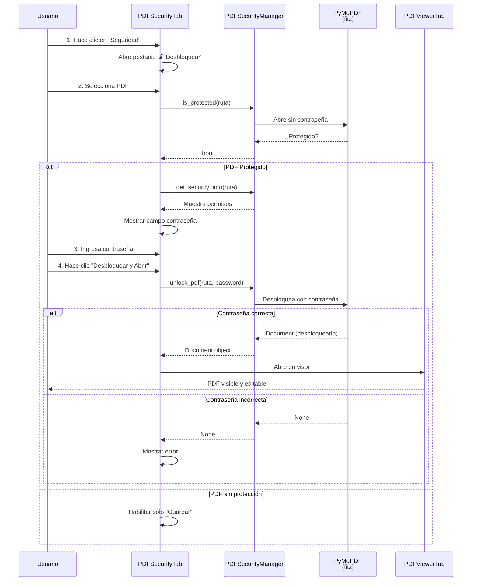
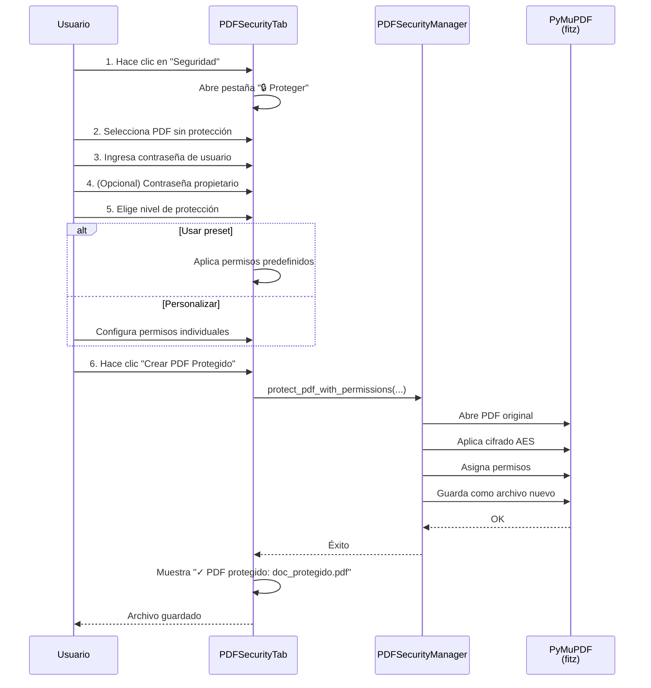
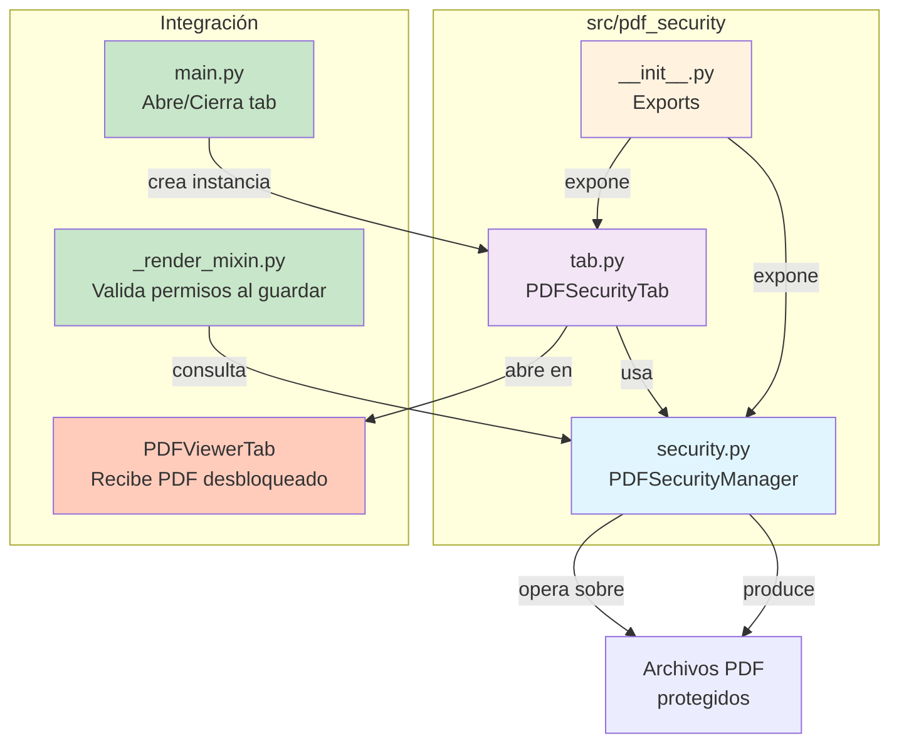
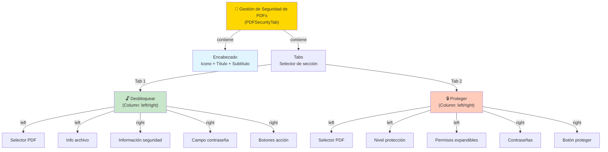
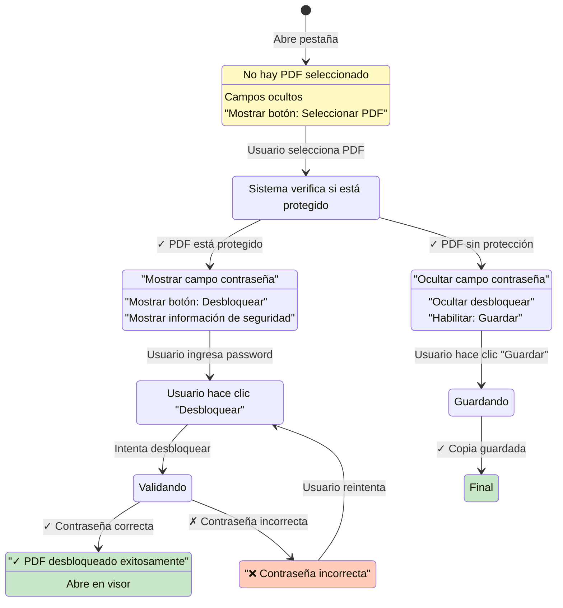
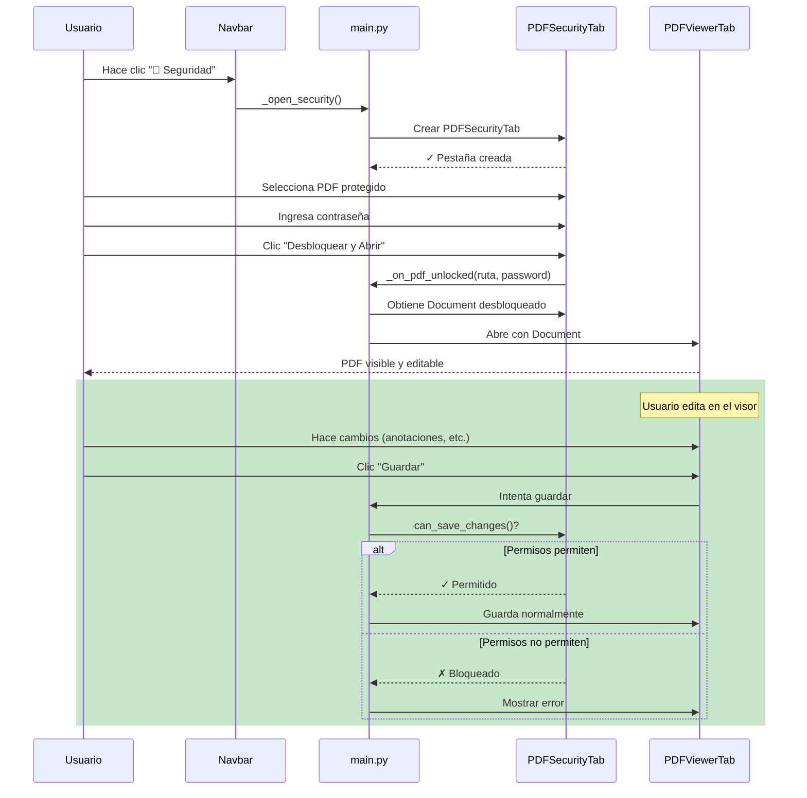

# Módulo de Seguridad de PDFs — Arquitectura y funcionamiento

## Índice

1. [Visión general](#1-visión-general)
2. [Flujo de desbloqueo](#2-flujo-de-desbloqueo)
3. [Flujo de protección](#3-flujo-de-protección)
4. [Estructura de componentes](#4-estructura-de-componentes)
5. [Gestor de Seguridad](#5-gestor-de-seguridad-pdfsecuritymanager)
6. [Interfaz de usuario](#6-interfaz-de-usuario-pdfsecuritytab)
7. [Integración con la aplicación](#7-integración-con-la-aplicación)
8. [Niveles de protección](#8-niveles-de-protección)

---

## 1. Visión general

El módulo `pdf_security` gestiona el ciclo de vida completo de PDFs protegidos: **detección**, **desbloqueo**, **visualización** e **integración con el visor**.

### Funcionalidades principales

- ✅ Detectar si un PDF está protegido sin abrirlo completamente
- ✅ Desbloquear PDFs y abrirlos directamente en el visor
- ✅ Guardar copias desbloqueadas
- ✅ Crear PDFs protegidos con contraseña
- ✅ Asignar niveles de permisos (presets o personalizados)
- ✅ Validar permisos al guardar cambios en el visor

| Capa | Tecnología | Responsabilidad |
|------|-----------|-----------------|
| **Lógica** | PyMuPDF (`fitz`), métodos de cifrado | Detectar protección, desbloquear, crear permisos, validar contraseñas |
| **Interfaz** | Flet / Flutter | Pestaña con dos secciones (desbloquear / proteger) |
| **Integración** | Main app (`main.py`) | Abrir PDFs desbloqueados en el visor, validar permisos al guardar |

---

## 2. Flujo de desbloqueo

**Pasos clave:**
1. **Detección**: Verifica si el PDF necesita contraseña
2. **Información**: Obtiene permisos y método de cifrado
3. **Validación**: Intenta desbloquear con la contraseña ingresada
4. **Apertura**: Si es exitoso, abre directamente en el visor

---

## 3. Flujo de protección

**Pasos clave:**
1. **Selección**: Elige PDF original sin protección
2. **Configuración**: Define contraseñas y permisos
3. **Creación**: Genera archivo protegido con extensión `_protegido.pdf`
4. **Resultado**: Nuevo archivo guardado en la misma carpeta

---

## 4. Estructura de componentes

---

## 5. Gestor de Seguridad (PDFSecurityManager)

Clase central que proporciona todas las operaciones de seguridad. Abstrae PyMuPDF y maneja el cifrado.

### Métodos de consulta

**`is_protected(ruta: str) -> bool`**
- Verifica si un PDF necesita contraseña para abrirse
- No abre el PDF completamente; solo detecta protección
- Retorna `True` si protegido, `False` si no

**`get_security_info(ruta: str) -> PDFSecurityInfo`**
- Obtiene detalles de seguridad sin abrir completamente
- Retorna: estado de protección, método de cifrado, lista de permisos
- Se muestra en la UI para informar al usuario

**`check_permissions(ruta: str, password: str | None = None) -> PDFSecurityInfo`**
- Valida permisos detallados del PDF
- Si está protegido, requiere la contraseña correcta
- Se usa al guardar en el visor para validar cambios permitidos

### Métodos de desbloqueo

**`unlock_pdf(ruta: str, password: str) -> Document | None`**
- Intenta desbloquear un PDF con la contraseña proporcionada
- Retorna documento abierto si es exitoso, `None` si falla
- El documento permanece en memoria para usar en el visor

**`unlock_pdf_to_file(ruta: str, password: str, salida: str) -> bool`**
- Desbloquea y guarda una copia sin protección
- Crea nuevo archivo sin cifrado
- Se usa cuando el usuario hace clic en "Guardar Desbloqueado"

### Métodos de protección

**`protect_pdf_with_permissions(entrada: str, salida: str, password_usuario: str, ...)`**
- Protege un PDF existente con cifrado AES
- Asigna permisos específicos
- Soporta contraseña de propietario (para cambios futuros)
- Crea nuevo archivo con sufijo `_protegido.pdf`

**`get_default_permissions() -> dict`**
- Retorna presets de niveles de protección
- Incluye: sin_restricciones, solo_lectura, solo_impresion, impresion_y_lectura, muy_restrictivo
- Se usa en el dropdown de la UI para elegir nivel predefinido

### Clase PDFSecurityInfo

Objeto de datos que encapsula información de seguridad:

- **`is_protected`**: bool — PDF necesita contraseña
- **`is_encrypted`**: bool — PDF usa cifrado (AES, etc.)
- **`encryption_method`**: str — Tipo de cifrado (ej. "AES")
- **`permissions`**: dict — Mapa de permisos booleanos
- **`get_permissions_text()`**: Retorna lista legible de permisos activos

---

## 6. Interfaz de usuario (PDFSecurityTab)

Pestaña Flet que implementa dos secciones principales: desbloquear y proteger.

### Arquitectura de la pestaña

### Flujo de estados - Sección Desbloquear

### Componentes principales

**Sección Desbloquear:**
- **Columna izquierda** (ancho fijo 300px): Selector PDF, info del archivo
- **Columna derecha** (expandible): Información de seguridad, campo contraseña, botones

**Sección Proteger:**
- **Columna izquierda** (ancho 340px): Selector PDF, nivel de protección, permisos personalizados
- **Columna derecha** (expandible): Contraseñas, botón proteger

---

## 7. Integración con la aplicación

### Cambios en `main.py`

El módulo de seguridad se integra en el flujo principal mediante:

1. **Variable de estado**: Se mantiene referencia a `security_tab` para abrirla/cerrarla
2. **Función `_open_security()`**: Crea la pestaña si no existe o la enfoca si existe
3. **Función `_close_security_tab(tab)`**: Elimina la pestaña y limpia recursos
4. **Callback `_on_pdf_unlocked(ruta, password)`**: Abre el PDF desbloqueado en el visor
5. **Botón navbar**: Acceso rápido a la pestaña "🔐 Seguridad"

### Validación al guardar - `_render_mixin.py`

Cuando el usuario guarda cambios en un PDF abierto en el visor:

1. Sistema verifica si el PDF está protegido
2. Si es protegido, consulta permisos mediante `can_save_changes()`
3. Si los permisos no lo permiten, muestra error y bloquea guardado
4. Si los permisos lo permiten, procede con guardado normal

### Flujo completo: usuario abre PDF protegido

---

## 8. Niveles de protección

### Presets disponibles

| Nombre | Contraseña | Impresión | Modificación | Copia | Anotaciones | Uso típico |
|--------|-----------|-----------|--------------|-------|-------------|-----------|
| **Sin restricciones** | Sí | Sí | Sí | Sí | Sí | Acceso completo (usa password de propietario) |
| **Solo lectura** | Sí | Sí | No | No | Sí | Documentos finales sin edición |
| **Solo impresión** | Sí | Sí | No | No | No | Evitar descargas, permitir impresos |
| **Impresión y lectura** | Sí | Sí | No | Sí | No | Lecturas académicas, reportes |
| **Muy restrictivo** | Sí | No | No | No | No | Máxima seguridad, solo visualización |

### Permisos individuales

Cada PDF protegido puede configurar estos permisos de forma independiente:

- **`allow_print`**: Usuario puede imprimir el PDF
- **`allow_modify`**: Usuario puede editar contenido (anotaciones, cambios)
- **`allow_copy`**: Usuario puede copiar/extraer texto e imágenes
- **`allow_annotate`**: Usuario puede añadir anotaciones (comentarios, marcas)
- **`allow_forms`**: Usuario puede llenar formularios interactivos
- **`allow_assembly`**: Usuario puede reordenar/insertar/eliminar páginas
- **`allow_print_hq`**: Usuario puede imprimir en alta calidad (sin `allow_print`, la copia es borrosa)

---

## Resumen de operaciones

| Operación | Función | Entrada | Salida |
|-----------|---------|---------|--------|
| Detectar protección | `is_protected()` | Ruta PDF | bool |
| Obtener información | `get_security_info()` | Ruta PDF | PDFSecurityInfo |
| Desbloquear en memoria | `unlock_pdf()` | Ruta, contraseña | Document object |
| Guardar desbloqueado | `unlock_pdf_to_file()` | Ruta entrada, password, ruta salida | bool |
| Proteger archivo | `protect_pdf_with_permissions()` | Ruta entrada, ruta salida, passwords, permisos | bool |
| Obtener presets | `get_default_permissions()` | — | dict de presets |
| Validar al guardar | `can_save_changes()` | Ruta PDF, password (si protegido) | bool |

