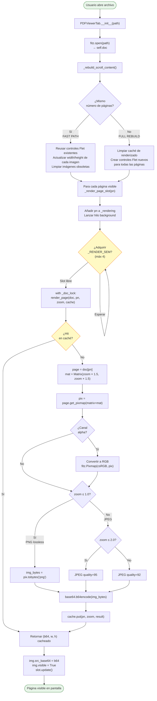
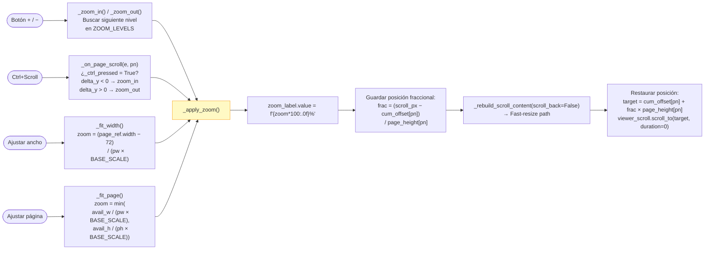
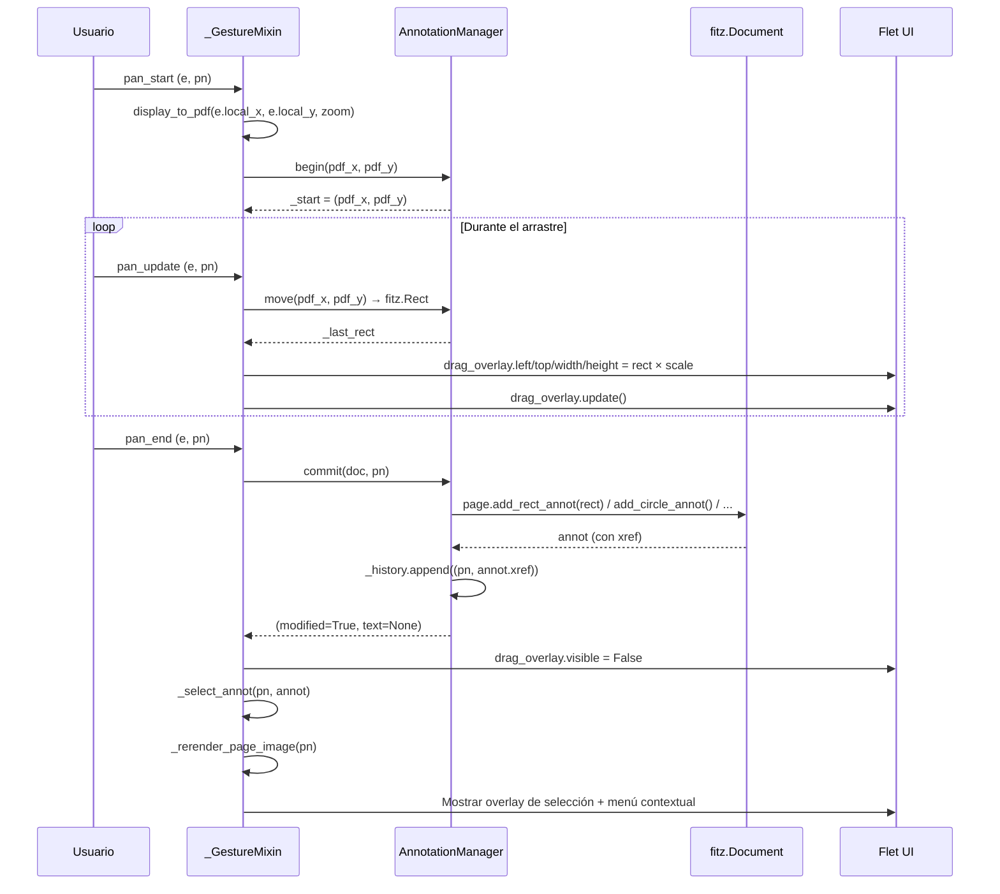
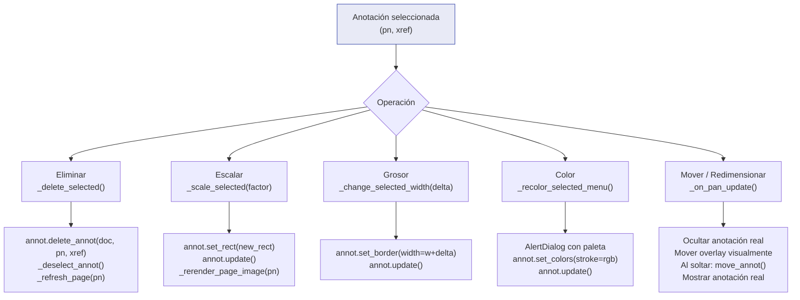
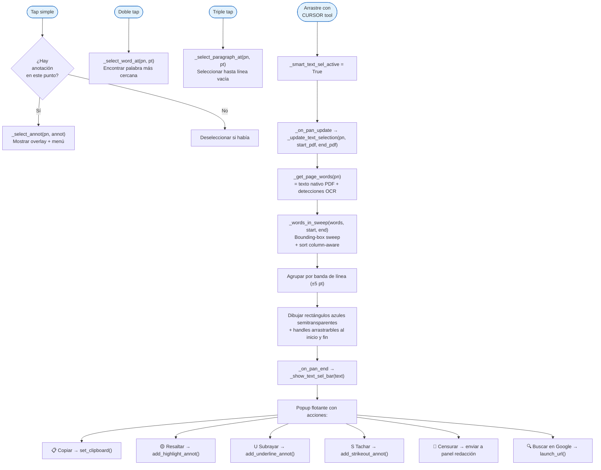
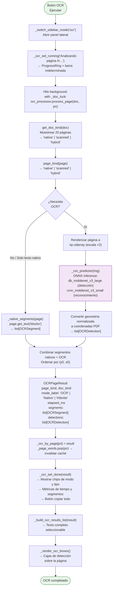
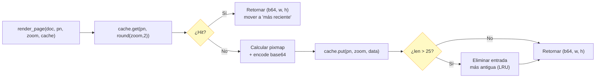

# Visor de PDF — Arquitectura y funcionamiento

## Índice

1. [Visión general](#1-visión-general)
2. [Estructura de clases](#2-estructura-de-clases)
3. [Cómo se abre y muestra un PDF](#3-cómo-se-abre-y-muestra-un-pdf)
4. [Sistema de scroll y viewport](#4-sistema-de-scroll-y-viewport)
5. [Sistema de zoom](#5-sistema-de-zoom)
6. [Anotaciones](#6-anotaciones)
7. [Selección de texto](#7-selección-de-texto)
8. [Pipeline OCR](#8-pipeline-ocr)
9. [Caché de renderizado](#9-caché-de-renderizado)
10. [Variables de estado principales](#10-variables-de-estado-principales)

---

## 1. Visión general

El visor está construido con **Flet** (Python sobre Flutter) y **PyMuPDF** (`fitz`).

| Capa | Tecnología | Responsabilidad |
|------|-----------|-----------------|
| UI | Flet / Flutter | Controles, eventos, overlays |
| Renderizado | PyMuPDF (`fitz`) | Convertir páginas PDF a píxeles |
| OCR | onnxtr (ONNX) | Reconocimiento de texto en páginas escaneadas |
| Anotaciones | PyMuPDF | Escribir marcas al documento en memoria |

**Constantes globales clave:**

```
BASE_SCALE  = 1.5   # Factor base pt→px (72 DPI → 108 DPI efectivos)
ZOOM_LEVELS = [0.25, 0.5, 0.75, 1.0, 1.25, 1.5, 2.0, 3.0, 4.0]
_RENDER_SEM = threading.Semaphore(4)   # Máx 4 renders simultáneos
_MAX_ENTRIES = 25   # Entradas máximas en la caché LRU
```

---

## 2. Estructura de clases

`PDFViewerTab` hereda de seis mixins. Cada uno gestiona un dominio concreto y accede al estado compartido mediante `self`.

```mermaid
classDiagram
    class PDFViewerTab {
        +path: str
        +doc: fitz.Document
        +zoom: float
        +current_page: int
        +_doc_lock: Lock
        +_render_cache: PageRenderCache
        +_annot: AnnotationManager
        +_ocr_processor: OCRProcessor
        +__init__(path, page_ref, on_close)
        +close()
        +get_tab_info() dict
        +on_focus()
        +on_blur()
    }

    class _RenderMixin {
        +_rebuild_scroll_content()
        +_render_page_slot(pn)
        +_render_visible(pixels, vh)
        +_evict_distant(pixels, vh)
        +_on_view_scroll(e)
        +_apply_zoom()
        +_zoom_in() / _zoom_out()
        +_fit_width() / _fit_page()
        +_on_page_scroll(e, pn)
    }

    class _GestureMixin {
        +_on_tap_down(e, pn)
        +_on_tap(e, pn)
        +_on_pan_start(e, pn)
        +_on_pan_update(e, pn)
        +_on_pan_end(e, pn)
        +_on_hover(e, pn)
        +_detect_drag_mode(pdf_pt, annot_rect)
    }

    class _AnnotMixin {
        +_select_tool(tool, cursor)
        +_select_annot(pn, annot)
        +_deselect_annot()
        +_refresh_selected_overlay(pn)
        +_delete_selected()
        +_scale_selected(factor)
        +_recolor_selected_menu()
    }

    class _TextSelMixin {
        +_get_page_words(pn)
        +_update_text_selection(pn, start, end)
        +_show_text_sel_bar(text)
        +_text_sel_copy()
        +_text_sel_apply(tool)
        +_select_word_at(pn, pt)
        +_select_paragraph_at(pn, pt)
    }

    class _OCRMixin {
        +_build_ocr_sidebar_panel()
        +_run_ocr()
        +_refresh_ocr_ui_for_page()
        +_toggle_ocr_boxes()
        +_ocr_set_running(stage)
        +_ocr_set_done(result)
        +_ocr_copy_all()
    }

    class _RedactAgentMixin {
        +_build_redact_sidebar_panel()
        +_build_agent_sidebar_panel()
        +_add_redact_term()
        +_render_redact_preview()
        +_apply_redaction()
    }

    class AnnotationManager {
        +tool: Tool
        +highlight_color: tuple
        +_history: list
        +begin(x, y)
        +move(x, y)
        +commit(doc, pn)
        +delete_annot(doc, pn, xref)
        +undo_last(doc)
    }

    class PageRenderCache {
        +_d: OrderedDict
        +_MAX_ENTRIES: int = 25
        +get(pn, zoom)
        +put(pn, zoom, data)
        +invalidate_page(pn)
        +clear()
    }

    class OCRProcessor {
        +predictor: onnxtr model
        +process_page(doc, pn, force_ocr)
        +get_doc_kind(doc)
        +_native_segments(page)
        +_run_predictor(img)
    }

    PDFViewerTab --|> _RenderMixin
    PDFViewerTab --|> _GestureMixin
    PDFViewerTab --|> _AnnotMixin
    PDFViewerTab --|> _TextSelMixin
    PDFViewerTab --|> _OCRMixin
    PDFViewerTab --|> _RedactAgentMixin
    PDFViewerTab *-- AnnotationManager
    PDFViewerTab *-- PageRenderCache
    PDFViewerTab *-- OCRProcessor
```



---

## 3. Cómo se abre y muestra un PDF

### Flujo completo: ruta de archivo → píxeles en pantalla



### Sistema de coordenadas

```
PDF points (72 DPI)  ──×zoom──►  lógicas  ──×BASE_SCALE(1.5)──►  píxeles
           pt                      pt                                 px

Conversión inversa (clic en pantalla → posición PDF):
  pdf_x = display_x / (zoom × BASE_SCALE)
  pdf_y = display_y / (zoom × BASE_SCALE)
```

### Formato de imagen según zoom

| Zoom | Formato | Calidad | Motivo |
|------|---------|---------|--------|
| ≤ 1.0 | PNG | Lossless | Texto pequeño — JPEG añade artefactos visibles |
| 1.0 – 2.0 | JPEG | 95 | Equilibrio calidad/tamaño |
| > 2.0 | JPEG | 92 | Pixmaps grandes — 92 es aceptable |

---

## 4. Sistema de scroll y viewport

La columna de páginas (`viewer_scroll: ft.Column`) es un scrollable continuo. El visor solo mantiene imágenes **visibles** en memoria; las páginas lejanas son desalojadas y vuelven a renderizarse cuando el usuario regresa.

```mermaid
flowchart TD
    S([Usuario hace scroll]) --> A["_on_view_scroll(e)\npixels = e.pixels\nvp_h = e.viewport_dimension"]

    A --> B["mid = pixels + vp_h / 2\nBuscar página donde\npage_cum_offsets[pn] ≤ mid"]

    B --> C{¿Cambió\ncurrent_page?}
    C -- Sí --> D["_update_nav_state()\n_refresh_ocr_ui_for_page()"]
    C -- No --> E

    D --> E["_render_visible(pixels, vp_h)"]

    E --> F["margin = vp_h × 0.5\ntop  = pixels − margin\nbottom = pixels + vp_h + margin"]

    F --> G["Para cada página:\n¿page_bottom ≥ top\nAND page_start ≤ bottom?"]

    G -- Sí --> H{¿Ya\nrenderizada?}
    G -- No --> I

    H -- No --> J["_render_page_slot(pn)\n→ hilo background"]
    H -- Sí --> I

    J --> I{¿|scroll − last_evict|\n≥ 400 px?}

    I -- Sí --> K["_evict_distant(pixels, vp_h)\nkeep_top  = pixels − vp_h × 3\nkeep_bottom = pixels + vp_h × 4"]
    I -- No --> L([Fin de ciclo])

    K --> M["Para cada pn en _rendered:\n¿fuera del rango keep?"]
    M -- Sí --> N["img.visible = False\nloading_overlay.visible = True\n_rendered.discard(pn)\n(datos siguen en caché LRU)"]
    M -- No --> L
    N --> L

    style S fill:#E3F2FD,stroke:#1565C0
    style L fill:#E8F5E9,stroke:#2E7D32
```

**Constantes de viewport:**

| Constante | Valor | Significado |
|-----------|-------|-------------|
| `_PRELOAD` | 2 | Páginas extras a renderizar al abrir |
| `_EVICT_MARGIN` | 3.0 | Retener 3 viewports a cada lado antes de desalojar |
| `_EVICT_THRESHOLD` | 400 px | Correr desalojo solo cada 400 px de scroll |
| `_PAGE_GAP` | 16 px | Separación vertical entre páginas |

---

## 5. Sistema de zoom



La **posición fraccional** evita que al hacer zoom el contenido salte al inicio de la página: si el usuario estaba viendo el 40% de la página 3, después del zoom sigue en el mismo punto visual.

---

## 6. Anotaciones

### Herramientas disponibles

```
Tool.CURSOR     → Seleccionar / mover anotaciones existentes
Tool.SELECT     → Seleccionar texto nativo
Tool.HIGHLIGHT  → Resaltado de texto
Tool.UNDERLINE  → Subrayado
Tool.STRIKEOUT  → Tachado
Tool.RECT       → Rectángulo
Tool.CIRCLE     → Elipse
Tool.LINE       → Línea recta
Tool.ARROW      → Flecha
Tool.INK        → Trazo libre (spline Catmull-Rom)
```

### Ciclo de vida: dibujar una anotación



### Editar anotación seleccionada



### Deshacer (Ctrl+Z)

```
_undo()
  ├─ pn, xref = _annot._history[-1]
  ├─ page.delete_annot(annot)
  ├─ _history.pop()
  └─ _refresh_page(pn)
```

---

## 7. Selección de texto



**Ordenamiento column-aware:** Las palabras se ordenan primero detectando columnas (brecha > 8% del ancho de página) y luego por (columna, y0, x0), evitando que el texto de dos columnas se mezcle.

---

## 8. Pipeline OCR



### OCRSegment vs OCRDetection

| | `OCRSegment` | `OCRDetection` |
|---|---|---|
| Contiene | `text`, `source`, `bbox` | `text`, `score`, `source`, `bbox` |
| Fuente | Nativo o OCR | Solo OCR |
| Uso | Caché de palabras, selección de texto | Cajas de detección, confianza |

### Integración con selección de texto

```
_get_page_words(pn):
  words  = page.get_text("words")          # Texto nativo PDF
  if pn in _ocr_by_page:
      words += [(det.bbox, det.text)        # Detecciones OCR
                for det in result.detections]
  return _sort_words_column_aware(words)
```

---

## 9. Caché de renderizado



- Clave: `(page_num, round(zoom, 2))`
- Estructura: `OrderedDict` con `move_to_end` para LRU
- Hilo-seguro: `threading.Lock` en cada operación
- Capacidad: 25 entradas (~25 páginas × 1 nivel de zoom en memoria)
- Al cambiar zoom: las entradas del zoom anterior siguen en caché y se reutilizan si el usuario vuelve

---

## 10. Variables de estado principales

### Documento y renderizado

```python
self.path: str                      # Ruta completa del archivo
self.doc: fitz.Document             # Documento PyMuPDF (protegido por _doc_lock)
self.zoom: float                    # Multiplicador actual (1.0 = 100%)
self.current_page: int              # Página actual (0-indexed)
self._scroll_px: float              # Posición de scroll en píxeles
self._doc_lock: threading.Lock      # Protege acceso a self.doc desde hilos
self._render_cache: PageRenderCache # Caché LRU de imágenes renderizadas
self._render_gen: int               # Generación; cambiar invalida renders en vuelo
self._rendering: set[int]           # Páginas siendo renderizadas ahora
self._rendered: set[int]            # Páginas con imagen visible
self._page_cum_offsets: list[float] # Offset Y acumulado por página (px)
self._page_heights: list[float]     # Alto renderizado por página (px)
```

### Controles Flet por página

```python
self._page_images[pn]: ft.Image            # Imagen renderizada
self._page_slots[pn]: ft.Container         # Stack de todos los controles
self._page_gestures[pn]: ft.GestureDetector
self._loading_overlays[pn]: ft.Container   # Spinner mientras renderiza
self._drag_overlays[pn]: ft.Container      # Overlay semitransparente al dibujar
self._sel_overlays[pn]: ft.Container       # Overlay de anotación seleccionada
self._text_sel_layers[pn]: ft.Stack        # Rectángulos de selección de texto
self._ocr_overlays[pn]: ft.Stack          # Cajas de detección OCR
self._ink_canvases[pn]: cv.Canvas          # Previsualización de trazo libre
```

### Anotaciones

```python
self._annot: AnnotationManager      # Estado de la herramienta activa
self._selected: (pn, xref) | None  # Anotación seleccionada
self._drag_mode: str | None        # None | "move" | "resize_tl" | ...
self._drag_annot_hidden: bool      # True mientras arrastra (oculta original)
self._ctrl_pressed: bool           # Estado de la tecla Ctrl (para Ctrl+Scroll)
```

### Selección de texto

```python
self._page_words: dict[int, list]         # Caché de palabras por página
self._text_sel_pn: int | None             # Página con selección activa
self._text_sel_text: str                  # Texto seleccionado
self._text_sel_start_pdf: tuple | None    # Inicio en coords PDF
self._text_sel_end_pdf: tuple | None      # Fin en coords PDF
self._smart_text_sel_active: bool         # True durante arrastre de selección
self._sel_drag_handle: str | None         # "start" | "end" (handle arrastrado)
```

### OCR

```python
self._ocr_processor: OCRProcessor         # Instancia del motor ONNX
self._ocr_by_page: dict[int, OCRPageResult]  # Resultados por página
self._ocr_show_boxes: bool                # Mostrar cajas de detección
```

---

## 11. Integración con DocumentManagerUI

`PDFViewerTab` no construye ni gestiona su propio `ft.Tab`. En su lugar expone:

```python
def get_tab_info(self) -> dict:
    return {
        "label":     Path(self.path).name,
        "icon":      ft.Icons.PICTURE_AS_PDF,
        "content":   self.view,          # ft.Column raíz
        "closeable": True,
        "close_cb":  lambda: self.on_close(self),
        "viewer":    self,               # referencia a sí mismo
    }

def on_focus(self) -> None:
    """Llamado por DocumentManagerUI al activar esta pestaña."""
    # Re-registra el teclado, relanza renders pendientes, etc.

def on_blur(self) -> None:
    """Llamado por DocumentManagerUI al desactivar esta pestaña."""
    # Detiene renders en vuelo, limpia estado de teclas.
```

`DocumentManagerUI.rebuild()` llama a `old_viewer.on_blur()` / `new_viewer.on_focus()` automáticamente al cambiar la pestaña activa, garantizando que el visor suspendido no compita por recursos con el activo.
