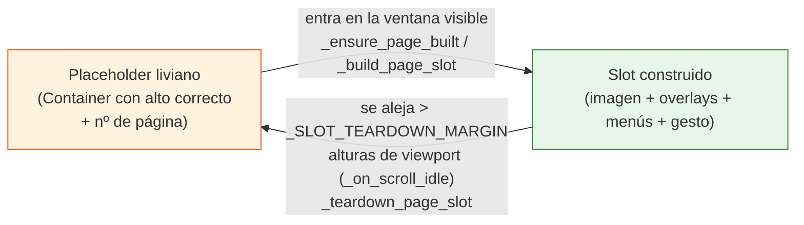
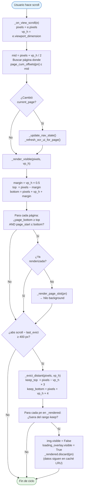
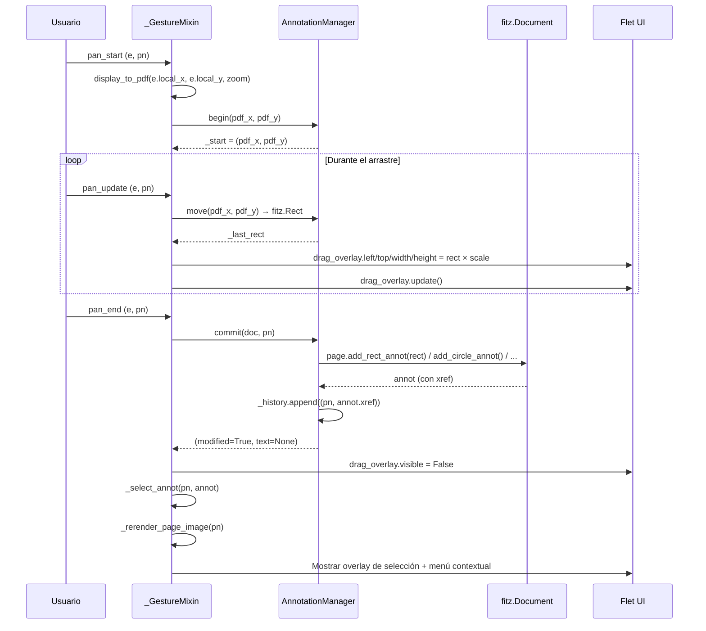
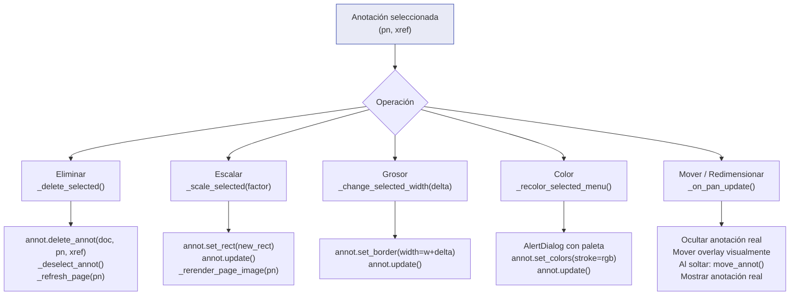
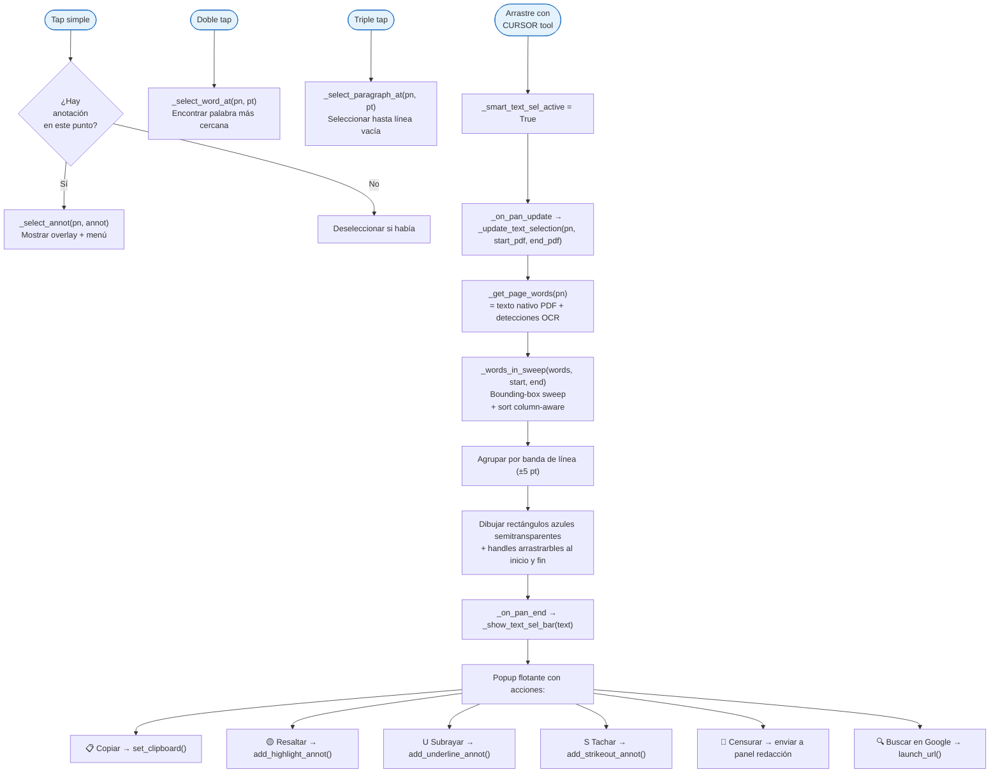
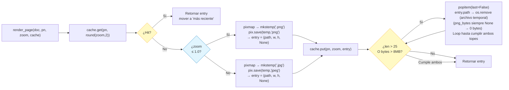

# Visor de PDF — Arquitectura y funcionamiento

## Índice

1. [Visión general](#1-visión-general)
2. [Estructura de clases](#2-estructura-de-clases)
3. [Cómo se abre y muestra un PDF](#3-cómo-se-abre-y-muestra-un-pdf)
4. [Scroll, viewport y virtualización](#4-scroll-viewport-y-virtualización)
5. [Sistema de zoom](#5-sistema-de-zoom)
6. [Anotaciones](#6-anotaciones)
7. [Selección de texto](#7-selección-de-texto)
8. [Pipeline OCR](#8-pipeline-ocr)
9. [Caché de renderizado](#9-caché-de-renderizado)
10. [Variables de estado principales](#10-variables-de-estado-principales)
11. [Integración con DocumentManagerUI](#11-integración-con-documentmanagerui)

---

## 1. Visión general

El visor está construido con **Flet** (Python sobre Flutter) y **PyMuPDF** (`fitz`).

| Capa | Tecnología | Responsabilidad |
|------|-----------|-----------------|
| UI | Flet / Flutter | Controles, eventos, overlays |
| Renderizado | PyMuPDF (`fitz`) | Convertir páginas PDF a píxeles |
| OCR | onnxtr (ONNX) | Reconocimiento de texto en páginas escaneadas |
| Anotaciones | PyMuPDF | Escribir marcas al documento en memoria |

**Constantes globales clave:**

```
BASE_SCALE   = 1.5   # Factor base pt→px (72 DPI → 108 DPI efectivos)
ZOOM_LEVELS  = [0.25, 0.5, 0.75, 1.0, 1.25, 1.5, 2.0, 3.0, 4.0]
_RENDER_SEM  = threading.Semaphore(6)   # Máx 6 renders concurrentes (todos
                                        #  los tabs comparten este semaphore;
                                        #  6 ≈ páginas visibles típicas, para
                                        #  que un cambio de zoom termine en
                                        #  una sola oleada en lugar de dos)
_MAX_ENTRIES = 25                       # Entradas máximas en la caché LRU
_MAX_BYTES   = 8 * 1024 * 1024          # Tope de bytes en RAM por tab (ver nota)
```

> **Nota de caché (importante):** desde la migración a render en disco, `render_page`
> guarda **todas** las páginas como archivo temporal (PNG para zoom ≤ 1.0, JPEG para
> zoom > 1.0) y el 4º campo de la entrada (`png_bytes`) es **siempre `None`** — ya no
> se mantienen bytes de imagen ni base64 en RAM. En la práctica la caché queda acotada
> por `_MAX_ENTRIES` (25) y por las ventanas de poda (`_CACHE_KEEP_PAGES`); el tope de
> bytes sólo contaría `png_bytes`, que hoy es siempre 0.

**Constantes de virtualización / ventana (en `_viewer_defs.py`):**

```
_PRELOAD              = 2     # páginas a renderizar al abrir
_EVICT_MARGIN         = 3     # alturas de viewport con IMAGEN retenida a cada lado
_SLOT_TEARDOWN_MARGIN = 6     # alturas de viewport: más allá, el SLOT vuelve a placeholder
_CACHE_KEEP_PAGES     = 5     # páginas con render cacheado alrededor de la actual
_TEXT_CACHE_KEEP_PAGES= 15    # páginas con caché de texto (rawdict) alrededor de la actual
_SCROLL_IDLE_DELAY    = 0.1   # seg tras detener el scroll antes de subir a calidad completa
_PREVIEW_QUALITY      = 0.66  # el tier preview rasteriza a esta fracción del zoom objetivo
```

---

## 2. Estructura de clases

`PDFViewerTab` hereda de **nueve mixins**. Cada uno gestiona un dominio concreto y accede al estado compartido mediante `self`. (El antiguo `_RedactAgentMixin` se dividió en `_RedactMixin`, `_ProfilesMixin` y `_AgentMixin`; la impresión vive en `_PrintMixin`.)

| Mixin | Archivo | Responsabilidad |
|-------|---------|-----------------|
| `_RenderMixin` | `_render_mixin.py` | Renderizado, navegación, zoom, guardado y **virtualización de slots** |
| `_GestureMixin` | `_gesture_mixin.py` | Enrutado de pan / tap; coordenadas viewport↔página |
| `_AnnotMixin` | `_annot_mixin.py` | Selección y edición de anotaciones |
| `_TextSelMixin` | `_text_sel_mixin.py` | Overlay de selección de texto a nivel palabra |
| `_OCRMixin` | `_ocr_mixin.py` | Ejecución de OCR y panel de resultados |
| `_RedactMixin` | `_redact_mixin.py` | Búsqueda/términos/preview/aplicar censura |
| `_ProfilesMixin` | `_profiles_mixin.py` | Diálogos de perfiles de censura |
| `_AgentMixin` | `_agent_mixin.py` | Panel de chat del agente IA |
| `_PrintMixin` | `_print_mixin.py` | Impresión (PowerShell en Windows, CUPS en Linux/macOS) |


```mermaid
classDiagram
    class PDFViewerTab {
        +path: str
        +doc: fitz.Document
        +zoom: float
        +current_page: int
        +_doc_lock: Lock
        +_render_cache: PageRenderCache
        +_annot: AnnotationManager
        +_ocr_processor: OCRProcessor
        +__init__(path, page_ref, on_close)
        +close()
        +get_tab_info() dict
        +on_focus()
        +on_blur()
    }

    class _RenderMixin {
        +_rebuild_scroll_content()
        +_make_placeholder(pn, w, h)
        +_build_page_slot(pn)
        +_ensure_page_built(pn)
        +_teardown_page_slot(pn)
        +_is_built(pn) / _page_is_active(pn)
        +_render_page_slot(pn, preview)
        +_render_visible(pixels, vh, preview)
        +_evict_distant(pixels, vh)
        +_teardown_built_distant(px, vh)
        +_on_view_scroll(e)
        +_apply_zoom()
        +_zoom_in() / _zoom_out()
        +_fit_width() / _fit_page()
        +_rotate(delta=90) / _rotate_ccw()
        +_undo() / _redo()
    }

    class _GestureMixin {
        +_on_tap_down(e, pn)
        +_on_tap(e, pn)
        +_on_pan_start(e, pn)
        +_on_pan_update(e, pn)
        +_on_pan_end(e, pn)
        +_on_hover(e, pn)
        +_detect_drag_mode(pdf_pt, annot_rect)
    }

    class _AnnotMixin {
        +_select_tool(tool, cursor)
        +_select_annot(pn, annot)
        +_deselect_annot()
        +_refresh_selected_overlay(pn)
        +_delete_selected()
        +_scale_selected(factor)
        +_recolor_selected_menu()
    }

    class _TextSelMixin {
        +_get_page_words(pn)
        +_update_text_selection(pn, start, end)
        +_show_text_sel_bar(text)
        +_text_sel_copy()
        +_text_sel_apply(tool)
        +_select_word_at(pn, pt)
        +_select_paragraph_at(pn, pt)
    }

    class _OCRMixin {
        +_build_ocr_sidebar_panel()
        +_run_ocr()
        +_refresh_ocr_ui_for_page()
        +_toggle_ocr_boxes()
        +_ocr_set_running(stage)
        +_ocr_set_done(result)
        +_ocr_copy_all()
    }

    class _RedactMixin {
        +_build_redact_sidebar_panel()
        +_add_redact_term()
        +_render_redact_preview()
        +_reapply_redact_page(pn)
        +_apply_redaction()
    }

    class _ProfilesMixin {
        +_open_profile_manager()
        +_save_current_as_profile()
        +_load_profile(profile)
    }

    class _AgentMixin {
        +_build_agent_sidebar_panel()
        +_agent_send()
        +_agent_quick_action(kind)
    }

    class _PrintMixin {
        +_print_pdf()
    }

    class AnnotationManager {
        +tool: Tool
        +highlight_color: tuple
        +_history: list
        +_redo_stack: list
        +begin(x, y)
        +move(x, y)
        +commit(doc, pn)
        +delete_annot(doc, pn, xref)
        +undo_last(doc)
        +redo_last(doc)
    }

    class PageRenderCache {
        +_d: OrderedDict
        +_MAX_ENTRIES: int = 25
        +get(pn, zoom)
        +put(pn, zoom, data)
        +invalidate_page(pn)
        +clear()
    }

    class OCRProcessor {
        +predictor: onnxtr model
        +process_page(doc, pn, force_ocr)
        +get_doc_kind(doc)
        +_native_segments(page)
        +_run_predictor(img)
    }

    PDFViewerTab --|> _RenderMixin
    PDFViewerTab --|> _GestureMixin
    PDFViewerTab --|> _AnnotMixin
    PDFViewerTab --|> _TextSelMixin
    PDFViewerTab --|> _OCRMixin
    PDFViewerTab --|> _RedactMixin
    PDFViewerTab --|> _ProfilesMixin
    PDFViewerTab --|> _AgentMixin
    PDFViewerTab --|> _PrintMixin
    PDFViewerTab *-- AnnotationManager
    PDFViewerTab *-- PageRenderCache
    PDFViewerTab *-- OCRProcessor
```

---

## 3. Cómo se abre y muestra un PDF

### Flujo completo: ruta de archivo → píxeles en pantalla


```mermaid
flowchart TD
    A([Usuario abre archivo]) --> B["PDFViewerTab.__init__(path)"]
    B --> C["fitz.open(path)\n→ self.doc"]
    C --> D["_rebuild_scroll_content()"]

    D --> E{¿Mismo\nnúmero de páginas?}

    E -- Sí\nFAST PATH --> F["Reusar controles Flet existentes (construidos)\nActualizar width/height\nReescalar placeholders no construidos"]
    E -- No\nFULL REBUILD --> G["Limpiar caché de renderizado\nCrear sólo PLACEHOLDERS livianos\npara todas las páginas (O(N) barato)"]

    F --> H["Para cada página visible\n_render_page_slot(pn)\n→ _ensure_page_built(pn) primero"]
    G --> H

    H --> I["_build_page_slot(pn) si es placeholder\nAñadir pn a _rendering\nLanzar hilo background"]

    I --> J{"¿Adquirir\n_RENDER_SEM?\n(máx 6)"}
    J -- Esperar --> J
    J -- Slot libre --> K

    K["with _doc_lock:\nrender_page(doc, pn, zoom, cache)"]

    K --> L{"¿Hit\nen caché?"}
    L -- Sí --> M["Retornar (b64, w, h) cacheado"]
    L -- No --> N["page = doc[pn]\nmat = Matrix(zoom × 1.5, zoom × 1.5)"]

    N --> O["pix = page.get_pixmap(matrix=mat, alpha=False)\n(sin canal alfa → −25% RAM, sin conversión)"]
    O --> R{zoom ≤ 1.0?}
    R -- Sí\nPNG a disco --> S["mkstemp('.png')\npix.save(temp, 'png')\nresult = (path, w, h, None)"]
    R -- No\nJPEG a disco --> T{zoom ≤ 2.0?}
    T -- Sí --> U["JPEG quality=90"]
    T -- No --> V["JPEG quality=82"]

    U --> W["mkstemp(suffix='.jpg')\npix.save(temp, jpeg)\nresult = (path, w, h, None)"]
    V --> W

    S --> X["cache.put(pn, zoom, result)"]
    W --> X
    X --> M
    M --> Y4["img.src = path  (siempre archivo en disco)\nimg.src_base64 = None\n(token vigente y slot construido)"]
    Y4 --> Y5["img.visible = True\n_schedule_render_update(pn)\n→ debounce 30 ms\n→ update sólo del slot sucio"]
    Y5 --> Z([Página visible en pantalla])

    style A fill:#E8F5E9,stroke:#2E7D32
    style Z fill:#E8F5E9,stroke:#2E7D32
    style J fill:#FFF9C4,stroke:#F57F17
    style L fill:#FFF9C4,stroke:#F57F17
```

### Sistema de coordenadas

```
PDF points (72 DPI)  ──×zoom──►  lógicas  ──×BASE_SCALE(1.5)──►  píxeles
           pt                      pt                                 px

Conversión inversa (clic en pantalla → posición PDF):
  pdf_x = display_x / (zoom × BASE_SCALE)
  pdf_y = display_y / (zoom × BASE_SCALE)
```

#### Páginas rotadas (`/Rotate` 90/180/270 — habitual en escaneos)

Una página con `/Rotate` mezcla **dos sistemas de coordenadas** que hay que no confundir:

| Espacio | Quién lo usa | Cómo se obtiene |
|---------|--------------|-----------------|
| **Pantalla / rotado** (`page.rect`) | la imagen renderizada (`get_pixmap` respeta `/Rotate`), las detecciones **OCR**, los overlays (`r.x0 × scale`), los clics (`display_to_pdf`) | — |
| **Sin rotar** (`page.mediabox`) | `search_for`/`get_text`, `add_redact_annot`, `add_*_annot`, `get_image_info().bbox` | — |

**Invariante del visor:** todo el estado interactivo (matches de censura, palabras de selección, geometría de overlays) se almacena en **espacio de pantalla**; sólo se convierte al escribir/leer geometría de PyMuPDF. Las matrices las deriva PyMuPDF de `page.rotation` y son la **identidad si `rotation == 0`** (sin coste para el caso común):

```
pantalla → sin rotar :  rect * page.derotation_matrix   (al escribir: censura, anotaciones)
sin rotar → pantalla :  rect * page.rotation_matrix      (al recolectar: search_for, texto nativo, annot.rect del overlay)
delta de pantalla → sin rotar : sólo la parte lineal de derotation_matrix (mover anotación)
```

Puntos de conversión: `_find_term_matches`/`_apply_redaction` (censura), `_get_page_words`/`_select_paragraph_at`/`_text_sel_apply` (selección), `AnnotationManager.commit`/`commit_ink`/`apply_text_tool`/`get_annot_at`/`move_annot`/`resize_annot`/`scale_annot` (anotaciones, vía helpers `_to_page_rect`/`_to_screen_rect`/`_to_page_delta`), y `processor._image_regions` (clip OCR). El recorte OCR se transforma a pantalla **antes** de `& page.rect` para cubrir toda la página rotada.

**Orden de lectura en selección.** Los rects de palabra se almacenan en pantalla (overlay, hit-test, dibujo), pero en una página rotada el texto puede verse vertical y un barrido que asume renglones horizontales agruparía mal (bandas que cruzan columnas). Por eso el **orden de lectura, el barrido y la agrupación de líneas** (`_sort_words_column_aware` con `pos=`, y la agrupación en `_update_text_selection`/`_select_word_at`) se calculan en el marco donde el texto es horizontal, y la franja resultante se transforma a pantalla para dibujarla.

El marco depende de la **fuente** del texto (lo elige `_reading_frames(pn)`):

| Fuente | Texto horizontal en… | Por qué |
|--------|----------------------|---------|
| **Nativo** (`rawdict`/bloques) | espacio SIN rotar | el texto se autoría horizontal en mediabox; al rotar la hoja se ve vertical en pantalla |
| **OCR** (detecciones) | **pantalla** | el OCR corre sobre la imagen MOSTRADA (ya derecha), así que sus cajas son horizontales en pantalla |

Por eso un escaneo con `/Rotate 270` que se ve recto (OCR → marco pantalla) y una hoja nativa rotada 90° (nativo → marco sin rotar) necesitan marcos **opuestos**. Identidad si `rotation == 0`. Al rotar desde el menú «Más opciones» («Rotar 90° a la derecha/izquierda», `_rotate(delta=±90)` / `_rotate_ccw`) se invalida la caché de render de la página (si no, se mostraría el PNG cacheado sin rotar) y sus cachés de texto/OCR.

> **Coste.** El arrastre de selección es camino caliente. `_reading_frames(pn)` devuelve un booleano `rotated_read`; cuando el marco de lectura es la pantalla (rotation==0 u OCR — el caso común), las transformaciones por palabra se **omiten** por completo (sin multiplicaciones de matriz) → mismo coste que antes de la lógica de rotación.

**Markup (resaltar/subrayar/tachar) en páginas rotadas.** La fusión por renglón (`_line_merged_rects`) debe hacerse en el marco de lectura (si no, en escaneos OCR el texto queda de lado en el espacio sin rotar y agrupa en bandas). Y al crear la anotación hay que pasar **quads orientados**, no rects: un `rect * matriz` da sólo el *bounding box* (pierde las esquinas) y `add_underline_annot`/`add_strikeout_annot` dibujarían la línea en el borde equivocado. `_text_sel_apply` fusiona en el marco de lectura, construye `rect.quad * read_to_page` (preserva las 4 esquinas → la línea va debajo/por el medio del texto) y los pasa a `apply_text_tool(..., rects_are_final=True)`, que entonces no re-fusiona ni des-rota. (`fitz.Quad(rect)` falla en PyMuPDF 1.27 → usar `rect.quad`.)

**Escaneos torcidos sin `/Rotate`** (la página se ve de lado pero `rotation == 0`): no hay metadato que des-rotar. `OCRProcessor.detect_orientation()` puntúa las 4 orientaciones con los modelos OCR ya incluidos y el botón **«Corregir orientación»** aplica `page.set_rotation` a todas las páginas → se ven derechas y todo lo anterior (que ya respeta `/Rotate`) queda correcto. No se guarda hasta que el usuario guarde.

### Formato y almacenamiento según zoom

| Zoom | Formato | Calidad | Ubicación | Motivo |
|------|---------|---------|-----------|--------|
| ≤ 1.0 | PNG | Lossless | Disco (`tempfile`) | Texto pequeño — JPEG añade artefactos; el PNG mantiene la nitidez. |
| 1.0 – 2.0 | JPEG | 90 | Disco (`tempfile`) | Pixmaps medianos; quality 90 ya es indistinguible para vista humana. |
| > 2.0 | JPEG | 82 | Disco (`tempfile`) | Pixmaps grandes (~5-15 MB de pixmap crudo) → quality 82 ahorra ~40% de tamaño sin pérdida perceptible en visualización. |

**Todas las páginas se rasterizan a un archivo temporal en disco — nunca se guardan bytes de imagen ni base64 en RAM.** La entrada de caché es `(temp_path, w, h, None)` y el control Flet apunta al archivo con `img.src = temp_path` (no `img.src_base64`). Así, transportar la imagen hacia Flutter es ligero (ruta de archivo, no un string base64 inflado un 33 %), y la rasterización/encode/IO corre **fuera** del `_doc_lock` (sólo `get_pixmap` lo toma), de modo que páginas del mismo documento no se serializan por completo entre sí.

```
Render:  page.get_pixmap()  →  pix.save(tempfile, png|jpeg)  →  entry = (path, w, h, None)
Mostrar: img.src = path     (gapless_playback evita el parpadeo al cambiar de imagen)
```

---

## 4. Scroll, viewport y virtualización

La columna de páginas (`viewer_scroll: ft.Column`) es un scrollable continuo. El visor solo mantiene imágenes **visibles** en memoria; las páginas lejanas son desalojadas y vuelven a renderizarse cuando el usuario regresa.

### Virtualización del árbol de controles (slots perezosos)

Construir el árbol pesado de cada página (imagen + overlays de selección/anotación/OCR/censura + menús flotantes + `GestureDetector`, **~50 controles**) para TODAS las páginas al abrir el PDF era inviable en documentos grandes: ~40.000 controles para 800 páginas → la carga se congelaba y la RAM se disparaba (objetos Python + árbol Flutter). Por eso el árbol está **virtualizado**:


```mermaid
flowchart LR
    PH["Placeholder liviano\n(Container con alto correcto\n+ nº de página)"] -- "entra en la ventana visible\n_ensure_page_built / _build_page_slot" --> BUILT["Slot construido\n(imagen + overlays + menús + gesto)"]
    BUILT -- "se aleja > _SLOT_TEARDOWN_MARGIN\nalturas de viewport (_on_scroll_idle)\n_teardown_page_slot" --> PH

    style PH fill:#FFF3E0,stroke:#E65100
    style BUILT fill:#E8F5E9,stroke:#2E7D32
```

- Cada página arranca como **placeholder** (`_make_placeholder`): un `Container` con el alto correcto (para que el scrollbar mida bien) y el número de página tenue. Crear esto para N páginas es **O(N) barato**.
- El árbol pesado se construye **bajo demanda** (`_build_page_slot`, vía `_ensure_page_built`) al entrar la página en la ventana visible, y se **desinfla** de vuelta a placeholder (`_teardown_page_slot`) al alejarse más de `_SLOT_TEARDOWN_MARGIN` alturas de viewport. Así los slots vivos quedan acotados a una ventana, sin importar el tamaño del PDF.
- `_page_is_active` evita desinflar páginas con estado interactivo vivo (actual, selección de anotación, rango de texto, popup, tinta). Al re-materializar un slot, `_build_page_slot` re-aplica los overlays activos de esa página (cajas OCR, preview de censura, overlay de selección).

> **INVARIANTE para todos los mixins:** las listas por página (`_page_images`, `_sel_overlays`, `_ocr_overlays`, …) tienen longitud == nº de páginas pero contienen **`None`** para los slots no construidos. Todo acceso indexado o iteración sobre esas listas **debe tolerar `None`** (saltarlo). Romper esta invariante produce `AttributeError: 'NoneType'` en caminos de la GUI.


```mermaid
flowchart TD
    S([Usuario hace scroll]) --> A["_on_view_scroll(e)\npixels = e.pixels\nvp_h = e.viewport_dimension"]

    A --> B["mid = pixels + vp_h / 2\nBuscar página donde\npage_cum_offsets[pn] ≤ mid"]

    B --> C{¿Cambió\ncurrent_page?}
    C -- Sí --> D["_update_nav_state()\n_refresh_ocr_ui_for_page()"]
    C -- No --> E

    D --> E["_render_visible(pixels, vp_h)"]

    E --> F["margin = vp_h × 0.5\ntop  = pixels − margin\nbottom = pixels + vp_h + margin"]

    F --> G["Para cada página:\n¿page_bottom ≥ top\nAND page_start ≤ bottom?"]

    G -- Sí --> H{¿Ya\nrenderizada?}
    G -- No --> I

    H -- No --> J["_render_page_slot(pn)\n→ hilo background"]
    H -- Sí --> I

    J --> I{¿abs scroll − last_evict\n≥ 400 px?}

    I -- Sí --> K["_evict_distant(pixels, vp_h)\nkeep_top  = pixels − vp_h × 3\nkeep_bottom = pixels + vp_h × 4"]
    I -- No --> L([Fin de ciclo])

    K --> M["Para cada pn en _rendered:\n¿fuera del rango keep?"]
    M -- Sí --> N["img.visible = False\nloading_overlay.visible = True\n_rendered.discard(pn)\n(datos siguen en caché LRU)"]
    M -- No --> L
    N --> L

    style S fill:#E3F2FD,stroke:#1565C0
    style L fill:#E8F5E9,stroke:#2E7D32
```

**Constantes de viewport:**

| Constante | Valor | Significado |
|-----------|-------|-------------|
| `_PRELOAD` | 2 | Páginas extras a renderizar al abrir |
| `_EVICT_MARGIN` | 3 | Alturas de viewport con **imagen** retenida a cada lado antes de desalojar |
| `_SLOT_TEARDOWN_MARGIN` | 6 | Alturas de viewport: más allá, el **slot** entero vuelve a placeholder (`_on_scroll_idle`) |
| `_EVICT_THRESHOLD` | 400 px | Correr desalojo de imágenes solo cada 400 px de scroll |
| `_CACHE_KEEP_PAGES` | 5 | Páginas con render cacheado alrededor de la actual (poda del `PageRenderCache`) |
| `_TEXT_CACHE_KEEP_PAGES` | 15 | Páginas con caché de texto (rawdict) alrededor de la actual |
| `_SCROLL_IDLE_DELAY` | 0.1 s | Espera tras detener el scroll antes de subir lo visible a calidad completa |
| `_PAGE_GAP` | 16 px | Separación vertical entre páginas |

### Calidad de render según la velocidad (preview en fling)

`_on_view_scroll` mide la velocidad del scroll (px/seg) y elige el tier de render **en vuelo**:

| Velocidad | Acción | Por qué |
|-----------|--------|---------|
| `< 6 × alturas/seg` (lento/medio) | `_render_visible(preview=False)` → **calidad completa** | A esa velocidad sí da tiempo a rasterizar nítido sin desperdicio. |
| `≥ 6 × alturas/seg` (fling rápido) | `_render_visible(preview=True)` → **tier PREVIEW (LOD)** | Rasteriza a ~1/4 del coste para que las hojas **no aparezcan en blanco** mientras scrolleas. |

Al detenerse, `_on_scroll_idle` (tras `_SCROLL_IDLE_DELAY` = 0.1 s) sube lo visible a **calidad completa**. El swap preview→nítido usa `gapless_playback`, así que la imagen anterior se mantiene hasta que la nueva decodifica → **no parpadea a blanco**, solo se afina la nitidez. (Antes no se renderizaba nada durante el fling → hojas en blanco.)

`_on_scroll_idle` también ejecuta `_teardown_built_distant`, que desinfla a placeholder los slots construidos lejos del viewport, acotando la RAM del árbol de controles al recorrer documentos grandes.

### Coordenadas viewport↔página: O(1) / O(log N)

`_get_global_y(pn, local_y)` y `_get_page_and_local_y(global_y)` (en `_gesture_mixin`) convierten entre coordenadas locales de página y la posición global de scroll. Se ejecutan en **cada evento de arrastre** (selección de texto, resaltado, mover handles). Usan los offsets acumulados ya cacheados (`_page_cum_offsets`):

```
_get_global_y(pn, ly)      = _page_cum_offsets[pn] + ly            # O(1)
_get_page_and_local_y(g)   = bisect sobre _page_cum_offsets        # O(log N)
```

Antes barrían `_page_heights` linealmente (**O(N) por evento**), lo que hacía que seleccionar texto o arrastrar una anotación en la página 700 de 800 se sintiera lento; ahora el coste es independiente de la página.

---

## 5. Sistema de zoom


```mermaid
flowchart LR
    Z1([Botón + / −]) --> A["_zoom_in() / _zoom_out()\nself.zoom = siguiente nivel\nActualizar label en el acto"]
    Z2([Ctrl+Scroll]) --> B["_on_page_scroll(e, pn)\n¿_ctrl_pressed = True?\ndelta_y < 0 → zoom_in\ndelta_y > 0 → zoom_out"]
    Z3([Ajustar ancho]) --> C["_fit_width()\nzoom = (page_ref.width − 72)\n         / (pw × BASE_SCALE)\n→ _apply_zoom() directo"]
    Z4([Ajustar página]) --> D["_fit_page()\nzoom = min(\n  avail_w / (pw × BASE_SCALE),\n  avail_h / (ph × BASE_SCALE))\n→ _apply_zoom() directo"]

    A --> DB["_schedule_zoom_apply()\n→ Timer 120 ms"]
    B --> DB
    DB -- "Más Ctrl+Scrolls\nantes de 120 ms" --> DB
    DB -- "120 ms sin\ninput" --> E["_apply_zoom()"]
    C --> E
    D --> E

    E --> F["zoom_label.value (ya estaba)"]
    F --> G["Guardar posición fraccional:\nfrac = (scroll_px − cum_offset[pn])\n       / page_height[pn]"]
    G --> H["_rebuild_scroll_content(scroll_back=False)\n→ Fast-resize path"]
    H --> I["Restaurar posición:\ntarget = cum_offset[pn] + frac × page_height[pn]\nviewer_scroll.scroll_to(target, duration=0)"]

    style E fill:#FFF9C4,stroke:#F9A825
    style DB fill:#FFE0B2,stroke:#E65100
```

### Debounce de zoom (120 ms)

`_zoom_in` / `_zoom_out` actualizan `self.zoom` y el label **inmediatamente** pero difieren el rebuild costoso vía `_schedule_zoom_apply`. Cada llamada cancela el timer previo y reinicia 120 ms. Esto significa que durante Ctrl+Scroll rápido (varios eventos en < 120 ms) solo se dispara **un** `_apply_zoom` al final, con el zoom final — no uno por cada tick de scroll.

Los entry points "directos" (botones de fit, menú de zoom específico) llaman a `_apply_zoom` sin pasar por el debounce.

### Preview durante transición (fast-resize path)

`_rebuild_scroll_content` con `len(_page_images) == total` reusa los controles existentes. Para cada página visible:

| Si la página ya tenía render | Si no |
|------------------------------|-------|
| `img.fit = CONTAIN` (escala la imagen vieja al nuevo tamaño) | `img.visible = False` |
| `img.visible = True` (preview escalado) | `load_overlay.visible = True` (respaldo "papel" blanco) |
| `load_overlay.visible = False` | — |

> Las páginas **no construidas** (placeholder) sólo reescalan su placeholder al nuevo tamaño; su slot pesado se construirá al entrar en la ventana visible.

Mientras el worker renderiza al nuevo zoom (200-300 ms), el usuario ve un preview escalado (borroso) en vez de un hueco. `img.fit` se mantiene en `CONTAIN` siempre (en un render completo la imagen ya mide exactamente lo que el slot, así que `CONTAIN` == 1:1 nítido); no se alterna a `NONE`, evitando el salto de tamaño de un frame durante el zoom mientras `gapless_playback` sostiene la imagen anterior. El render nítido se asigna en un update batched (ver `_schedule_render_update`).

### Coalescing de updates post-render (30 ms)

Cuando varios workers terminan dentro de una ventana corta (típico en cambios de zoom donde 5-6 páginas se renderizan en paralelo), `_schedule_render_update` debounce 30 ms y consolida en un único `viewer_scroll.update()`. Sin esto, cada worker disparaba su propio `slot.update()`, generando una cascada visual.

### Posición fraccional

La posición fraccional (`frac`) evita que al hacer zoom el contenido salte al inicio de la página: si el usuario estaba viendo el 40% vertical de la página 3, después del zoom sigue en el mismo punto visual.

---

## 6. Anotaciones

### Herramientas disponibles

```
Tool.CURSOR     → Seleccionar / mover anotaciones existentes
Tool.SELECT     → Seleccionar texto nativo
Tool.HIGHLIGHT  → Resaltado de texto
Tool.UNDERLINE  → Subrayado
Tool.STRIKEOUT  → Tachado
Tool.RECT       → Rectángulo
Tool.CIRCLE     → Elipse
Tool.LINE       → Línea recta
Tool.ARROW      → Flecha
Tool.INK        → Trazo libre (spline Catmull-Rom)
```

### Ciclo de vida: dibujar una anotación


```mermaid
sequenceDiagram
    participant U as Usuario
    participant GM as _GestureMixin
    participant AM as AnnotationManager
    participant Doc as fitz.Document
    participant UI as Flet UI

    U->>GM: pan_start (e, pn)
    GM->>GM: display_to_pdf(e.local_x, e.local_y, zoom)
    GM->>AM: begin(pdf_x, pdf_y)
    AM-->>GM: _start = (pdf_x, pdf_y)

    loop Durante el arrastre
        U->>GM: pan_update (e, pn)
        GM->>AM: move(pdf_x, pdf_y) → fitz.Rect
        AM-->>GM: _last_rect
        GM->>UI: drag_overlay.left/top/width/height = rect × scale
        GM->>UI: drag_overlay.update()
    end

    U->>GM: pan_end (e, pn)
    GM->>AM: commit(doc, pn)
    AM->>Doc: page.add_rect_annot(rect) / add_circle_annot() / ...
    Doc-->>AM: annot (con xref)
    AM->>AM: _history.append((pn, annot.xref))
    AM-->>GM: (modified=True, text=None)
    GM->>UI: drag_overlay.visible = False
    GM->>GM: _select_annot(pn, annot)
    GM->>GM: _rerender_page_image(pn)
    GM->>UI: Mostrar overlay de selección + menú contextual
```

### Editar anotación seleccionada


```mermaid
flowchart TD
    SEL["Anotación seleccionada\n(pn, xref)"] --> OP{Operación}

    OP --> D["Eliminar\n_delete_selected()"]
    OP --> SC["Escalar\n_scale_selected(factor)"]
    OP --> W["Grosor\n_change_selected_width(delta)"]
    OP --> C["Color\n_recolor_selected_menu()"]
    OP --> MV["Mover / Redimensionar\n_on_pan_update()"]

    D --> DA["annot.delete_annot(doc, pn, xref)\n_deselect_annot()\n_refresh_page(pn)"]
    SC --> SCA["annot.set_rect(new_rect)\nannot.update()\n_rerender_page_image(pn)"]
    W --> WA["annot.set_border(width=w+delta)\nannot.update()"]
    C --> CA["AlertDialog con paleta\nannot.set_colors(stroke=rgb)\nannot.update()"]
    MV --> MVA["Ocultar anotación real\nMover overlay visualmente\nAl soltar: move_annot()\nMostrar anotación real"]

    style SEL fill:#E8EAF6,stroke:#3949AB
```

### Deshacer / Rehacer (Ctrl+Z · Ctrl+Y / Ctrl+Shift+Z)

`AnnotationManager` mantiene dos pilas: `_history` (anotaciones creadas, en orden de inserción) y `_redo_stack` (instantáneas de las deshechas, listas para recrearse).

```
_undo()  →  AnnotationManager.undo_last(doc)
  ├─ pn, xref = _history[-1]
  ├─ snap = _snapshot_annot(annot)   # serializa geometría + estilo a un dict
  ├─ _redo_stack.append(snap)
  ├─ page.delete_annot(annot)
  ├─ _history.pop()
  └─ _refresh_page(pn)

_redo()  →  AnnotationManager.redo_last(doc)
  ├─ snap = _redo_stack.pop()
  ├─ annot = _recreate_annot(page, snap)   # vuelve a crear la anotación
  ├─ _history.append((pn, annot.xref))      # NO limpia _redo_stack
  └─ _refresh_page(pn)
```

> **Invalidación de la pila de rehacer.** Toda anotación nueva se registra vía
> `_push_history(pn, xref)`, que añade a `_history` **y limpia `_redo_stack`** —
> igual que un editor de texto: crear algo nuevo descarta el futuro rehacible.
> `redo_last` re-añade a `_history` directamente (sin pasar por `_push_history`)
> para no borrarse a sí misma.

`_snapshot_annot` guarda `type`, `rect`, colores (`stroke`/`fill`), `width`, `opacity` y, según el tipo, los `quads` (markup: resaltado/subrayado/tachado/garabato), `points` + `line_ends` (línea) o `strokes` (tinta). `_recreate_annot` reconstruye desde ese dict; los markup rechazan `set_border`, así que sólo se aplica a las formas. Si la página o el tipo no se pueden recrear, devuelve `None` y el rehacer se aborta sin error.

---

## 7. Selección de texto


```mermaid
flowchart TD
    T1([Tap simple]) --> A{¿Hay\nanotación\nen este punto?}
    A -- Sí --> B["_select_annot(pn, annot)\nMostrar overlay + menú"]
    A -- No --> C["Deseleccionar si había"]

    T2([Doble tap]) --> D["_select_word_at(pn, pt)\nEncontrar palabra más cercana"]
    T3([Triple tap]) --> E["_select_paragraph_at(pn, pt)\nSeleccionar hasta línea vacía"]

    T4([Arrastre con\nCURSOR tool]) --> F["_smart_text_sel_active = True"]

    F --> G["_on_pan_update → _update_text_selection(pn, start_pdf, end_pdf)"]

    G --> H["_get_page_words(pn)\n= texto nativo PDF + detecciones OCR"]
    H --> I["_words_in_sweep(words, start, end)\nBounding-box sweep\n+ sort column-aware"]
    I --> J["Agrupar por banda de línea (±5 pt)"]
    J --> K["Dibujar rectángulos azules semitransparentes\n+ handles arrastrarbles al inicio y fin"]
    K --> L["_on_pan_end → _show_text_sel_bar(text)"]

    L --> M["Popup flotante con acciones:"]
    M --> M1["📋 Copiar → set_clipboard()"]
    M --> M2["🟡 Resaltar → add_highlight_annot()"]
    M --> M3["U Subrayar → add_underline_annot()"]
    M --> M4["S Tachar → add_strikeout_annot()"]
    M --> M5["🚫 Censurar → enviar a panel redacción"]
    M --> M6["🔍 Buscar en Google → launch_url()"]

    style T1 fill:#E3F2FD,stroke:#1565C0
    style T2 fill:#E3F2FD,stroke:#1565C0
    style T3 fill:#E3F2FD,stroke:#1565C0
    style T4 fill:#E3F2FD,stroke:#1565C0
```

**Ordenamiento column-aware:** Las palabras se ordenan primero detectando columnas (brecha > 8% del ancho de página) y luego por (columna, y0, x0), evitando que el texto de dos columnas se mezcle.

---

## 8. Pipeline OCR


```mermaid
flowchart TD
    BTN([Botón OCR\nEjecutar]) --> SW["_switch_sidebar_mode('ocr')\nAbrir panel lateral"]
    SW --> A["_ocr_set_running('Analizando página N…')\n→ ProgressRing + barra indeterminada"]
    A --> B["Hilo background:\nwith _doc_lock:\nocr_processor.process_page(doc, pn)"]

    B --> C["get_doc_kind(doc)\nMuestrear 20 páginas\n→ 'native' | 'scanned' | 'hybrid'"]
    C --> D["page_kind(page)\n→ 'native' | 'scanned' | 'hybrid'"]

    D --> E{"¿Necesita\nOCR?"}

    E -- No / Solo texto nativo --> F["_native_segments(page)\npage.get_text('blocks')\n→ list[OCRSegment]"]
    E -- Sí --> G["Renderizar página a\nnp.ndarray (escala ×2)"]
    G --> H["_run_predictor(img)\nONNX inference:\ndb_mobilenet_v3_large (detección)\ncrnn_mobilenet_v3_small (reconocimiento)"]
    H --> I["Convertir geometría normalizada\na coordenadas PDF\n→ list[OCRDetection]"]

    F --> J["Combinar segmentos nativos + OCR\nOrdenar por (y0, x0)"]
    I --> J

    J --> K["OCRPageResult\n  page_kind, doc_kind\n  mode_label: 'OCR' | 'Nativo' | 'Híbrido'\n  elapsed_ms\n  segments: list[OCRSegment]\n  detections: list[OCRDetection]"]

    K --> L["_ocr_by_page[pn] = result\n_page_words.pop(pn) → invalidar caché"]
    L --> M["_ocr_set_done(result)\n→ Mostrar chips de modo y tipo\n→ Métricas de tiempo y segmentos\n→ Botón copiar todo"]
    M --> N["_build_ocr_results_list(result)\n→ Texto completo seleccionable"]
    N --> O["_render_ocr_boxes()\n→ Cajas de detección sobre la página"]

    O --> P(["OCR completado"])

    style BTN fill:#E8F5E9,stroke:#2E7D32
    style P fill:#E8F5E9,stroke:#2E7D32
    style H fill:#F3E5F5,stroke:#7B1FA2
```

### OCRSegment vs OCRDetection

| | `OCRSegment` | `OCRDetection` |
|---|---|---|
| Contiene | `text`, `source`, `bbox` | `text`, `score`, `source`, `bbox` |
| Fuente | Nativo o OCR | Solo OCR |
| Uso | Caché de palabras, selección de texto | Cajas de detección, confianza |

### Integración con selección de texto

```
_get_page_words(pn):
  if pn in _page_words: return _page_words[pn]   # cacheado (ver poda abajo)
  # Extracción a nivel CARÁCTER (no "words") para una selección más fina.
  # Tupla (rect, char, word_start): word_start marca el primer carácter de cada
  # palabra OCR — las cajas OCR de palabras adyacentes se tocan (hueco ~0) y el
  # heurístico de espacios por hueco no las separaría; con la marca, la
  # reconstrucción de texto inserta el espacio. El nativo usa word_start=False
  # (sus huecos son reales).
  raw = page.get_text("rawdict")
  words = [(fitz.Rect(char["bbox"]), char["c"], False)  # nativo: sin marca
           for block in raw["blocks"] for line in block["lines"]
           for span in line["spans"] for char in span["chars"]
           if char["c"].strip()]
  if pn in _ocr_by_page:                          # + detecciones OCR como chars
      words += _ocr_chars(_ocr_by_page[pn])        # word_start=True en el 1er char
  words = _sort_words_column_aware(words)
  _page_words[pn] = words
  _page_word_bands[pn] = _build_y_band_index(words)   # índice espacial O(k)
  return words
```

> Las cachés de texto por página (`_page_words` rawdict char-level,
> `_page_word_bands`, `_page_blocks_cache`, `_text_rects_cache`) se **podan a una
> ventana** (`_TEXT_CACHE_KEEP_PAGES` = 15) alrededor de la página actual: recorrer
> un PDF grande con el cursor no debe acumular el rawdict de todas las páginas. La
> reconstrucción es perezosa (re-extrae si vuelves a una página lejana).

---

## 9. Caché de renderizado


```mermaid
flowchart LR
    R["render_page(doc, pn, zoom, cache)"] --> G["cache.get(pn, round(zoom,2))"]
    G --> H{¿Hit?}
    H -- Sí --> RET["Retornar entry\nmover a 'más reciente'"]
    H -- No --> COMPUTE{¿zoom\n≤ 1.0?}
    COMPUTE -- Sí --> CM["pixmap → mkstemp('.png')\npix.save(temp,'png')\n→ entry = (path, w, h, None)"]
    COMPUTE -- No --> CD["pixmap → mkstemp('.jpg')\npix.save(temp,'jpeg')\n→ entry = (path, w, h, None)"]
    CM --> P["cache.put(pn, zoom, entry)"]
    CD --> P
    P --> EVICT{¿len > 25\nO bytes > 8MB?}
    EVICT -- Sí --> DEL["popitem(last=False)\nentry.path → os.remove (archivo temporal)\n(png_bytes siempre None → 0 bytes)\nLoop hasta cumplir ambos topes"]
    EVICT -- No --> RET2["Retornar entry"]
    DEL --> EVICT
    EVICT -- Cumple ambos --> RET2

    style H fill:#FFF9C4,stroke:#F9A825
    style EVICT fill:#FFF9C4,stroke:#F9A825
    style COMPUTE fill:#E1F5FE,stroke:#0277BD
```

### Estructura de la entrada del caché

```python
CacheEntry = tuple[str, int, int, None]
#               (path,  w,   h,   png_bytes=None)
#
# Todas las páginas → archivo en disco:
#   zoom ≤ 1.0:  ("/tmp/xxx.png", w, h, None)   # PNG lossless
#   zoom > 1.0:  ("/tmp/xxx.jpg", w, h, None)   # JPEG
#
# El 4º campo (png_bytes) se conserva por compatibilidad y SIEMPRE es None:
# ya no se mantienen bytes de imagen ni base64 en RAM.
```

### Propiedades del caché

| Propiedad | Valor |
|-----------|-------|
| Clave | `(page_num, round(zoom, 2))` |
| Estructura | `OrderedDict` con `move_to_end` para LRU |
| Thread-safety | `threading.Lock` en cada operación |
| Tope por count | `_MAX_ENTRIES = 25` entradas |
| Tope por bytes | `_MAX_BYTES = 8 MB` (cuenta `png_bytes`, hoy siempre `None` → 0 bytes; todas las páginas son archivos en disco, no consumen RAM en la caché) |
| Eviction trigger | El que se alcance primero (count o bytes); en la práctica manda el count y la poda por ventana (`_CACHE_KEEP_PAGES`) |

### Operaciones públicas

```python
get(pn, zoom)         → CacheEntry | None    # con LRU bump
put(pn, zoom, entry)  → None                  # eviccion automática
invalidate_page(pn)   → None                  # tras edición / anotación
clear()               → None                  # tras suspend o close
shrink(max_entries)   → None                  # tras on_blur (max_entries=5)
```

### Lifecycle del caché por tab

1. **Tab activo**: hasta 25 entradas o 8 MB, lo que se alcance primero
2. **Tab pierde foco** (`on_blur`): `shrink(5)` inmediato → libera ~80% de la RAM del caché
3. **20 s después sin recuperar foco** (`_do_suspend`): `clear()` completo + `_render_gen += 1` para abortar workers en vuelo
4. **Tab recupera foco** (`on_focus`): si estaba suspendido, fast-resize re-renderiza las páginas visibles; además `_restore_scroll_position()` vuelve a la hoja donde estaba el usuario (re-mostrar el tab reinicia el scroll del Column en Flutter)
5. **Tab cerrado** (`close`): `clear()` + `doc.close()`

Esto permite tener 10+ PDFs abiertos simultáneamente reteniendo ~13 MB en total en el peor caso (1 activo × 8 MB + 9 inactivos × ~500 KB), en lugar de 80-200 MB que serían con el caché completo en cada tab.

---

## 10. Variables de estado principales

### Documento y renderizado

```python
self.path: str                      # Ruta completa del archivo
self.doc: fitz.Document             # Documento PyMuPDF (protegido por _doc_lock)
self.zoom: float                    # Multiplicador actual (1.0 = 100%)
self.current_page: int              # Página actual (0-indexed)
self._scroll_px: float              # Posición de scroll en píxeles
self._doc_lock: threading.Lock      # Protege acceso a self.doc desde hilos
self._render_cache: PageRenderCache # Caché LRU de imágenes renderizadas
self._render_gen: int               # Generación; cambiar invalida renders en vuelo
self._rendering: set[int]           # Páginas siendo renderizadas ahora
self._rendered: set[int]            # Páginas con imagen visible
self._page_cum_offsets: list[float] # Offset Y acumulado por página (px)
self._page_heights: list[float]     # Alto renderizado por página (px)
```

### Controles Flet por página (virtualizados)

> **Todas estas listas tienen longitud == nº de páginas, pero contienen `None`
> para los slots no construidos (placeholder).** Itera/indexa siempre tolerando
> `None`. Se pueblan en `_build_page_slot(pn)` y se vuelven a poner en `None` en
> `_teardown_page_slot(pn)`.

```python
self._page_rows[pn]: ft.Row                # SIEMPRE presente; su hijo es el
                                           #  placeholder o el slot construido
self._page_placeholders[pn]: ft.Container  # Stand-in liviano (alto + nº de página)
self._page_cum_offsets[pn]: float          # Offset Y del tope de la página (px)
self._page_heights[pn]: float              # Alto renderizado de la página (px)

# Árbol pesado — None hasta construir el slot:
self._page_images[pn]: ft.Image | None            # Imagen renderizada
self._page_slots[pn]: ft.Container | None         # Stack de todos los controles
self._page_gestures[pn]: ft.GestureDetector | None
self._loading_overlays[pn]: ft.Container | None   # Respaldo "papel" mientras renderiza
self._drag_overlays[pn]: ft.Container | None      # Overlay semitransparente al dibujar
self._sel_overlays[pn]: ft.Container | None       # Overlay de anotación seleccionada
self._sel_handles[pn]: dict | None                # Handles + menú de la selección
self._text_sel_layers[pn]: ft.Stack | None        # Rectángulos de selección de texto
self._ocr_overlays[pn]: ft.Stack | None           # Cajas de detección OCR
self._redact_overlays[pn]: ft.Stack | None        # Cajas de preview de censura
self._ink_canvases[pn]: cv.Canvas | None          # Previsualización de trazo libre
```

### Anotaciones

```python
self._annot: AnnotationManager      # Estado de la herramienta activa
self._selected: (pn, xref) | None  # Anotación seleccionada
self._drag_mode: str | None        # None | "move" | "resize_tl" | ...
self._drag_annot_hidden: bool      # True mientras arrastra (oculta original)
self._ctrl_pressed: bool           # Estado de la tecla Ctrl (para Ctrl+Scroll)
```

### Selección de texto

```python
self._page_words: dict[int, list]         # Caché de palabras por página
self._text_sel_start_pn: int | None       # Página de inicio de la selección activa
self._text_sel_end_pn: int | None         # Página de fin de la selección activa
self._text_sel_text: str                  # Texto seleccionado
self._text_sel_start_pdf: tuple | None    # Inicio en coords PDF
self._text_sel_end_pdf: tuple | None      # Fin en coords PDF
self._smart_text_sel_active: bool         # True durante arrastre de selección
self._sel_drag_handle: str | None         # "start" | "end" (handle arrastrado)
```

### OCR

```python
self._ocr_processor: OCRProcessor         # Instancia del motor ONNX
self._ocr_by_page: dict[int, OCRPageResult]  # Resultados por página
self._ocr_show_boxes: bool                # Mostrar cajas de detección
```

---

## 11. Integración con DocumentManagerUI

`PDFViewerTab` no construye ni gestiona su propio `ft.Tab`. En su lugar expone:

```python
def get_tab_info(self) -> dict:
    return {
        "label":     Path(self.path).name,
        "icon":      ft.Icons.PICTURE_AS_PDF,
        "content":   self.view,          # ft.Column raíz
        "closeable": True,
        "close_cb":  lambda: self.on_close(self),
        "viewer":    self,               # referencia a sí mismo
    }

def on_focus(self) -> None:
    """Llamado por DocumentManagerUI al activar esta pestaña."""
    self._cancel_suspend_timer()
    if self._is_suspended:
        self._is_suspended = False
        # fast-resize re-renderiza las páginas visibles bajo demanda
        self._rebuild_scroll_content(scroll_back=False)
    # Restaurar la hoja donde estaba el usuario: re-mostrar el tab (visible
    # False→True) reinicia el offset del Column en Flutter, así que sin esto el
    # visor saltaba al inicio. _scroll_px se conserva a través del blur/suspend.
    self._restore_scroll_position()   # scroll_to(_scroll_px) con un frame de retardo

def on_blur(self) -> None:
    """Llamado por DocumentManagerUI al desactivar esta pestaña."""
    # Shrink inmediato: libera ~80% del caché sin esperar el timer.
    self._render_cache.shrink(self._BLUR_SHRINK_KEEP)  # = 5 entradas
    self._start_suspend_timer()  # 20 s → clear total
```

`DocumentManagerUI.rebuild()` llama a `old_viewer.on_blur()` / `new_viewer.on_focus()` automáticamente al cambiar la pestaña activa.

### Lifecycle de RAM en dos pasos

| Paso | Trigger | Acción | Efecto |
|------|---------|--------|--------|
| 1 | `on_blur` (inmediato) | `cache.shrink(5)` | Libera ~6-7 MB por tab al instante |
| 2 | 20 s sin recuperar foco | `_do_suspend()`: `_render_gen += 1` + `cache.clear()` | Libera el resto + aborta workers en vuelo |
| ↩ | `on_focus` | Cancela el timer; fast-resize si estaba suspendido; `_restore_scroll_position()` | Re-renderiza las páginas visibles y vuelve a la hoja donde estabas |

Sin este lifecycle, con 10 PDFs abiertos cada uno retendría 8 MB de caché → ~80 MB en total solo en imágenes cacheadas. Con el lifecycle de dos pasos, el costo realista cae a ~13 MB (1 activo × 8 MB + 9 inactivos × ~500 KB tras el shrink, hasta que el timer hace el clear completo).

El `fitz.Document` **queda abierto** entre suspend y resume — abrirlo de nuevo serializaría las anotaciones no guardadas. Solo el caché de imágenes se libera.
