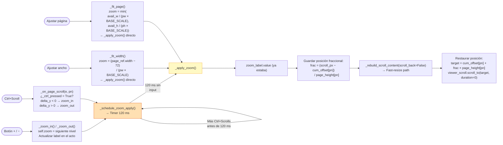
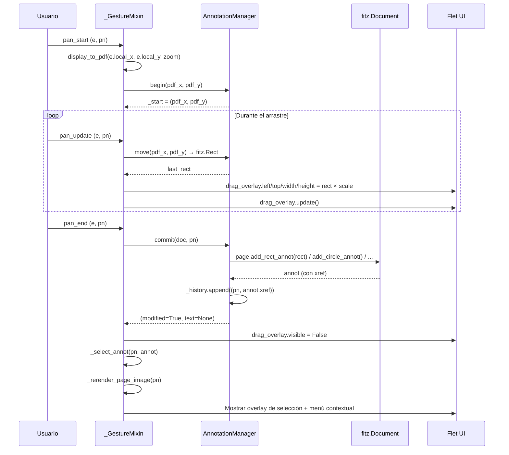
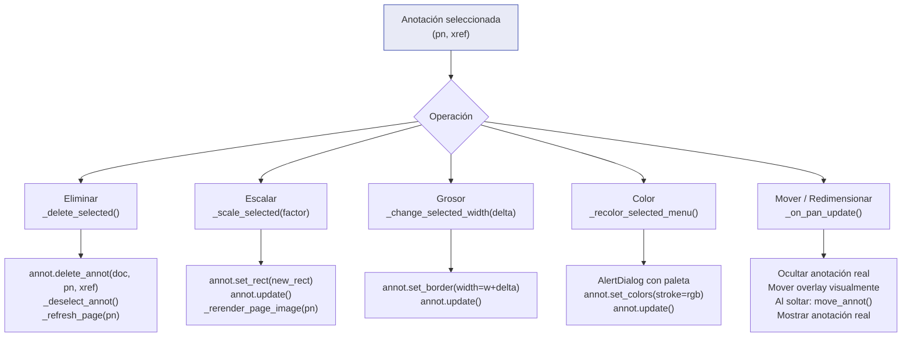
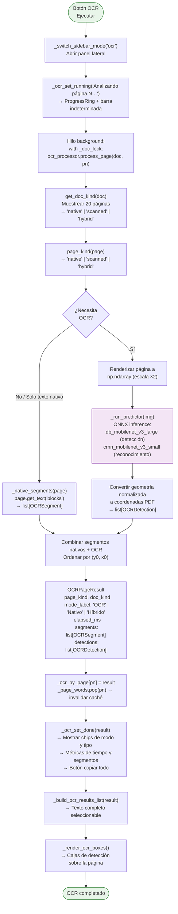
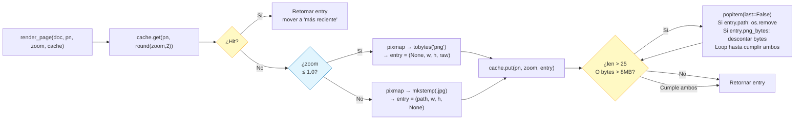

# Visor de PDF — Arquitectura y funcionamiento

## Índice

1. [Visión general](#1-visión-general)
2. [Estructura de clases](#2-estructura-de-clases)
3. [Cómo se abre y muestra un PDF](#3-cómo-se-abre-y-muestra-un-pdf)
4. [Sistema de scroll y viewport](#4-sistema-de-scroll-y-viewport)
5. [Sistema de zoom](#5-sistema-de-zoom)
6. [Anotaciones](#6-anotaciones)
7. [Selección de texto](#7-selección-de-texto)
8. [Pipeline OCR](#8-pipeline-ocr)
9. [Caché de renderizado](#9-caché-de-renderizado)
10. [Variables de estado principales](#10-variables-de-estado-principales)

---

## 1. Visión general

El visor está construido con **Flet** (Python sobre Flutter) y **PyMuPDF** (`fitz`).

| Capa | Tecnología | Responsabilidad |
|------|-----------|-----------------|
| UI | Flet / Flutter | Controles, eventos, overlays |
| Renderizado | PyMuPDF (`fitz`) | Convertir páginas PDF a píxeles |
| OCR | onnxtr (ONNX) | Reconocimiento de texto en páginas escaneadas |
| Anotaciones | PyMuPDF | Escribir marcas al documento en memoria |

**Constantes globales clave:**

```
BASE_SCALE   = 1.5   # Factor base pt→px (72 DPI → 108 DPI efectivos)
ZOOM_LEVELS  = [0.25, 0.5, 0.75, 1.0, 1.25, 1.5, 2.0, 3.0, 4.0]
_RENDER_SEM  = threading.Semaphore(6)   # Máx 6 renders concurrentes (todos
                                        #  los tabs comparten este semaphore;
                                        #  6 ≈ páginas visibles típicas, para
                                        #  que un cambio de zoom termine en
                                        #  una sola oleada en lugar de dos)
_MAX_ENTRIES = 25                       # Entradas máximas en la caché LRU
_MAX_BYTES   = 8 * 1024 * 1024          # Tope duro de bytes PNG en RAM por tab
                                        #  (evicción por size + por count)
```

---

## 2. Estructura de clases

`PDFViewerTab` hereda de seis mixins. Cada uno gestiona un dominio concreto y accede al estado compartido mediante `self`.


```mermaid
classDiagram
    class PDFViewerTab {
        +path: str
        +doc: fitz.Document
        +zoom: float
        +current_page: int
        +_doc_lock: Lock
        +_render_cache: PageRenderCache
        +_annot: AnnotationManager
        +_ocr_processor: OCRProcessor
        +__init__(path, page_ref, on_close)
        +close()
        +get_tab_info() dict
        +on_focus()
        +on_blur()
    }

    class _RenderMixin {
        +_rebuild_scroll_content()
        +_render_page_slot(pn)
        +_render_visible(pixels, vh)
        +_evict_distant(pixels, vh)
        +_on_view_scroll(e)
        +_apply_zoom()
        +_zoom_in() / _zoom_out()
        +_fit_width() / _fit_page()
        +_on_page_scroll(e, pn)
    }

    class _GestureMixin {
        +_on_tap_down(e, pn)
        +_on_tap(e, pn)
        +_on_pan_start(e, pn)
        +_on_pan_update(e, pn)
        +_on_pan_end(e, pn)
        +_on_hover(e, pn)
        +_detect_drag_mode(pdf_pt, annot_rect)
    }

    class _AnnotMixin {
        +_select_tool(tool, cursor)
        +_select_annot(pn, annot)
        +_deselect_annot()
        +_refresh_selected_overlay(pn)
        +_delete_selected()
        +_scale_selected(factor)
        +_recolor_selected_menu()
    }

    class _TextSelMixin {
        +_get_page_words(pn)
        +_update_text_selection(pn, start, end)
        +_show_text_sel_bar(text)
        +_text_sel_copy()
        +_text_sel_apply(tool)
        +_select_word_at(pn, pt)
        +_select_paragraph_at(pn, pt)
    }

    class _OCRMixin {
        +_build_ocr_sidebar_panel()
        +_run_ocr()
        +_refresh_ocr_ui_for_page()
        +_toggle_ocr_boxes()
        +_ocr_set_running(stage)
        +_ocr_set_done(result)
        +_ocr_copy_all()
    }

    class _RedactAgentMixin {
        +_build_redact_sidebar_panel()
        +_build_agent_sidebar_panel()
        +_add_redact_term()
        +_render_redact_preview()
        +_apply_redaction()
    }

    class AnnotationManager {
        +tool: Tool
        +highlight_color: tuple
        +_history: list
        +begin(x, y)
        +move(x, y)
        +commit(doc, pn)
        +delete_annot(doc, pn, xref)
        +undo_last(doc)
    }

    class PageRenderCache {
        +_d: OrderedDict
        +_MAX_ENTRIES: int = 25
        +get(pn, zoom)
        +put(pn, zoom, data)
        +invalidate_page(pn)
        +clear()
    }

    class OCRProcessor {
        +predictor: onnxtr model
        +process_page(doc, pn, force_ocr)
        +get_doc_kind(doc)
        +_native_segments(page)
        +_run_predictor(img)
    }

    PDFViewerTab --|> _RenderMixin
    PDFViewerTab --|> _GestureMixin
    PDFViewerTab --|> _AnnotMixin
    PDFViewerTab --|> _TextSelMixin
    PDFViewerTab --|> _OCRMixin
    PDFViewerTab --|> _RedactAgentMixin
    PDFViewerTab *-- AnnotationManager
    PDFViewerTab *-- PageRenderCache
    PDFViewerTab *-- OCRProcessor
```

---

## 3. Cómo se abre y muestra un PDF

### Flujo completo: ruta de archivo → píxeles en pantalla


```mermaid
flowchart TD
    A([Usuario abre archivo]) --> B["PDFViewerTab.__init__(path)"]
    B --> C["fitz.open(path)\n→ self.doc"]
    C --> D["_rebuild_scroll_content()"]

    D --> E{¿Mismo\nnúmero de páginas?}

    E -- Sí\nFAST PATH --> F["Reusar controles Flet existentes\nActualizar width/height de cada imagen\nLimpiar imágenes obsoletas"]
    E -- No\nFULL REBUILD --> G["Limpiar caché de renderizado\nCrear controles Flet nuevos\npara todas las páginas"]

    F --> H["Para cada página visible\n_render_page_slot(pn)"]
    G --> H

    H --> I["Añadir pn a _rendering\nLanzar hilo background"]

    I --> J{"¿Adquirir\n_RENDER_SEM?\n(máx 4)"}
    J -- Esperar --> J
    J -- Slot libre --> K

    K["with _doc_lock:\nrender_page(doc, pn, zoom, cache)"]

    K --> L{"¿Hit\nen caché?"}
    L -- Sí --> M["Retornar (b64, w, h) cacheado"]
    L -- No --> N["page = doc[pn]\nmat = Matrix(zoom × 1.5, zoom × 1.5)"]

    N --> O["pix = page.get_pixmap(matrix=mat)"]
    O --> P{¿Canal\nalpha?}
    P -- Sí --> Q["Convertir a RGB\nfitz.Pixmap(csRGB, pix)"]
    P -- No --> R

    Q --> R{zoom ≤ 1.0?}
    R -- Sí\nPNG en RAM --> S["raw = pix.tobytes('png')\nresult = (None, w, h, raw)"]
    R -- No\nJPEG a disco --> T{zoom ≤ 2.0?}
    T -- Sí --> U["JPEG quality=90"]
    T -- No --> V["JPEG quality=82"]

    U --> W["mkstemp(suffix='.jpg')\npix.save(temp, jpeg)\nresult = (path, w, h, None)"]
    V --> W

    S --> X["cache.put(pn, zoom, result)"]
    W --> X
    X --> M
    M --> Y2{¿png_bytes\nestá set?}
    Y2 -- Sí --> Y3["img.src_base64 =\nb64encode(png_bytes)\nimg.src = None"]
    Y2 -- No\n(JPEG en disco) --> Y4["img.src = path\nimg.src_base64 = None"]
    Y3 --> Y5["img.visible = True\n_schedule_render_update()\n→ debounce 30 ms\n→ un solo viewer_scroll.update()"]
    Y4 --> Y5
    Y5 --> Z([Página visible en pantalla])

    style A fill:#E8F5E9,stroke:#2E7D32
    style Z fill:#E8F5E9,stroke:#2E7D32
    style J fill:#FFF9C4,stroke:#F57F17
    style L fill:#FFF9C4,stroke:#F57F17
```

### Sistema de coordenadas

```
PDF points (72 DPI)  ──×zoom──►  lógicas  ──×BASE_SCALE(1.5)──►  píxeles
           pt                      pt                                 px

Conversión inversa (clic en pantalla → posición PDF):
  pdf_x = display_x / (zoom × BASE_SCALE)
  pdf_y = display_y / (zoom × BASE_SCALE)
```

### Formato y almacenamiento según zoom

| Zoom | Formato | Calidad | Ubicación | Motivo |
|------|---------|---------|-----------|--------|
| ≤ 1.0 | PNG | Lossless | **RAM** (`png_bytes`) | Texto pequeño — JPEG añade artefactos. Sin escritura a disco → menos latencia. |
| 1.0 – 2.0 | JPEG | 90 | Disco (`tempfile`) | Pixmaps medianos; quality 90 ya es indistinguible para vista humana. |
| > 2.0 | JPEG | 82 | Disco (`tempfile`) | Pixmaps grandes (~5-15 MB de pixmap crudo) → quality 82 ahorra ~40% de tamaño sin pérdida perceptible en visualización. |

**El caché guarda PNG bytes crudos (no base64).** El worker codifica a base64 solo al asignar a `img.src_base64`. Esto evita el overhead del 33% de base64 en RAM:

```
Antes:  cache ←  base64-string (270 KB por página)  → img.src_base64
Ahora:  cache ←  bytes PNG (200 KB)                  → b64encode()  → img.src_base64
```

---

## 4. Sistema de scroll y viewport

La columna de páginas (`viewer_scroll: ft.Column`) es un scrollable continuo. El visor solo mantiene imágenes **visibles** en memoria; las páginas lejanas son desalojadas y vuelven a renderizarse cuando el usuario regresa.

```mermaid
flowchart TD
    S([Usuario hace scroll]) --> A["_on_view_scroll(e)\npixels = e.pixels\nvp_h = e.viewport_dimension"]

    A --> B["mid = pixels + vp_h / 2\nBuscar página donde\npage_cum_offsets[pn] ≤ mid"]

    B --> C{¿Cambió\ncurrent_page?}
    C -- Sí --> D["_update_nav_state()\n_refresh_ocr_ui_for_page()"]
    C -- No --> E

    D --> E["_render_visible(pixels, vp_h)"]

    E --> F["margin = vp_h × 0.5\ntop  = pixels − margin\nbottom = pixels + vp_h + margin"]

    F --> G["Para cada página:\n¿page_bottom ≥ top\nAND page_start ≤ bottom?"]

    G -- Sí --> H{¿Ya\nrenderizada?}
    G -- No --> I

    H -- No --> J["_render_page_slot(pn)\n→ hilo background"]
    H -- Sí --> I

    J --> I{¿|scroll − last_evict|\n≥ 400 px?}

    I -- Sí --> K["_evict_distant(pixels, vp_h)\nkeep_top  = pixels − vp_h × 3\nkeep_bottom = pixels + vp_h × 4"]
    I -- No --> L([Fin de ciclo])

    K --> M["Para cada pn en _rendered:\n¿fuera del rango keep?"]
    M -- Sí --> N["img.visible = False\nloading_overlay.visible = True\n_rendered.discard(pn)\n(datos siguen en caché LRU)"]
    M -- No --> L
    N --> L

    style S fill:#E3F2FD,stroke:#1565C0
    style L fill:#E8F5E9,stroke:#2E7D32
```

**Constantes de viewport:**

| Constante | Valor | Significado |
|-----------|-------|-------------|
| `_PRELOAD` | 2 | Páginas extras a renderizar al abrir |
| `_EVICT_MARGIN` | 3.0 | Retener 3 viewports a cada lado antes de desalojar |
| `_EVICT_THRESHOLD` | 400 px | Correr desalojo solo cada 400 px de scroll |
| `_PAGE_GAP` | 16 px | Separación vertical entre páginas |

---

## 5. Sistema de zoom


```mermaid
flowchart LR
    Z1([Botón + / −]) --> A["_zoom_in() / _zoom_out()\nself.zoom = siguiente nivel\nActualizar label en el acto"]
    Z2([Ctrl+Scroll]) --> B["_on_page_scroll(e, pn)\n¿_ctrl_pressed = True?\ndelta_y < 0 → zoom_in\ndelta_y > 0 → zoom_out"]
    Z3([Ajustar ancho]) --> C["_fit_width()\nzoom = (page_ref.width − 72)\n         / (pw × BASE_SCALE)\n→ _apply_zoom() directo"]
    Z4([Ajustar página]) --> D["_fit_page()\nzoom = min(\n  avail_w / (pw × BASE_SCALE),\n  avail_h / (ph × BASE_SCALE))\n→ _apply_zoom() directo"]

    A --> DB["_schedule_zoom_apply()\n→ Timer 120 ms"]
    B --> DB
    DB -- "Más Ctrl+Scrolls\nantes de 120 ms" --> DB
    DB -- "120 ms sin\ninput" --> E["_apply_zoom()"]
    C --> E
    D --> E

    E --> F["zoom_label.value (ya estaba)"]
    F --> G["Guardar posición fraccional:\nfrac = (scroll_px − cum_offset[pn])\n       / page_height[pn]"]
    G --> H["_rebuild_scroll_content(scroll_back=False)\n→ Fast-resize path"]
    H --> I["Restaurar posición:\ntarget = cum_offset[pn] + frac × page_height[pn]\nviewer_scroll.scroll_to(target, duration=0)"]

    style E fill:#FFF9C4,stroke:#F9A825
    style DB fill:#FFE0B2,stroke:#E65100
```

### Debounce de zoom (120 ms)

`_zoom_in` / `_zoom_out` actualizan `self.zoom` y el label **inmediatamente** pero difieren el rebuild costoso vía `_schedule_zoom_apply`. Cada llamada cancela el timer previo y reinicia 120 ms. Esto significa que durante Ctrl+Scroll rápido (varios eventos en < 120 ms) solo se dispara **un** `_apply_zoom` al final, con el zoom final — no uno por cada tick de scroll.

Los entry points "directos" (botones de fit, menú de zoom específico) llaman a `_apply_zoom` sin pasar por el debounce.

### Preview durante transición (fast-resize path)

`_rebuild_scroll_content` con `len(_page_images) == total` reusa los controles existentes. Para cada página visible:

| Si la página ya tenía render | Si no |
|------------------------------|-------|
| `img.fit = CONTAIN` (escala la imagen vieja al nuevo tamaño) | `img.visible = False` |
| `slot.bgcolor = None` | `slot.bgcolor = _PAGE_BG` (gris) |
| `load_overlay.visible = False` | `load_overlay.visible = True` (spinner) |

Mientras el worker renderiza al nuevo zoom (200-300 ms), el usuario ve un preview escalado (borroso) en vez de un gris vacío. Al terminar, el worker restaura `fit = NONE` y asigna el render nítido en un solo update batchedeado (ver `_schedule_render_update`).

### Coalescing de updates post-render (30 ms)

Cuando varios workers terminan dentro de una ventana corta (típico en cambios de zoom donde 5-6 páginas se renderizan en paralelo), `_schedule_render_update` debounce 30 ms y consolida en un único `viewer_scroll.update()`. Sin esto, cada worker disparaba su propio `slot.update()`, generando una cascada visual.

### Posición fraccional

La posición fraccional (`frac`) evita que al hacer zoom el contenido salte al inicio de la página: si el usuario estaba viendo el 40% vertical de la página 3, después del zoom sigue en el mismo punto visual.

---

## 6. Anotaciones

### Herramientas disponibles

```
Tool.CURSOR     → Seleccionar / mover anotaciones existentes
Tool.SELECT     → Seleccionar texto nativo
Tool.HIGHLIGHT  → Resaltado de texto
Tool.UNDERLINE  → Subrayado
Tool.STRIKEOUT  → Tachado
Tool.RECT       → Rectángulo
Tool.CIRCLE     → Elipse
Tool.LINE       → Línea recta
Tool.ARROW      → Flecha
Tool.INK        → Trazo libre (spline Catmull-Rom)
```

### Ciclo de vida: dibujar una anotación


```mermaid
sequenceDiagram
    participant U as Usuario
    participant GM as _GestureMixin
    participant AM as AnnotationManager
    participant Doc as fitz.Document
    participant UI as Flet UI

    U->>GM: pan_start (e, pn)
    GM->>GM: display_to_pdf(e.local_x, e.local_y, zoom)
    GM->>AM: begin(pdf_x, pdf_y)
    AM-->>GM: _start = (pdf_x, pdf_y)

    loop Durante el arrastre
        U->>GM: pan_update (e, pn)
        GM->>AM: move(pdf_x, pdf_y) → fitz.Rect
        AM-->>GM: _last_rect
        GM->>UI: drag_overlay.left/top/width/height = rect × scale
        GM->>UI: drag_overlay.update()
    end

    U->>GM: pan_end (e, pn)
    GM->>AM: commit(doc, pn)
    AM->>Doc: page.add_rect_annot(rect) / add_circle_annot() / ...
    Doc-->>AM: annot (con xref)
    AM->>AM: _history.append((pn, annot.xref))
    AM-->>GM: (modified=True, text=None)
    GM->>UI: drag_overlay.visible = False
    GM->>GM: _select_annot(pn, annot)
    GM->>GM: _rerender_page_image(pn)
    GM->>UI: Mostrar overlay de selección + menú contextual
```

### Editar anotación seleccionada


```mermaid
flowchart TD
    SEL["Anotación seleccionada\n(pn, xref)"] --> OP{Operación}

    OP --> D["Eliminar\n_delete_selected()"]
    OP --> SC["Escalar\n_scale_selected(factor)"]
    OP --> W["Grosor\n_change_selected_width(delta)"]
    OP --> C["Color\n_recolor_selected_menu()"]
    OP --> MV["Mover / Redimensionar\n_on_pan_update()"]

    D --> DA["annot.delete_annot(doc, pn, xref)\n_deselect_annot()\n_refresh_page(pn)"]
    SC --> SCA["annot.set_rect(new_rect)\nannot.update()\n_rerender_page_image(pn)"]
    W --> WA["annot.set_border(width=w+delta)\nannot.update()"]
    C --> CA["AlertDialog con paleta\nannot.set_colors(stroke=rgb)\nannot.update()"]
    MV --> MVA["Ocultar anotación real\nMover overlay visualmente\nAl soltar: move_annot()\nMostrar anotación real"]

    style SEL fill:#E8EAF6,stroke:#3949AB
```

### Deshacer (Ctrl+Z)

```
_undo()
  ├─ pn, xref = _annot._history[-1]
  ├─ page.delete_annot(annot)
  ├─ _history.pop()
  └─ _refresh_page(pn)
```

---

## 7. Selección de texto


```mermaid
flowchart TD
    T1([Tap simple]) --> A{¿Hay\nanotación\nen este punto?}
    A -- Sí --> B["_select_annot(pn, annot)\nMostrar overlay + menú"]
    A -- No --> C["Deseleccionar si había"]

    T2([Doble tap]) --> D["_select_word_at(pn, pt)\nEncontrar palabra más cercana"]
    T3([Triple tap]) --> E["_select_paragraph_at(pn, pt)\nSeleccionar hasta línea vacía"]

    T4([Arrastre con\nCURSOR tool]) --> F["_smart_text_sel_active = True"]

    F --> G["_on_pan_update → _update_text_selection(pn, start_pdf, end_pdf)"]

    G --> H["_get_page_words(pn)\n= texto nativo PDF + detecciones OCR"]
    H --> I["_words_in_sweep(words, start, end)\nBounding-box sweep\n+ sort column-aware"]
    I --> J["Agrupar por banda de línea (±5 pt)"]
    J --> K["Dibujar rectángulos azules semitransparentes\n+ handles arrastrarbles al inicio y fin"]
    K --> L["_on_pan_end → _show_text_sel_bar(text)"]

    L --> M["Popup flotante con acciones:"]
    M --> M1["📋 Copiar → set_clipboard()"]
    M --> M2["🟡 Resaltar → add_highlight_annot()"]
    M --> M3["U Subrayar → add_underline_annot()"]
    M --> M4["S Tachar → add_strikeout_annot()"]
    M --> M5["🚫 Censurar → enviar a panel redacción"]
    M --> M6["🔍 Buscar en Google → launch_url()"]

    style T1 fill:#E3F2FD,stroke:#1565C0
    style T2 fill:#E3F2FD,stroke:#1565C0
    style T3 fill:#E3F2FD,stroke:#1565C0
    style T4 fill:#E3F2FD,stroke:#1565C0
```

**Ordenamiento column-aware:** Las palabras se ordenan primero detectando columnas (brecha > 8% del ancho de página) y luego por (columna, y0, x0), evitando que el texto de dos columnas se mezcle.

---

## 8. Pipeline OCR


```mermaid
flowchart TD
    BTN([Botón OCR\nEjecutar]) --> SW["_switch_sidebar_mode('ocr')\nAbrir panel lateral"]
    SW --> A["_ocr_set_running('Analizando página N…')\n→ ProgressRing + barra indeterminada"]
    A --> B["Hilo background:\nwith _doc_lock:\nocr_processor.process_page(doc, pn)"]

    B --> C["get_doc_kind(doc)\nMuestrear 20 páginas\n→ 'native' | 'scanned' | 'hybrid'"]
    C --> D["page_kind(page)\n→ 'native' | 'scanned' | 'hybrid'"]

    D --> E{"¿Necesita\nOCR?"}

    E -- No / Solo texto nativo --> F["_native_segments(page)\npage.get_text('blocks')\n→ list[OCRSegment]"]
    E -- Sí --> G["Renderizar página a\nnp.ndarray (escala ×2)"]
    G --> H["_run_predictor(img)\nONNX inference:\ndb_mobilenet_v3_large (detección)\ncrnn_mobilenet_v3_small (reconocimiento)"]
    H --> I["Convertir geometría normalizada\na coordenadas PDF\n→ list[OCRDetection]"]

    F --> J["Combinar segmentos nativos + OCR\nOrdenar por (y0, x0)"]
    I --> J

    J --> K["OCRPageResult\n  page_kind, doc_kind\n  mode_label: 'OCR' | 'Nativo' | 'Híbrido'\n  elapsed_ms\n  segments: list[OCRSegment]\n  detections: list[OCRDetection]"]

    K --> L["_ocr_by_page[pn] = result\n_page_words.pop(pn) → invalidar caché"]
    L --> M["_ocr_set_done(result)\n→ Mostrar chips de modo y tipo\n→ Métricas de tiempo y segmentos\n→ Botón copiar todo"]
    M --> N["_build_ocr_results_list(result)\n→ Texto completo seleccionable"]
    N --> O["_render_ocr_boxes()\n→ Cajas de detección sobre la página"]

    O --> P(["OCR completado"])

    style BTN fill:#E8F5E9,stroke:#2E7D32
    style P fill:#E8F5E9,stroke:#2E7D32
    style H fill:#F3E5F5,stroke:#7B1FA2
```

### OCRSegment vs OCRDetection

| | `OCRSegment` | `OCRDetection` |
|---|---|---|
| Contiene | `text`, `source`, `bbox` | `text`, `score`, `source`, `bbox` |
| Fuente | Nativo o OCR | Solo OCR |
| Uso | Caché de palabras, selección de texto | Cajas de detección, confianza |

### Integración con selección de texto

```
_get_page_words(pn):
  words  = page.get_text("words")          # Texto nativo PDF
  if pn in _ocr_by_page:
      words += [(det.bbox, det.text)        # Detecciones OCR
                for det in result.detections]
  return _sort_words_column_aware(words)
```

---

## 9. Caché de renderizado


```mermaid
flowchart LR
    R["render_page(doc, pn, zoom, cache)"] --> G["cache.get(pn, round(zoom,2))"]
    G --> H{¿Hit?}
    H -- Sí --> RET["Retornar entry\nmover a 'más reciente'"]
    H -- No --> COMPUTE{¿zoom\n≤ 1.0?}
    COMPUTE -- Sí --> CM["pixmap → tobytes('png')\n→ entry = (None, w, h, raw)"]
    COMPUTE -- No --> CD["pixmap → mkstemp(.jpg)\n→ entry = (path, w, h, None)"]
    CM --> P["cache.put(pn, zoom, entry)"]
    CD --> P
    P --> EVICT{¿len > 25\nO bytes > 8MB?}
    EVICT -- Sí --> DEL["popitem(last=False)\nSi entry.path: os.remove\nSi entry.png_bytes: descontar bytes\nLoop hasta cumplir ambos"]
    EVICT -- No --> RET2["Retornar entry"]
    DEL --> EVICT
    EVICT -- Cumple ambos --> RET2

    style H fill:#FFF9C4,stroke:#F9A825
    style EVICT fill:#FFF9C4,stroke:#F9A825
    style COMPUTE fill:#E1F5FE,stroke:#0277BD
```

### Estructura de la entrada del caché

```python
CacheEntry = tuple[str | None, int, int, bytes | None]
#               (path,        w,   h,   png_bytes)
#
# Modo memoria (zoom ≤ 1.0):  (None, w, h, raw_png_bytes)
# Modo disco   (zoom > 1.0):  ("/tmp/xxx.jpg", w, h, None)
```

### Propiedades del caché

| Propiedad | Valor |
|-----------|-------|
| Clave | `(page_num, round(zoom, 2))` |
| Estructura | `OrderedDict` con `move_to_end` para LRU |
| Thread-safety | `threading.Lock` en cada operación |
| Tope por count | `_MAX_ENTRIES = 25` entradas |
| Tope por bytes | `_MAX_BYTES = 8 MB` (solo cuenta `png_bytes`; los JPEGs en disco no consumen RAM) |
| Eviction trigger | El que se alcance primero (count o bytes) |

### Operaciones públicas

```python
get(pn, zoom)         → CacheEntry | None    # con LRU bump
put(pn, zoom, entry)  → None                  # eviccion automática
invalidate_page(pn)   → None                  # tras edición / anotación
clear()               → None                  # tras suspend o close
shrink(max_entries)   → None                  # tras on_blur (max_entries=5)
```

### Lifecycle del caché por tab

1. **Tab activo**: hasta 25 entradas o 8 MB, lo que se alcance primero
2. **Tab pierde foco** (`on_blur`): `shrink(5)` inmediato → libera ~80% de la RAM del caché
3. **20 s después sin recuperar foco** (`_do_suspend`): `clear()` completo + `_render_gen += 1` para abortar workers en vuelo
4. **Tab recupera foco** (`on_focus`): si estaba suspendido, fast-resize re-renderiza las páginas visibles
5. **Tab cerrado** (`close`): `clear()` + `doc.close()`

Esto permite tener 10+ PDFs abiertos simultáneamente reteniendo ~13 MB en total en el peor caso (1 activo × 8 MB + 9 inactivos × ~500 KB), en lugar de 80-200 MB que serían con el caché completo en cada tab.

---

## 10. Variables de estado principales

### Documento y renderizado

```python
self.path: str                      # Ruta completa del archivo
self.doc: fitz.Document             # Documento PyMuPDF (protegido por _doc_lock)
self.zoom: float                    # Multiplicador actual (1.0 = 100%)
self.current_page: int              # Página actual (0-indexed)
self._scroll_px: float              # Posición de scroll en píxeles
self._doc_lock: threading.Lock      # Protege acceso a self.doc desde hilos
self._render_cache: PageRenderCache # Caché LRU de imágenes renderizadas
self._render_gen: int               # Generación; cambiar invalida renders en vuelo
self._rendering: set[int]           # Páginas siendo renderizadas ahora
self._rendered: set[int]            # Páginas con imagen visible
self._page_cum_offsets: list[float] # Offset Y acumulado por página (px)
self._page_heights: list[float]     # Alto renderizado por página (px)
```

### Controles Flet por página

```python
self._page_images[pn]: ft.Image            # Imagen renderizada
self._page_slots[pn]: ft.Container         # Stack de todos los controles
self._page_gestures[pn]: ft.GestureDetector
self._loading_overlays[pn]: ft.Container   # Spinner mientras renderiza
self._drag_overlays[pn]: ft.Container      # Overlay semitransparente al dibujar
self._sel_overlays[pn]: ft.Container       # Overlay de anotación seleccionada
self._text_sel_layers[pn]: ft.Stack        # Rectángulos de selección de texto
self._ocr_overlays[pn]: ft.Stack          # Cajas de detección OCR
self._ink_canvases[pn]: cv.Canvas          # Previsualización de trazo libre
```

### Anotaciones

```python
self._annot: AnnotationManager      # Estado de la herramienta activa
self._selected: (pn, xref) | None  # Anotación seleccionada
self._drag_mode: str | None        # None | "move" | "resize_tl" | ...
self._drag_annot_hidden: bool      # True mientras arrastra (oculta original)
self._ctrl_pressed: bool           # Estado de la tecla Ctrl (para Ctrl+Scroll)
```

### Selección de texto

```python
self._page_words: dict[int, list]         # Caché de palabras por página
self._text_sel_start_pn: int | None       # Página de inicio de la selección activa
self._text_sel_end_pn: int | None         # Página de fin de la selección activa
self._text_sel_text: str                  # Texto seleccionado
self._text_sel_start_pdf: tuple | None    # Inicio en coords PDF
self._text_sel_end_pdf: tuple | None      # Fin en coords PDF
self._smart_text_sel_active: bool         # True durante arrastre de selección
self._sel_drag_handle: str | None         # "start" | "end" (handle arrastrado)
```

### OCR

```python
self._ocr_processor: OCRProcessor         # Instancia del motor ONNX
self._ocr_by_page: dict[int, OCRPageResult]  # Resultados por página
self._ocr_show_boxes: bool                # Mostrar cajas de detección
```

---

## 11. Integración con DocumentManagerUI

`PDFViewerTab` no construye ni gestiona su propio `ft.Tab`. En su lugar expone:

```python
def get_tab_info(self) -> dict:
    return {
        "label":     Path(self.path).name,
        "icon":      ft.Icons.PICTURE_AS_PDF,
        "content":   self.view,          # ft.Column raíz
        "closeable": True,
        "close_cb":  lambda: self.on_close(self),
        "viewer":    self,               # referencia a sí mismo
    }

def on_focus(self) -> None:
    """Llamado por DocumentManagerUI al activar esta pestaña."""
    self._cancel_suspend_timer()
    if self._is_suspended:
        self._is_suspended = False
        # fast-resize re-renderiza las páginas visibles bajo demanda
        self._rebuild_scroll_content(scroll_back=False)

def on_blur(self) -> None:
    """Llamado por DocumentManagerUI al desactivar esta pestaña."""
    # Shrink inmediato: libera ~80% del caché sin esperar el timer.
    self._render_cache.shrink(self._BLUR_SHRINK_KEEP)  # = 5 entradas
    self._start_suspend_timer()  # 20 s → clear total
```

`DocumentManagerUI.rebuild()` llama a `old_viewer.on_blur()` / `new_viewer.on_focus()` automáticamente al cambiar la pestaña activa.

### Lifecycle de RAM en dos pasos

| Paso | Trigger | Acción | Efecto |
|------|---------|--------|--------|
| 1 | `on_blur` (inmediato) | `cache.shrink(5)` | Libera ~6-7 MB por tab al instante |
| 2 | 20 s sin recuperar foco | `_do_suspend()`: `_render_gen += 1` + `cache.clear()` | Libera el resto + aborta workers en vuelo |
| ↩ | `on_focus` | Cancela el timer; fast-resize si estaba suspendido | Re-renderiza las páginas visibles |

Sin este lifecycle, con 10 PDFs abiertos cada uno retendría 8 MB de caché → ~80 MB en total solo en imágenes cacheadas. Con el lifecycle de dos pasos, el costo realista cae a ~13 MB (1 activo × 8 MB + 9 inactivos × ~500 KB tras el shrink, hasta que el timer hace el clear completo).

El `fitz.Document` **queda abierto** entre suspend y resume — abrirlo de nuevo serializaría las anotaciones no guardadas. Solo el caché de imágenes se libera.
